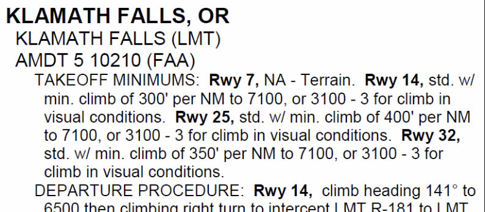
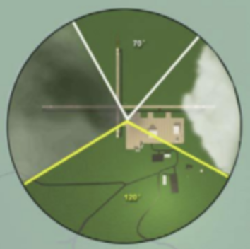
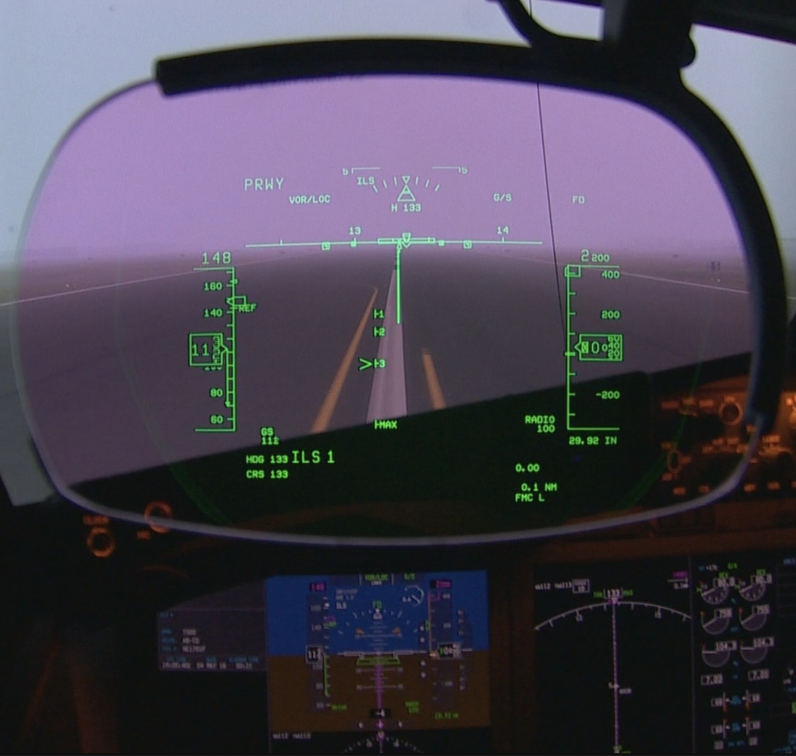
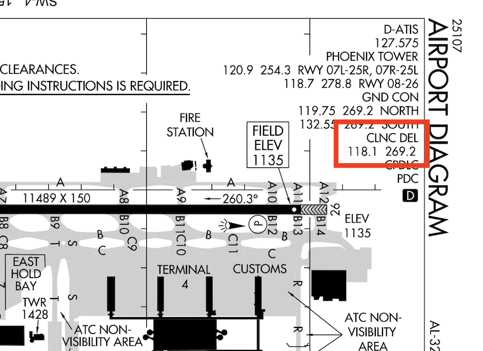
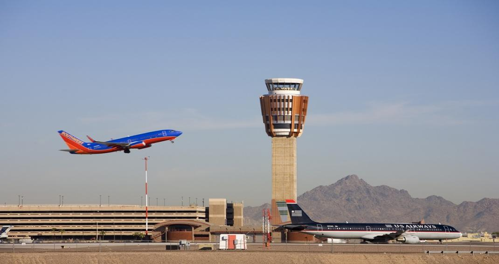
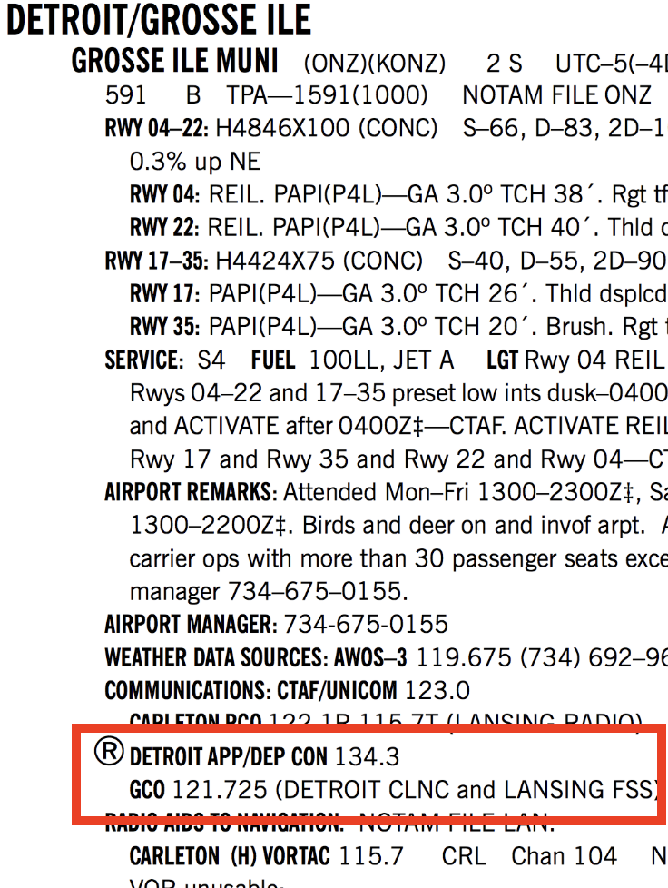

# Departure Planning

---

## Preflight

- Departure Option
- Takeoff Minimum
- IFR Destination
- IFR Alternate
- Loss Communication Procedure
- Emergency Plan 

---

## Departure Option

- Standard Instrument Departure (SID)
- Obstacle Departure Procedure (ODP)
  - Graphic
  - Textual (not assigned by ATC)
- Radar Departure
- No-DP Departure
- VFR Departure

<red>Do NOT accept clearance if graphic/textual information for SID/ODP is not in possess.</red>
<!--
- Radar Departure: maintain awareness of location
- No-DP Departure: ATC read DP routing over radio
- VFR Departure: Maintain VFR until obtain clearance and above IFR minimum altitude. 
-->

---

## Takeoff Minimum

- Climb Gradient
- Visibility
- Ceiling

---

## Takeoff Minimum - Climb Gradient

<left>

Standard Takeoff Minimum: 200ft / nm

Non-standard minimum:

</left>
<right>

Consider aircraft performance:
- at top-of-climb altitude
- with density altitude
- with wind aloft
- with turbulence
- with icing

</right>

<!--
Climb gradient: 246fpm for Cessna 172 climbing at 74kts
-->

---

## Takeoff Minimum - Visibility

<left>

1. Runway Visual Range (RVR) 
(report in 100ft, per runway, per minute)
(touch-down RVR, Mid-RVR, Roll-out RVR)
1. Runway Visibility Value (RVV)
(report in status miles, per runway)
1. Prevailing visibility

</left>

<right>

     

</right>

<!--
!!!RVR, !!RVV, !PV
PV: observer see throughout 1/2 horizon (not continuous)
RVV: measured by transmissometer near runway, as pilot to see unlighted objects.
RVR: measured by transmissometer near instrument runway, as pilot to see high intensity runway lights (HIRL). Ambient light is considered. Report in hundreds of feet, update every minute, format: RVR 5-5-5 
-->

---

## Standard Takeoff Minimum

||Part 121/135|Part 91|
|--:|:--:|:--:|
Visibility|1 sm (<=2 engines) $1 \over 2$ sm (>2 engines)||
|Ceiling|0||
|Climb Gradient|200ft/nm||

<!--
to use lower-than-standard takeoff minimums: OpsSpecs
- Crew training
- Equipment installed in aircraft
- Equipment installed at airport
  - High intensity runway lights
  - Runway centerline markings

HUD: minimum 300ft RVR, cost $500k
-->

---

---

## Takeoff Minimum

||Non-Standard (Part 121/135)|Non-Standard (Part 91)|Standard (Part 121/135)|Standard (Part 91)|
|--:|:--:|:--:|:--:|:--:|
Visibility|As specified|-|1 sm (<=2 engines) $1 \over 2$ sm (>2 engines)|-|
|Ceiling|As specified|-|0|-|
|Climb Gradient|As specified|-|200ft/nm|-|

<footnote>
Part 91 operation: not required to comply with published IFR takeoff minimums.
</footnote>

<!--
Question: what is your personal takeoff minimum?
Answer: One that allows return to land in case of emergency.
-->

---

## IFR Destination

Part 121/135
- <quote><small>CFR Part 135.219: flight crews and dispatchers may only designate an airport as a destination if the latest weather reports or forecasts, or any combination of them, indicate that the weather conditions will be at or above IFR landing minimums at the estimated time of arrival (ETA).</small><quote>
<red>DON'T takeoff if you cannot land.</red>
- <quote><small>CFR Part 135.225: Pilots may not begin an instrument approach unless the latest weather report indicates that the weather conditions are at or above the authorized IFR landing minimums for that procedure.</small></quote>
<red>DON'T start approach if you cannot land.</red>
- <quote><small>...required to land within the touchdown zone</small></quote>
<red>DON'T land if you cannot land normally.</red>

---

## IFR Destination

Part 91

---

## IFR Alternate (Part 121/135)

Have alternate takeoff airport, if weather at departure airport below landing minimum:
- within 2h flying time (>2 engines)
- within 1h flying time (<=2 engines)

(1-2-3 rule) Have alternate landing airport when:
- ETA ±1h @ destination
- Ceiling < 2000ft
- Visibility < 3sm

Standard alternate minimums (Only apply to flight planning purpose):
- Ceiling > minimum + 400ft
- Visibility > minimum + 1sm

---

## IFR Alternate (Part 91)

(1-2-3 rule) Have alternate landing airport when:
- ETA ±1h @ destination
- Ceiling < 2000ft
- Visibility < 3sm
 
Standard alternate minimums (Only apply to flight planning purpose):

<left>

Precision approach:
- Ceiling > 600ft
- Visibility > 2sm 

</left>
<right>

Non-Precision approach:
- Ceiling > 800ft
- Visibility > 2sm

</right>

---

## Departure - Towered Airport

Contact clearance delivery

---

<invert>

### Departure - Non-towered Airport

<left>

- Contact TRACON/ARTCC
- Contact AFSS by phone/radio
- Contact UNICOM
- Depart VFR

Ground Communication Outlet (GCO)
- ATC: 4 clicks
- FSS: 6 clicks

</left>
<right>

</right>

</invert>

