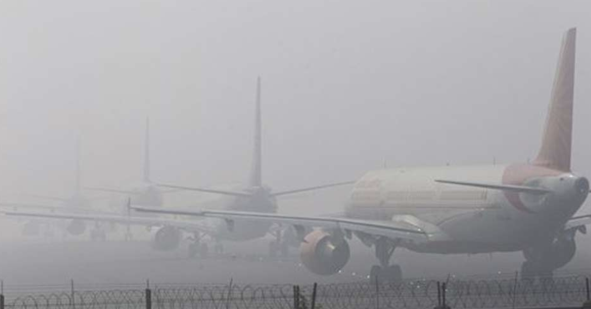
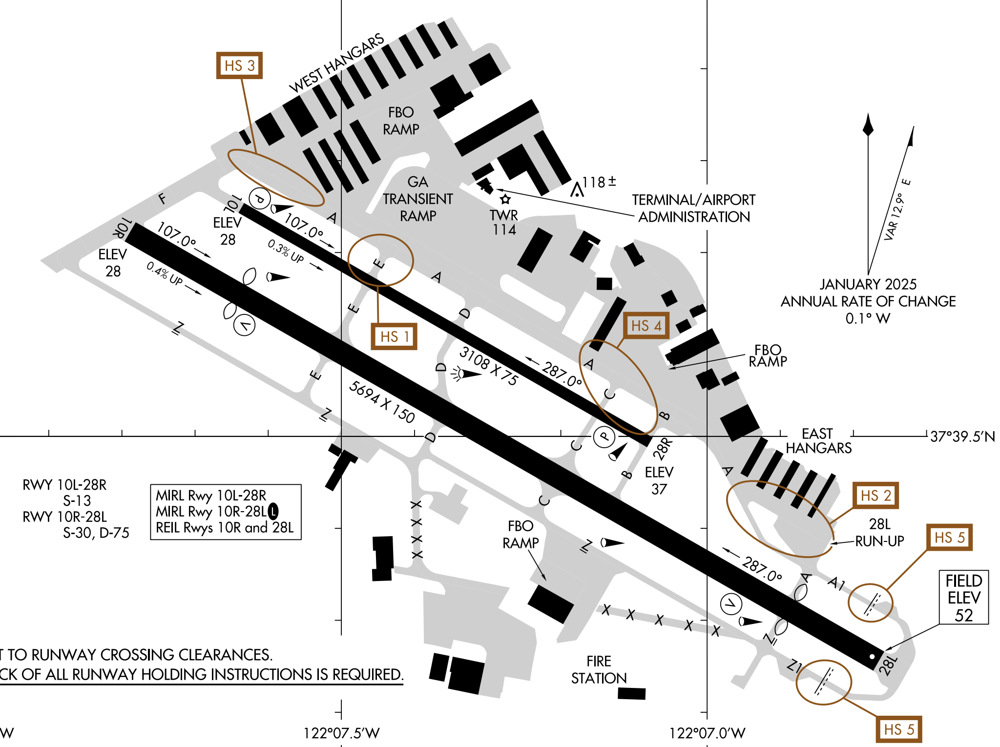
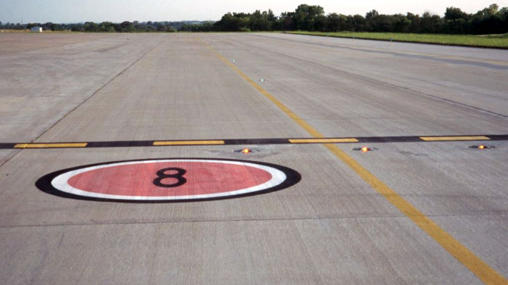
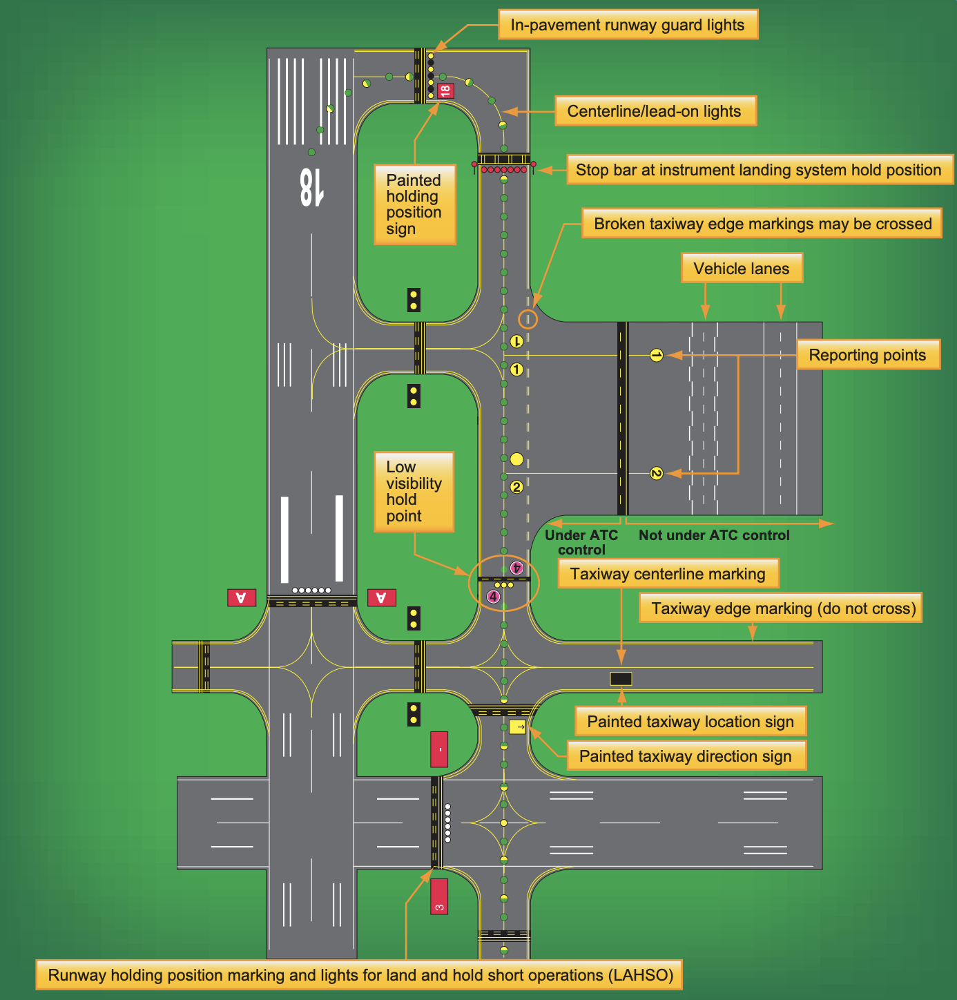
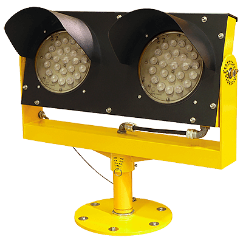
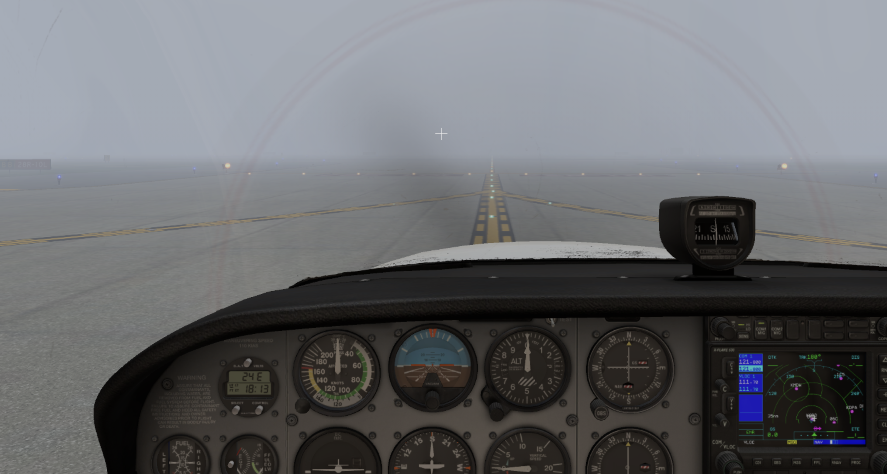
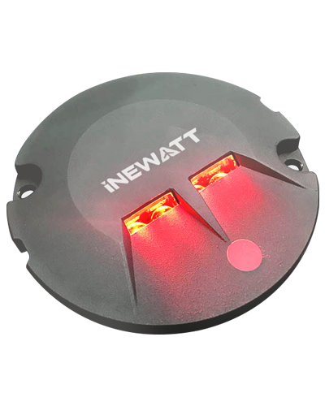
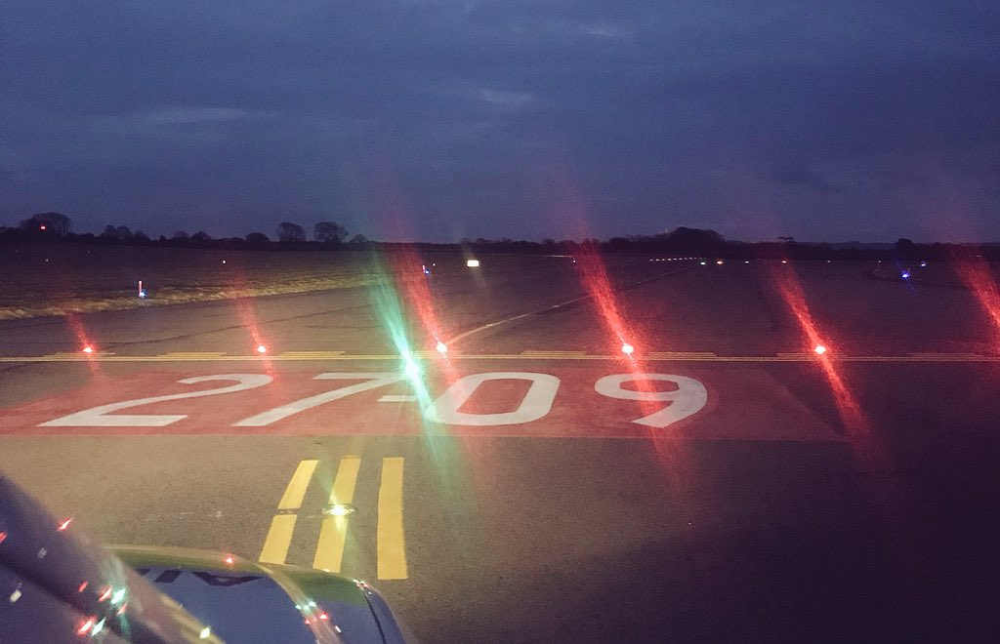

# Ground Movement

---

<!--
December 6, 1999, 20:35 EDT, a runway incursion involving United Airlines flight 1448 (a Boeing 757) and FedEx Express flight 1662 (a Boeing 727) on Runway 5R/23L occurred due to the low-visibility conditions and pilot disorientation. 
-->

---

## Hotspot

---

## Surface Movement Guidance Control System

- Geographic Position Markings
- <green>Taxiway Lights</green>
- <yellow>Clearance bar</yellow>
- <yellow>Runway guard light (RGL)</yellow>
- <red>Stop bar</red>

<!--
Taxiway centerline lights: in-pavement, green
Geographic position markings: for position reporting (St Louis Airport on Google Map)
Clearance bar: 3, in-pavement, yellow 
-->

---

## Runway Guard Light (RGL)

in-pavement/elevated, alternate flashing yellow lights

    

<simulation>

[demo](simulation/runway-guard-light.sit)

</simulation>

---

<left>
<invert>

## Stop Bar

- In-pavement
- Red
- On when < 600ft RVR

          

</invert>
</left>
<right>

        

</right>

---

## Sterile cockpit rule (CFR Part 121.542 & Part 135.100)

<small>
(a) No certificate holder shall require, nor may any flight crewmember perform, any duties during a critical phase of flight except those duties required for the safe operation of the aircraft. …...
 
(b) No flight crewmember may engage in, nor may any pilot in command permit, any activity during a critical phase of flight which could distract any flight crewmember from the performance of his or her duties or which could interfere in any way with the proper conduct of those duties. Activities such as eating meals, engaging in nonessential conversations within the cockpit and nonessential communications between the cabin and cockpit crews, and reading publications not related to the proper conduct of the flight are not required for the safe operation of the aircraft.
 
(c) For the purposes of this section, <highlight>critical phases</highlight> of flight includes all ground operations <highlight>involving taxi, takeoff and landing</highlight>, and all other flight operations conducted <highlight>below 10,000 feet, except cruise flight</highlight>. 

</small>