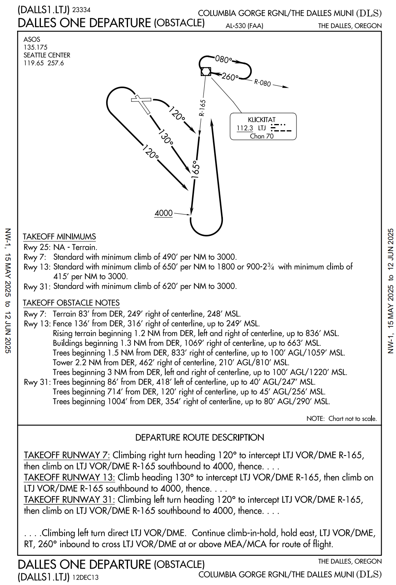
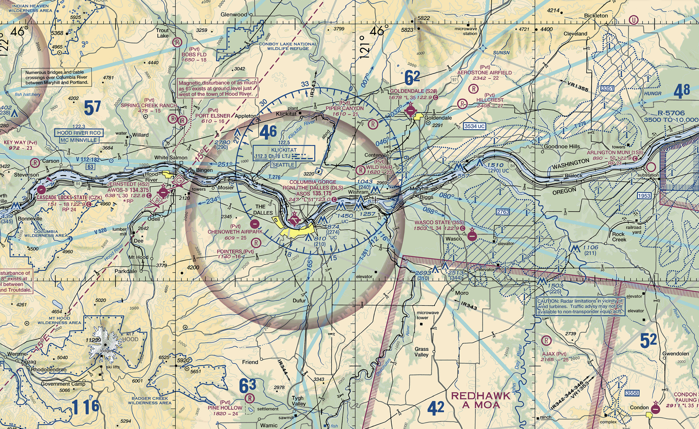
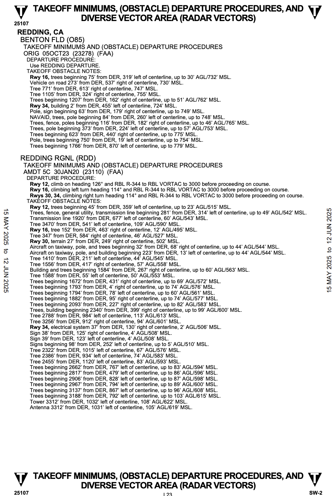

# Obstacle Departure Procedure

<!--
simply provide obstacle clearance.
ODPs are only used for obstruction clearance and do not include ATC-related climb requirements. 
The primary emphasis of ODP design is to use the least restrictive route of flight to the en route structure or to facilitate a climb to an altitude that allows random (diverse) IFR flight, while attempting to accommodate typical departure routes.
-->

---

## Obstacle Departure Procedure - Graphics 

- Airport Name
- City & State Name
- Procedure Name & Code
- Frequencies
- Diagram
- Takeoff Minimums (Performance & Weather)
- Takeoff Obstacles
- Departure Route Description
- Expiration Date 

---

<right>

</right>

---

## Obstacle Departure Procedure - Textual 

- City & State Name
- Airport Name
- Takeoff Minimums
(Performance & Weather)
- Departure Route Description
- Takeoff Obstacles 

