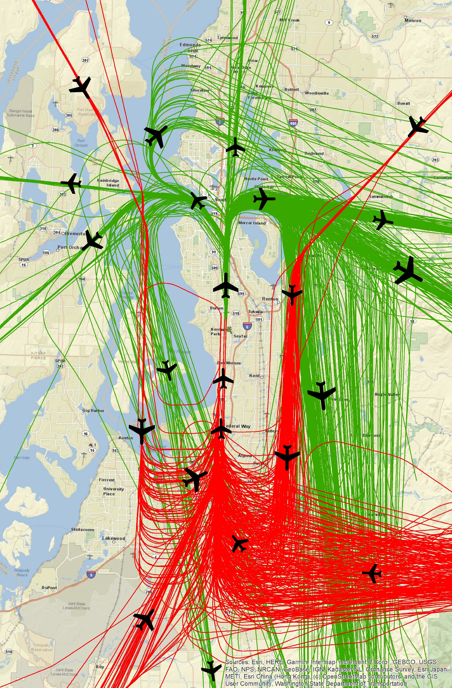
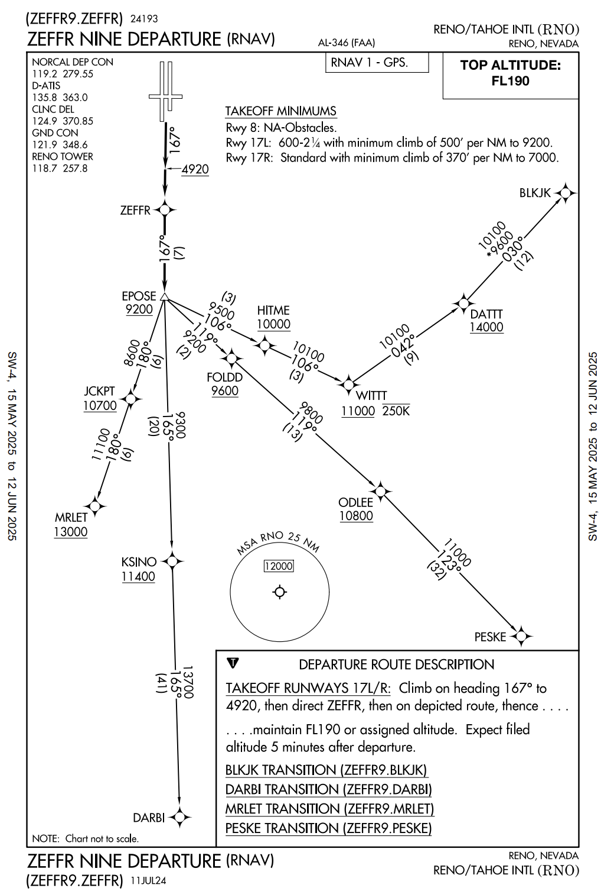
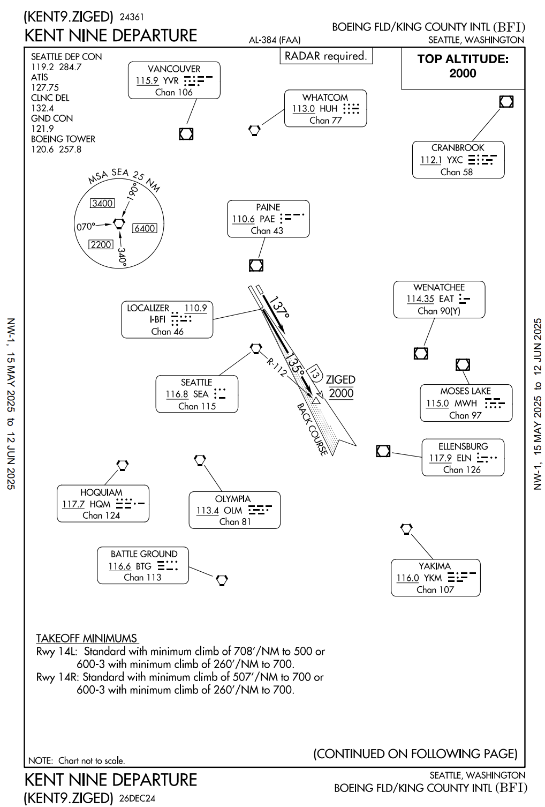
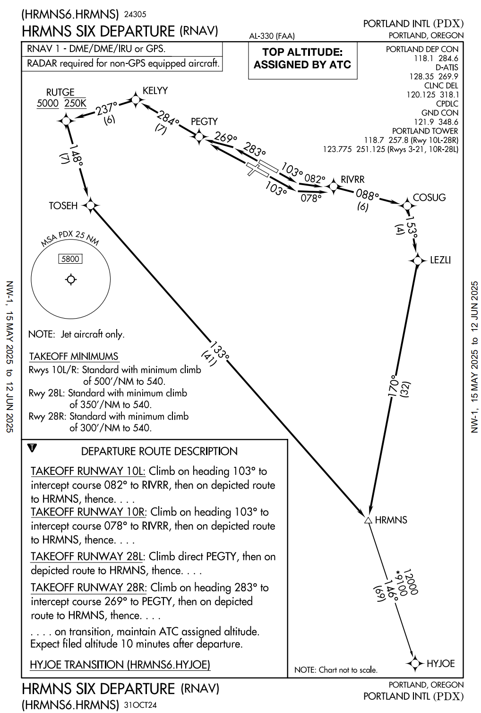

# Standard Instrument Departure (SID)

<!--
Designed at the request of ATC in order to increase capacity of terminal airspace, effectively control the flow of traffic with minimal communication, and reduce environmental impact through noise abatement procedures.

Primary goal is to reduce ATC/pilot workload
while providing seamless transitions to the en route
structure.
-->
---

## Standard Instrument Departure (SID)

Enhance airspace
reduce pilot/controller workload
expedite traffic flow
reduce environmental impact

---

## Standard Instrument Departure (SID)

ATC clearance must be received prior to flying a SID

---

## Standard Instrument Departure (SID)

Graphics only.

Mandatory notes:
- Aircraft equipment requirements (DME, ADF, etc)
- ATC equipment (RADAR)
- Minimum climb
- Type of aircraft (Turbojet)
- Certain destination 

---

## Standard Instrument Departure (SID) 

|GPS, Multiple Transitions|Radar vector only|Jet only|
|--|--|--|
||||

