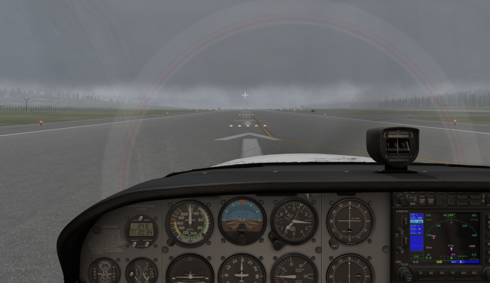
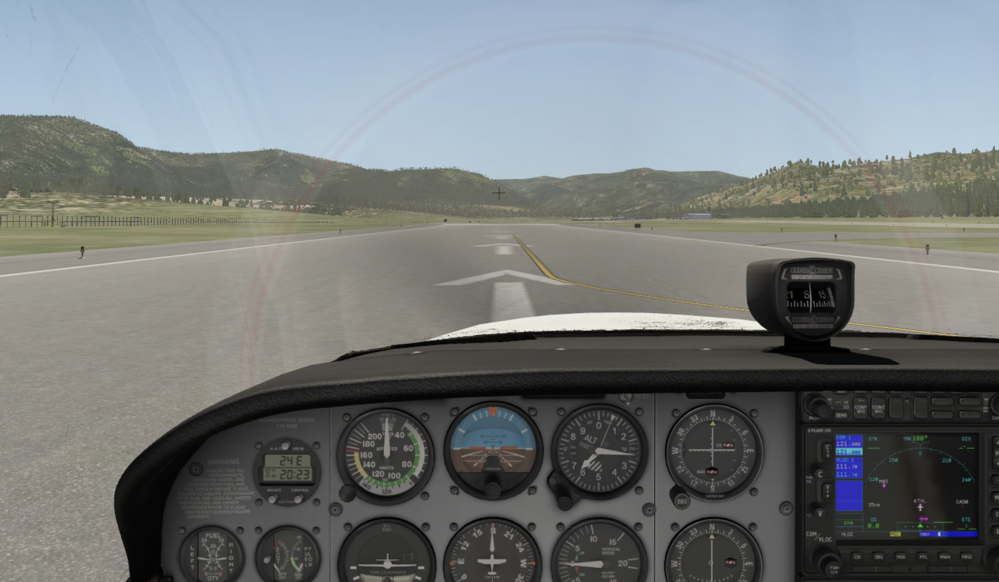
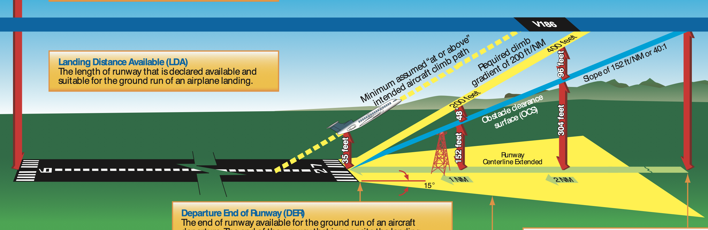
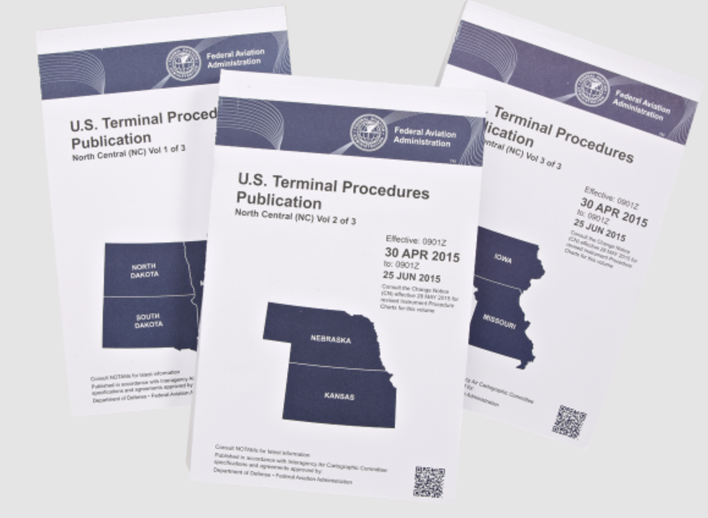
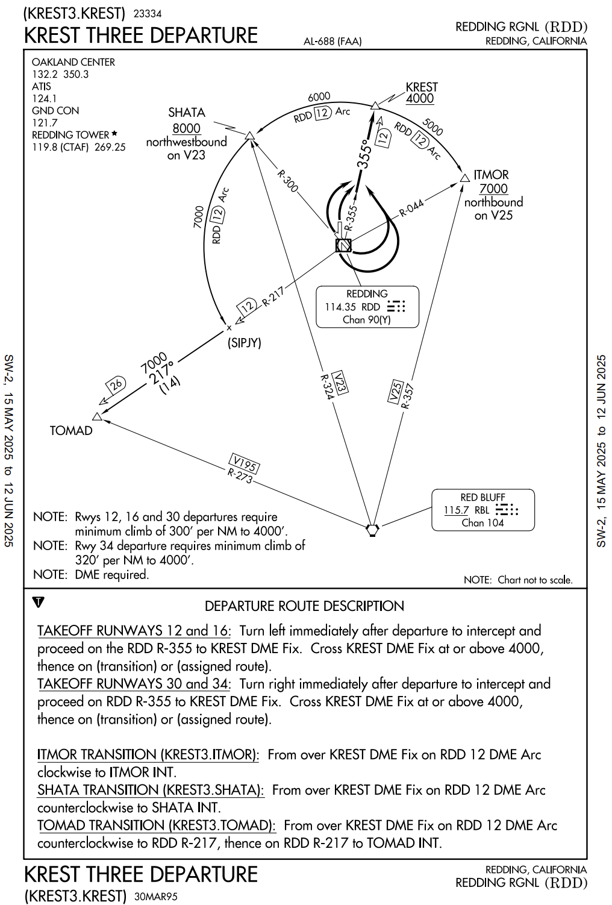

# Terminal Procedures

---

---

---

## U.S. Standard for Terminal Instrument Procedures (TERPS)

- Cross end of runway: 35ft AGL
- Climb gradient: 200ft/nm
- Obstacle slope: 152ft/nm (40:1)
- No turn until > 400 AGL
 

<!--
Initial climb area (ICA):
  - 500ft wide on each side at DER
  - spread out at 15 degree

Course guidance: A continuous display of navigational data that enables an aircraft to be flown along a specific course line (e.g., radar vector, RNAV, ground-based NAVAID)
Course guidance: 10nm (5nm after turns)

Turns and non-standard climb gradient to:
- clear high obstacles
- high terrain
- environment (noise abatement)
-->

---

## IFR Terminal Procedures

- [US] [FAA: Aeronautical Information Services](https://www.faa.gov/air_traffic/flight_info/aeronav/)
- [worldwide] [Jeppesen Sanderson, Inc](www.jeppesen.com)

---

## Departure Procedures

<left>

Obstacle Departure Procedure (ODP)

 

</left>
</right>

Standard Instrument Departure  (SID)

 

 </right>

<!--
SID: primarily on what is convenient for ATC traffic flow, not whether all airplanes can perform the procedure or not
ODP: generally designed to be available to the largest number of aircraft possible
Textural: simple procedures (heading, intercept via)
Graphic: complicated

DP exist only if approach procedures exist.
-->