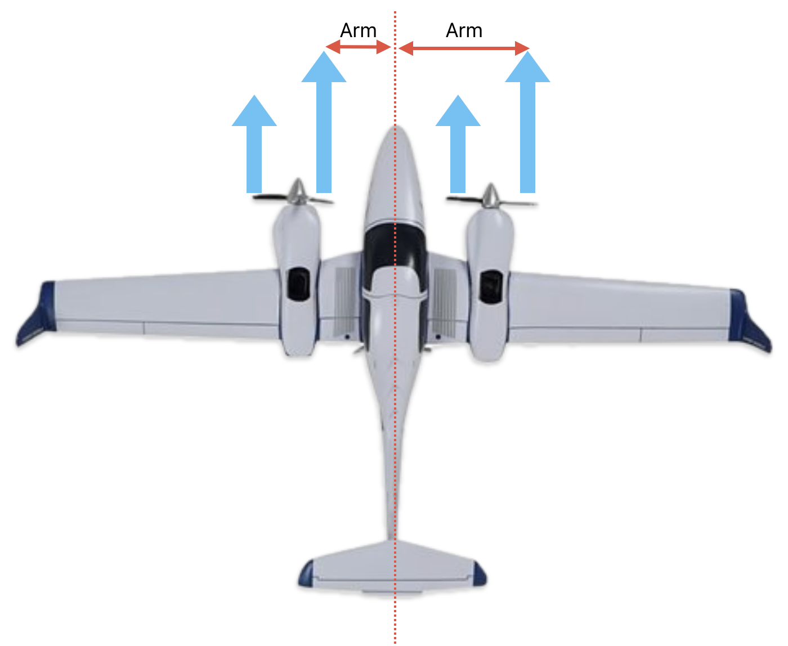
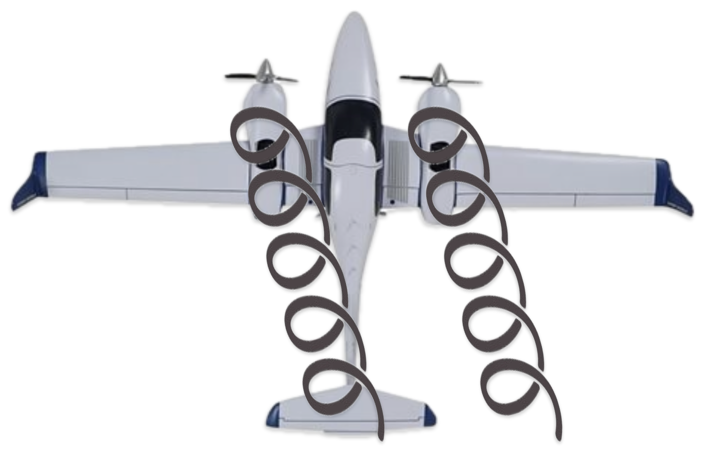
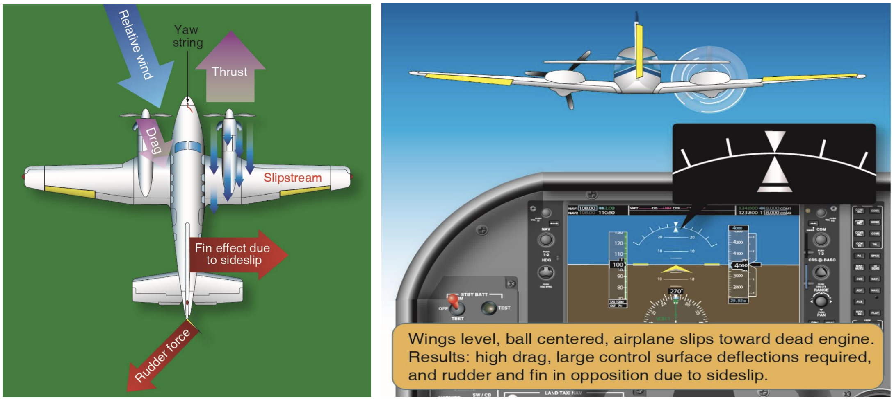
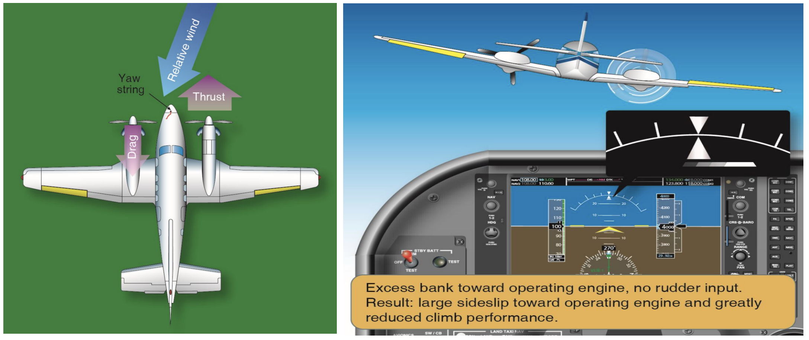
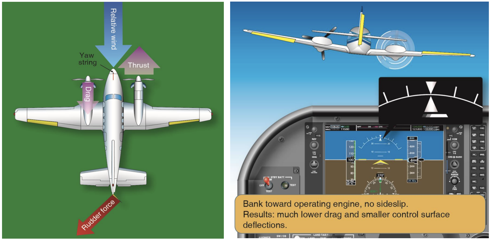
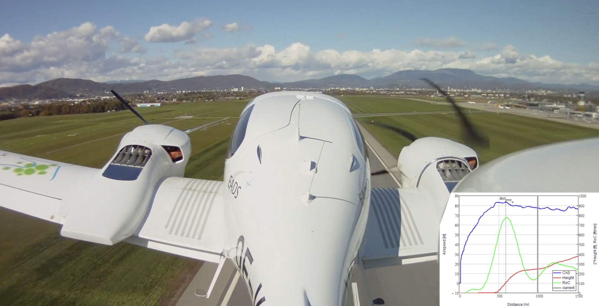

# Aerodynamic

---

## Aerodynamic Factors

- P-factor
- Accelerated slipstream
- Spiraling slipstream
- Torque

---

## P-Factor

- Descending blade: more thrust
- Ascending blade: less thrust

|Left engine fails|Right engine fails|
|:--:|:--:|
|More yaw to left|Less yaw to right|

---

## Accelerated Slipstream

Due to P-factor...

- Descending blade: more airflow
- Ascending blade: less airflow

|Left engine fails|Right engine fails|
|:--:|:--:|
|More roll to left|Less roll to right|

<!--
slipstream => about 12% faster airflow
-->

---

## Spiraling Slipstream

Due to P-factor...

- Descending blade: lower pressure
- Ascending blade: higher pressure

=> Slipstream drift to right

|Left engine fails|Right engine fails|
|:--:|:--:|
|Less airflow over rudder|same airflow over rudder|

---

## Torque

<non-key>

Newton's 3rd law: for every action there's an equal and opposite reaction.

</non-key>

|Left engine fails|Right engine fails|
|:--:|:--:|
|Torque amplifies left roll|Torque offset right roll|

---

## Critical Engine

Most adverse effect on directional control upon failure

||Left engine fails|Right engine fails|
|--|:--:|:--:|
|P-factor|+ left yaw|- right yaw|
|Accelerated  Slipstream|+ left roll|- right roll|
|Spiraling  Slipstream|- rudder authority|no change|
|Torque|Amplifies Left roll|Offset right roll|

---

## Control

If using rudder only...

---

## Control

If using bank only...

<!--
Excessive bank:
- uncomfortable
- reduce performance (more drag, less vertical lift)
-->

---

## Zero Sideslip

With both engines operative:
- Coordinated flight (0° bank, ball centered)

With OEI:
- bank 2-3° towards good engine
- ball one-half towards good engine

=> Best climb performance

  

---

## Minimum Control Speed: VMC

- Maintain control of airplane
- Maintain straight flight with bank angle < 5°

Like VS, not a fixed number.

---

|Factor|Most Unfavorable Condition|Control|Performance|VMC|
|--|:--:|:--:|:--:|:--:|
|Density altitude|Std. day @ sea level|worse|better|worse|
|Weight|Light|worse|better|worse|
|CG|Aft|worse|better|worse|
|Power|MAX|worse|better|worse
|Flaps|UP|worse|better|worse|
|Gear|UP|worse|better|worse|
|Prop|Windmilling|worse|worse|worse|
|Bank|0°|worse|worse|worse|

<!--
lower weight:
  => lower inertia / momentum
  => lower lift => lower horizontal component of lift when banking => less force to counter turns towards inop engine

-1° bank angle => +3kts VMC

Flaps: increase drag on operating engine's wing, counteracts yaw
-->

---

## VMC Determination

- Windmilling propeller at takeoff position (low pitch, high rpm)
- Aft-most CG
- Lowest weight
- Landing gear up
- Flaps: TO
- Trim: TO
- No ground effect
- Bank angle: 5°

---

## VMC Determination

Static condition
- Maintain straight flight with bank angle < 5°

Dynamic condition
- Max power
- Climbing
- Cut power
- Pitch down to maintain speed
- Maintain directional control within 20° of the original entry heading

---

## VMC Demo

As altitude increases:
- VMC decreases towards VS

<red>Avoid stall by immediately...</red>
- Reduce pitch
- retard throttle

<!--
High altitude...
=> decrease power (normally aspirated engine)
=> less asymmetric thrust

DA42: turbochargers maintain sea-level power up to 8000ft
-->