# Aircraft System

---

## Major Differences

- Propeller: Constant-Speed & Feathering
- Fuel: Cross-feed
- Yaw Damper
- Anti-icing / Deicing

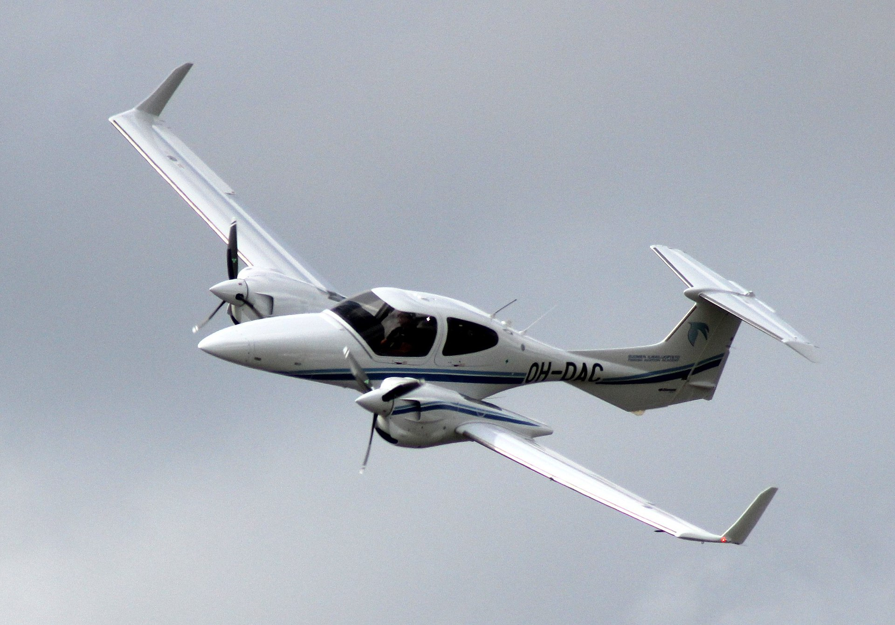

---

## Constant-Speed Propeller

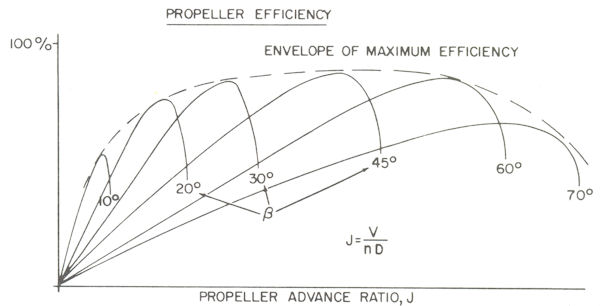

<!--
Propeller:
- parasite drag (as much as from entire airframe)

Propeller advance ratio: forward speed / rotational speed
-->

---

## Constant-Speed Propeller

Fail-Safe Design: when oil pressure from one engine is lost...

<col-2>

**Single-engine airplane**
- prop shall keep working
- Hub spring => low pitch
- Oil pressure => high pitch

</col-2>
<col-2>

**Multi-engine airplane**
- prop shall stop with minimum drag
- Hub spring => high pitch (feather)
- Oil pressure => low pitch

</col-2>

<!--
- single-engine: no need to fly fast; need to land
-->

---

## Multi-Engine Propeller

- Aerodynamic force + oil pressure => low pitch
- counterweights (centrifugal force) => high pitch
- spring / high pressure air => full feathered

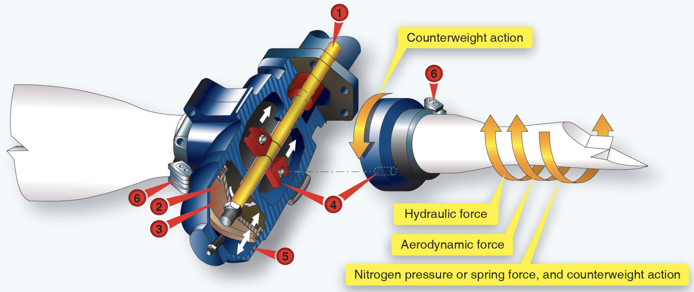

---

<left>

## Feathering

0. Propeller: > 800 RPM
1. Prop control: full aft
2. Governor: dump oil
3. Counterweights: drive towards feather
4. Spring / high pressure air: force into feather

</left>
<right>

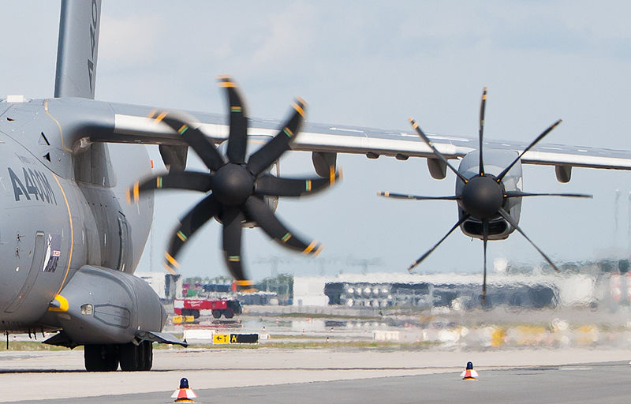
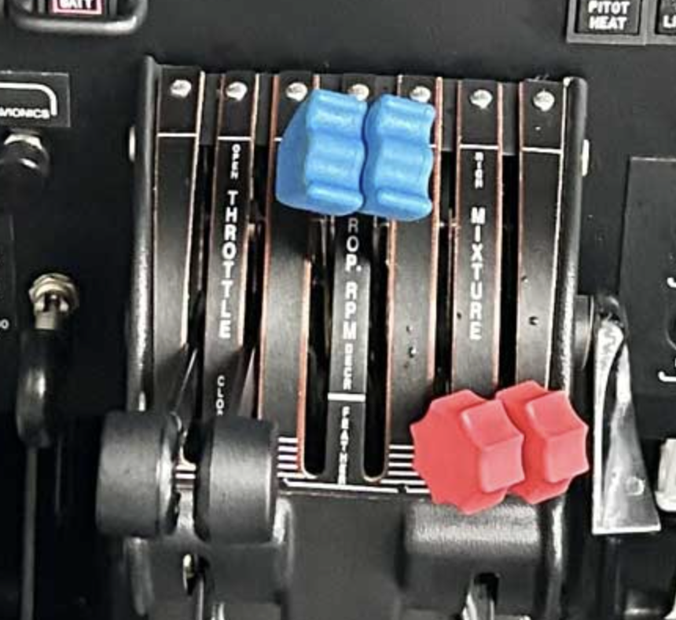

</right>

<!--
Complete secure of engine:
- fuel mixture
- boost pump
- fuel selector
- ignition
- alternator
- cowl flaps
- air bleed
might manipulate the incorrect switch
-->

---

## Unfeathering

<left>

1. Prop control: out of feathered position
1. Unfeathering accumulator[1]: release
1. Propeller: windmilling[2]
1. Fuel & ignition: start engine
1. Unfeathering accumulator: recharge

 
<footnote>

[1] Engine oil
[2] Electric start as backup

</footnote>

</left>
<right>

</right>

---

## Engine Shutdown

Why propeller doesn't feather after shutdown?
- Anti-feather lock pin: ON when < 800 rpm

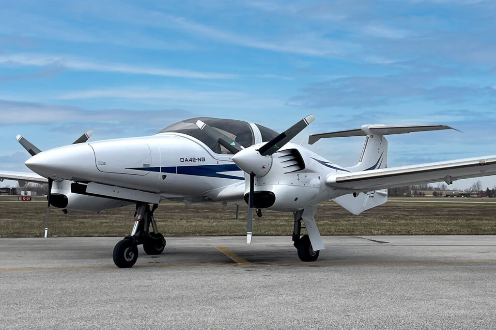

---

## Propeller Synchronization

- Prop synchronizer: match rpm
- Prop synchrophaser: match blade position

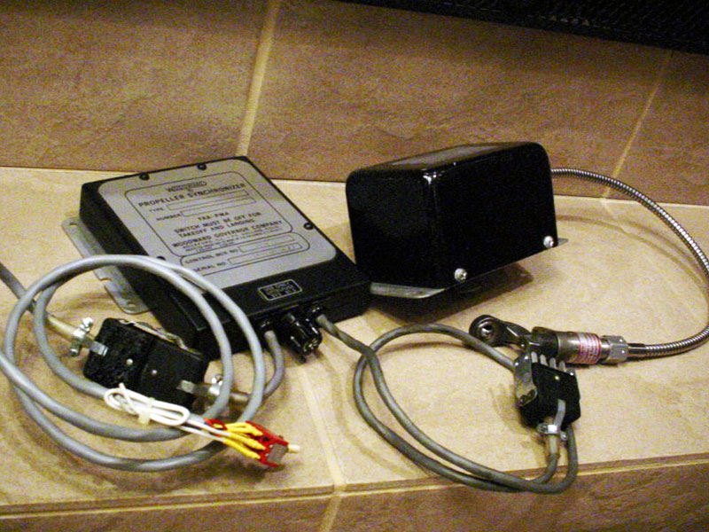 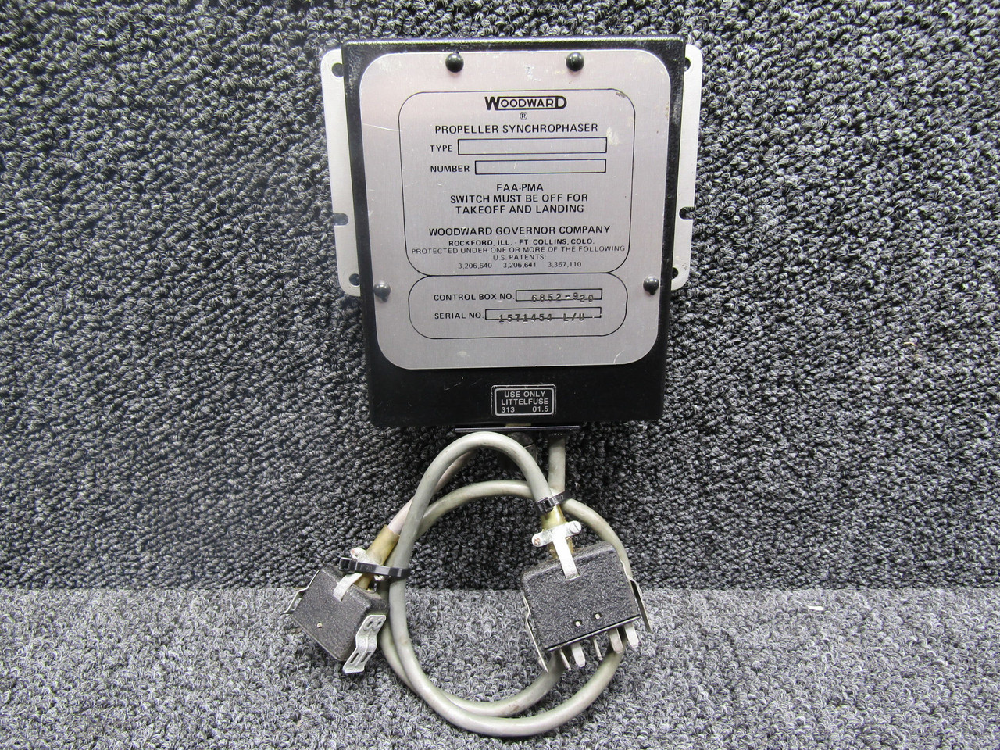 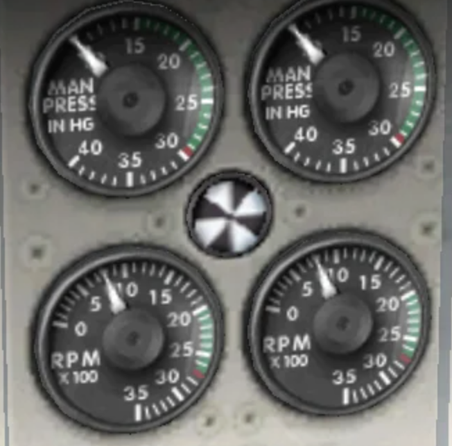

<!--
Reduce noise & vibration
-->

---

## Fuel Crossfeed

- As emergency procedure
- As normal operation*

**Before Takeoff Check**
1. ON; 1min with > 1500 RPM
1. OFF; 1min with > 1500 RPM

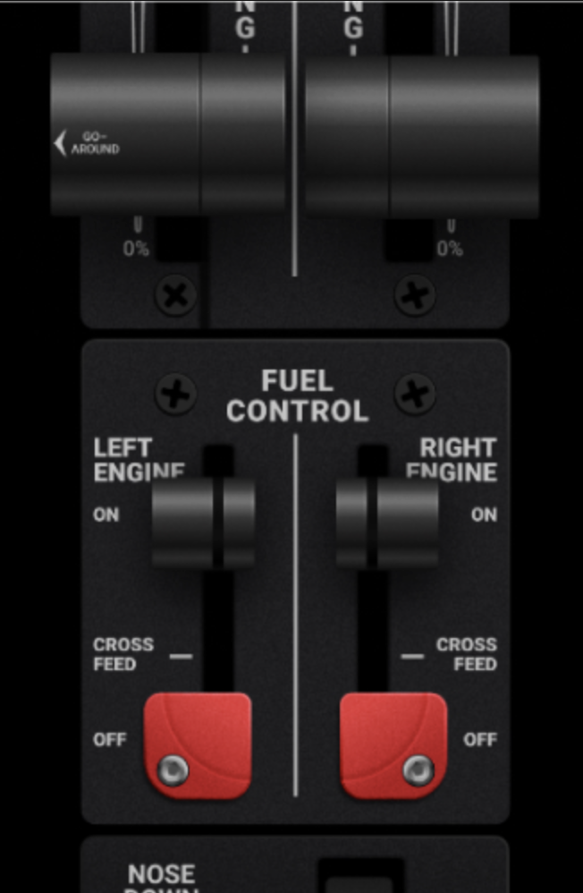

---

## Combustion Heater

- Gas furnace
- For cabin comfort and windshield defogging
- Automatic over-temperature protection (thermal switch)
- Cool-down before shutting down

    

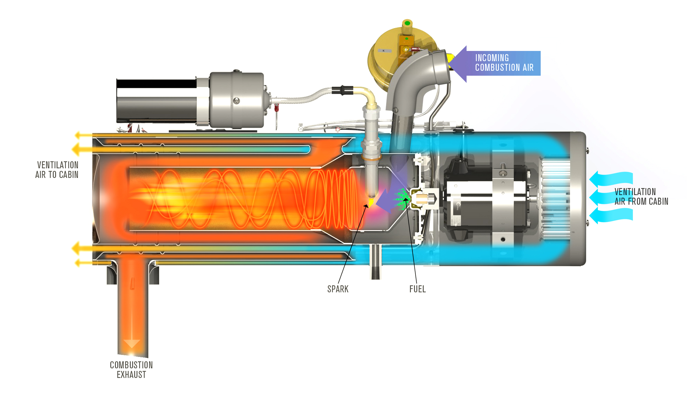

---

## Yaw Damper

- Yaw Rate => Gyro / accelerometer => Servo => Rudder
- OFF during takeoff / landing

<!--
- prevent dutch roll (instability)
- automated coordinated turn
-->

---

## Nose Baggage Compartment

- Weight & balance
- Secure load
- Secure door latches

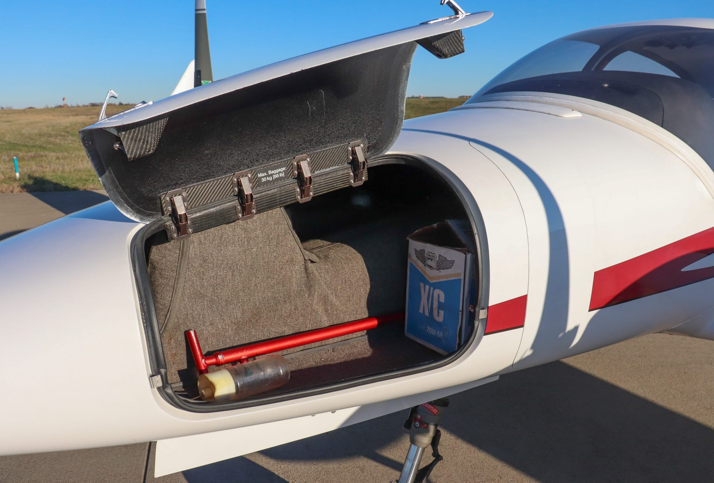

<!--
Don't become preoccupied when open door; fly the airplane
-->

---

## Anti-Icing

<col-2>

- Heated pitot tube
- Heated static port
- Heated fuel vents
- Electrothermal boots / alcohol slingers for propeller blades

</col-2>
<col-2>

- Heated / alcohol-sprayed windshield
- Heated lift detector
- Heated air intake lip
- Sweeping wing

</col-2>

Actuate before icing condition

---

## Deicing

- Pneumatic boots for wing and tail leading edges

      

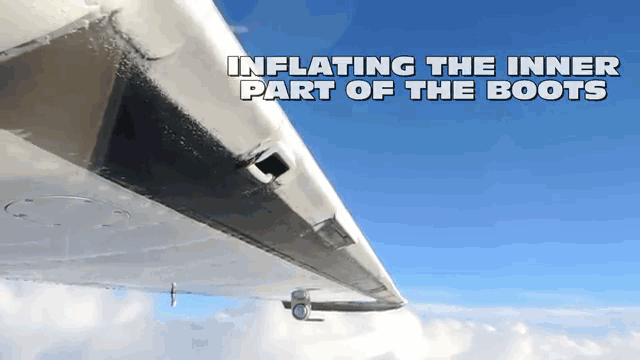

---

## Flight into Known Icing Condition

- Avoid using flaps
- No autopilot
- No severe icing
- No indefinite flight

