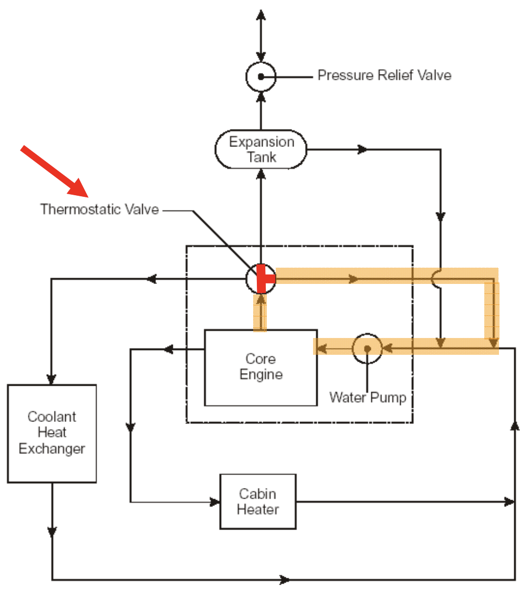
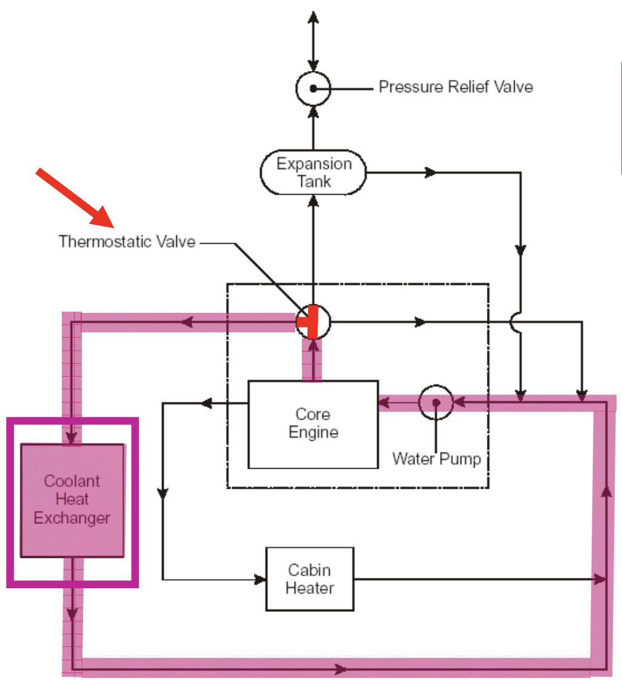
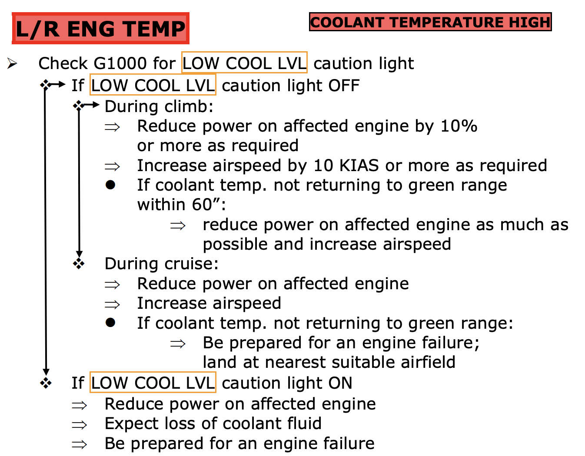
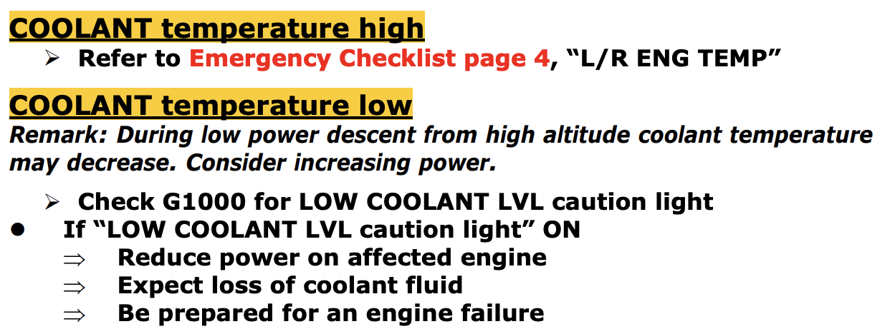
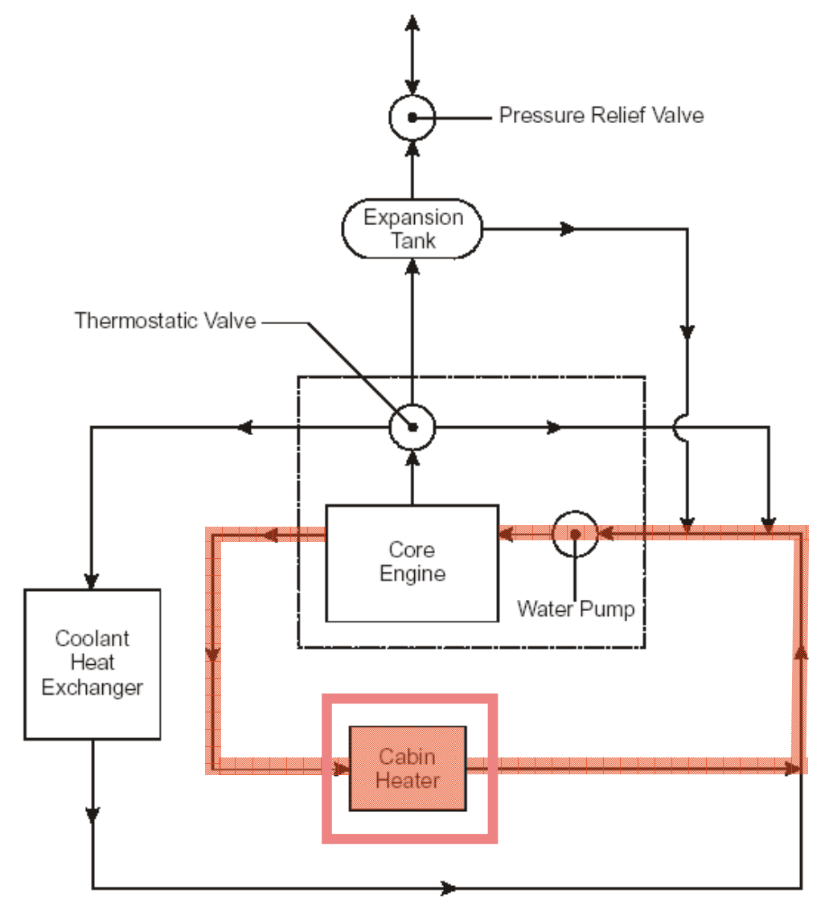
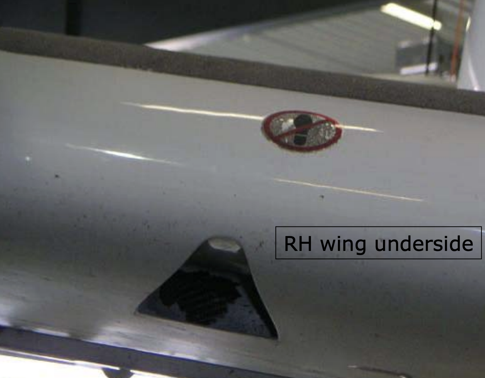

# DA42-VI: Cooling System

---

- Engine cooling
- Engine intake air cooling
- Engine oil cooling
- Gearbox oil cooling
- Fuel cooling
- Cabin heating/cooling

---

## Engine Cooling

<col-2>

**Below 88°C**

</col-2>
<col-2>

**Above 88°C**

</col-2>

---

## Emergency Checklist

<left>

</left>
<right>

</right>

---

## Cabine Heat

(image: cabin heat lever)

---

## Cabin Cooling

(image: cabin air vent)