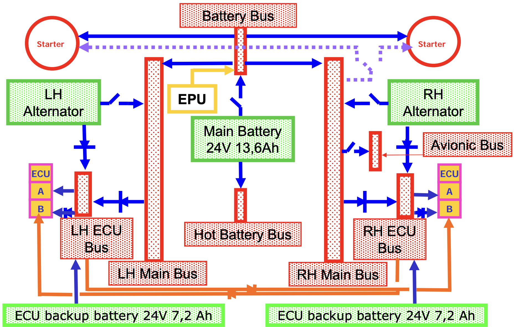
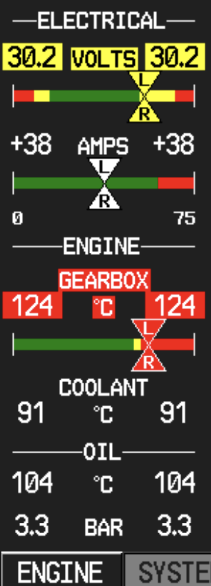
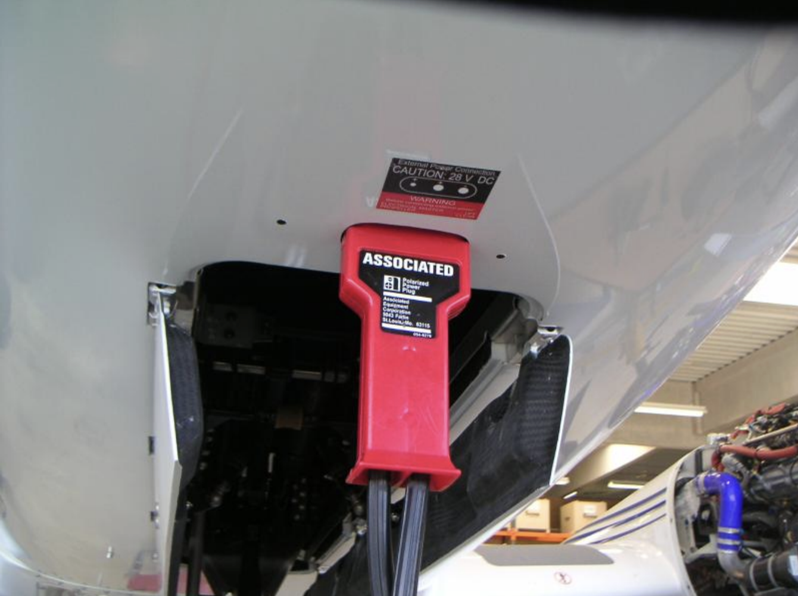

# DA42-VI: Electrical System

---

## Overview

Batteries
- 1x main battery (24V 13.6Ah)
- 2x ECU batteries (30min)
- 1x emergency battery
- 2x excitation batteries
- 1x ELT battery

Alternators
- 2x, 28V, 70A

Buses

---

## Hot Battery Bus

- Pilot map / reading light

---

## Battery Bus

- LH / RH main bus
- LH / RH starter

---

## LH Main Bus

<col-2>

- PFD
- Air Data Computer
- AHRS
- COM 1
- GPS/NAV 1
- Transponder
- Engine
- Instruments

</col-2>
<col-2>

- Pitot heating
- Oxygen system
- Gear control
- Gear warning
- Map light
- Flood light
- Taxi light
- Anticollision lights

</col-2>

---

## RH Main Bus

<col-2>

- Avionic Bus
- MFD
- Horizon
- Starter control
- Flap system
- Avionic / CDU cooling fan

</col-2>
<col-2>

- Stall warning
- Autopilot warning
- Landing light
- Navigation lights
- Instrument lights

</col-2>

---

## Avionic Bus

- COM 2
- GPS/NAV 2
- Audio panel
- Autopilot
- (Data Link)
- (WX 500)
- (ADF)
- DME
- (Weather Radar)

---

## Electric Master Switch

- Battery => battery bus (& LH/RH main bus)

(image)

---

## Alternator Switch

- Alternator to main bus
- Normal ops: always ON

(image)

---

## Engine Master Switch

- Starter
- ECU (A+B) => ECU bus
- Glow
- Unfeathering accumulator
- Alternator => ECU backup battery

(image)

---

## Avionic Switch

- Avionic bus => RH main bus

(image)

---

## Electrical Instruments

- Amperemeter

---

## External Power Connection

- External power: connect
- LH engine: start
- External power: disconnect
- RH engine: start

<red>NO night flight with empty battery</red>

