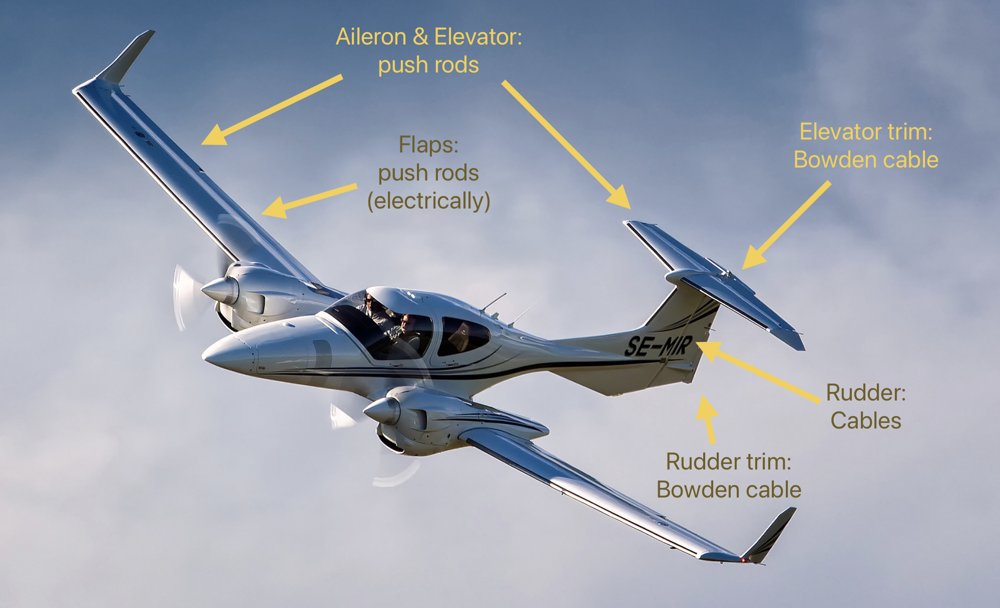
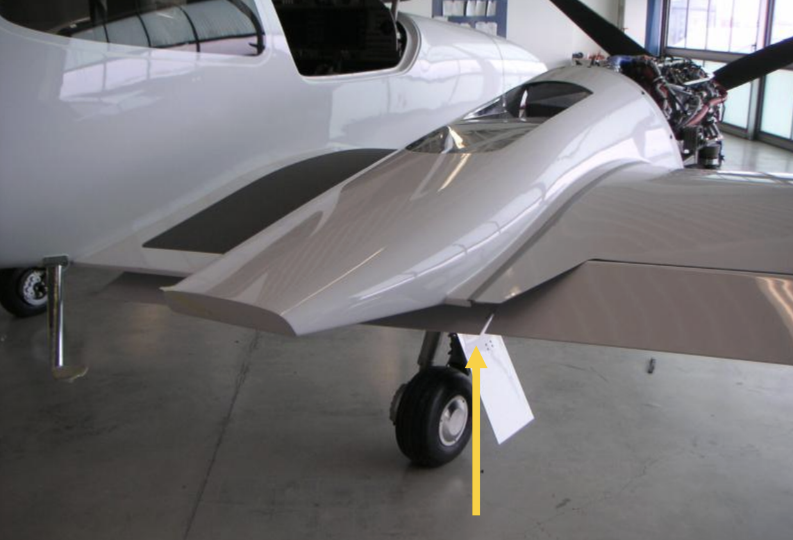
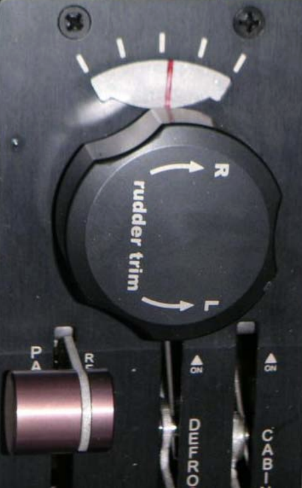
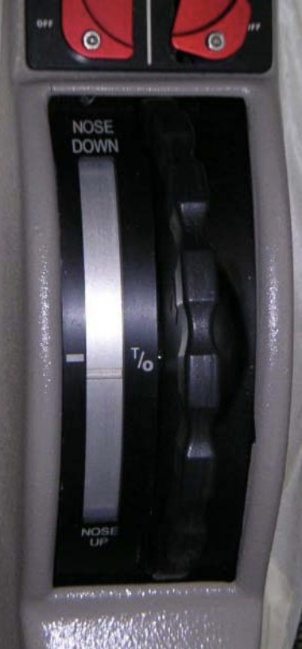
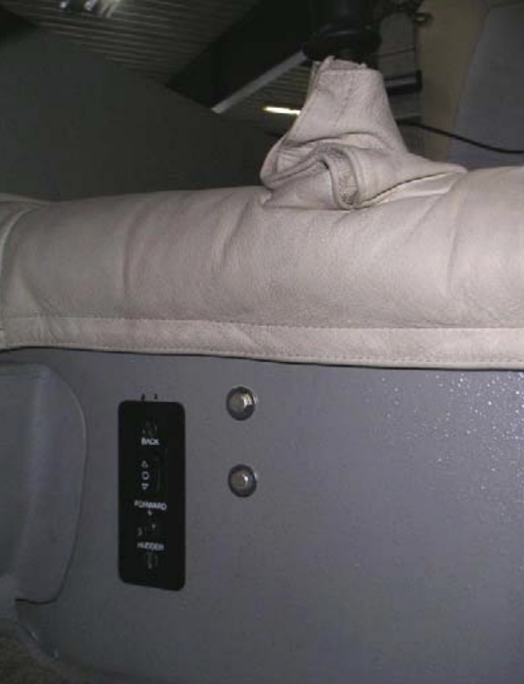

# Flight Controls

---

---

## Flaps

- Inboard & outboard
- Separate bellcranks
- Mechanically connected

---

## Variable Elevator Stop

Elevator "up" deflection
- Normal: 15.5°
- Limited to 13° when both power levers > 20%

<red>Preflight check of this device is mandatory!</red>

<!--
With full elevator deflection in case of stalling the handling qualities and stall characteristics are degraded.

"STICK LIMIT“ caution when variable stop not in proper position.
-->

---

<left>

## Trim

- Elevator trim
- Rudder trim

</left>
<right>

 

</right>

---

## Rudder Pedal

- Electronically adjustable

