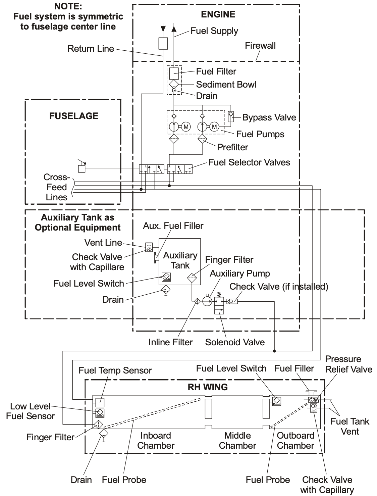
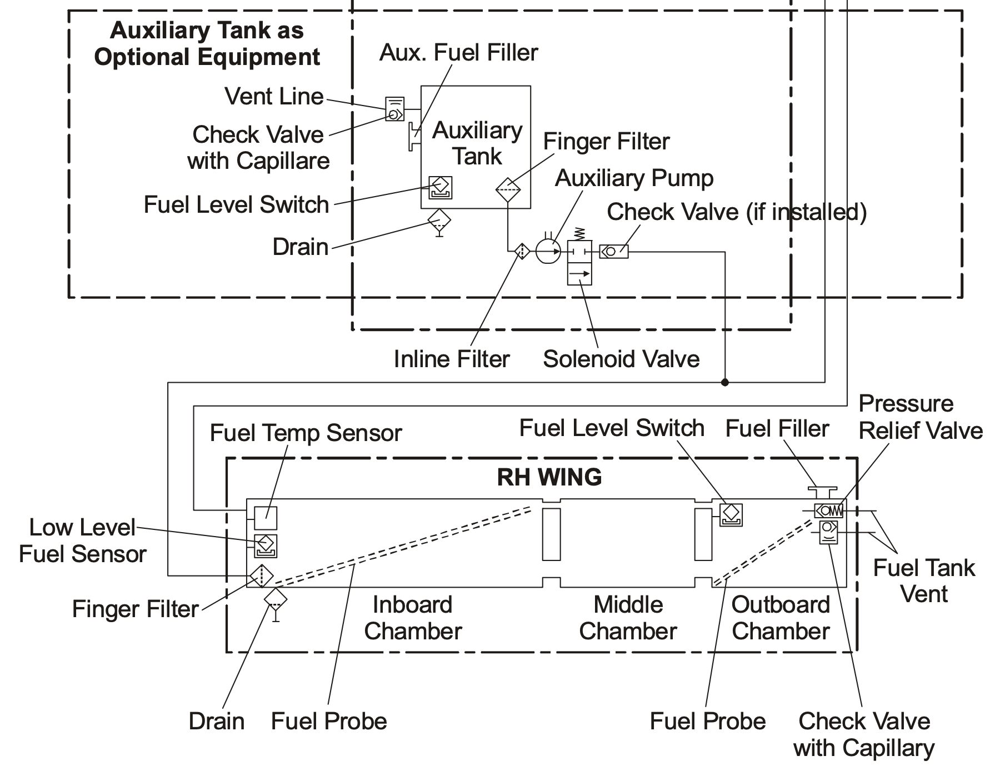
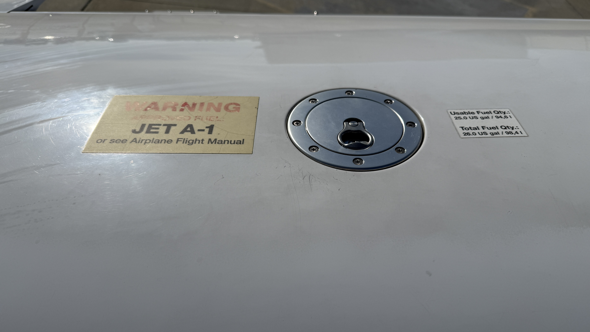
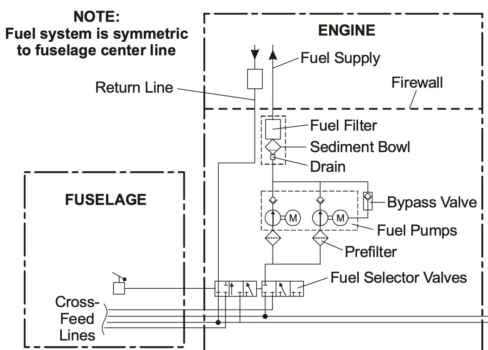
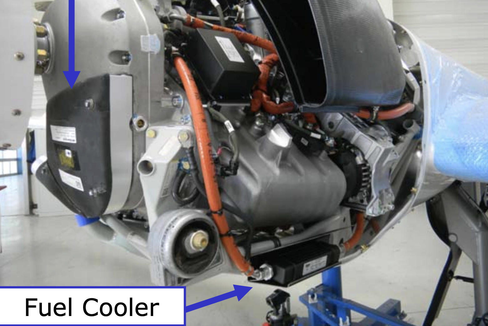
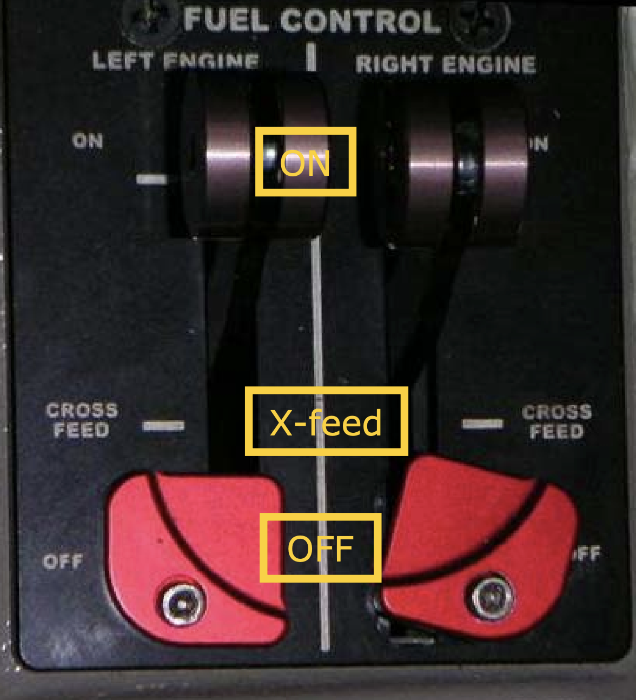
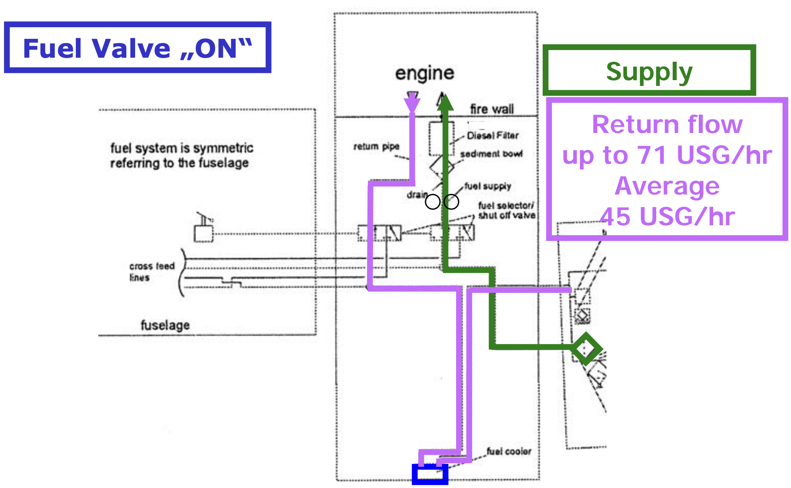
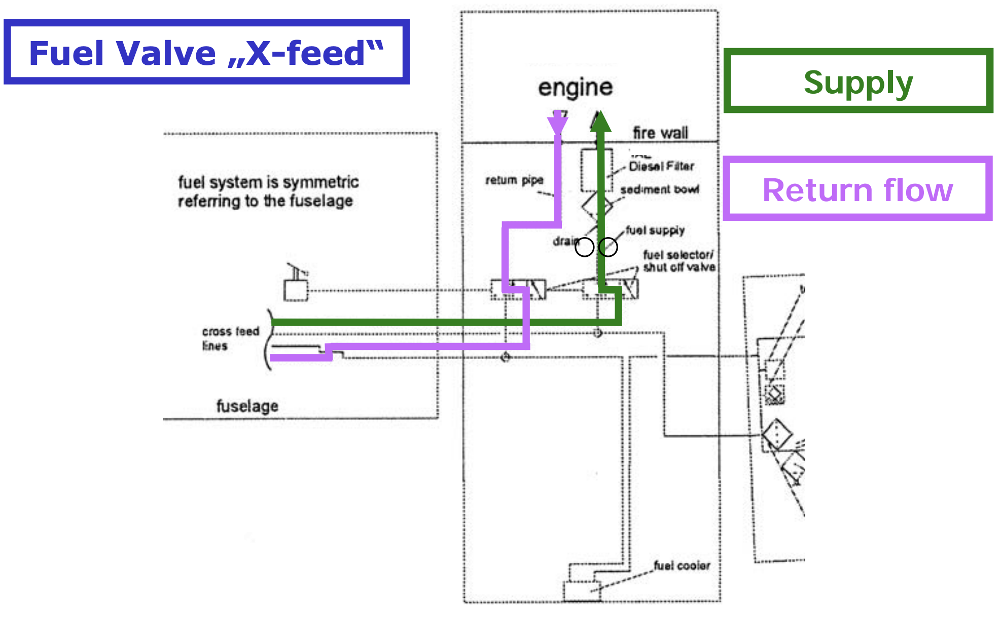
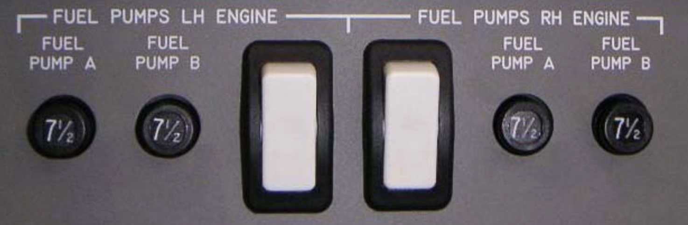

# Fuel System

---

## Fuel Type

- JET A / JET A-1 (6.75 lbs / gal)
- Disel

<red>Disel fuel not permitted in AUX tank</red>

---

## Fuel Tanks

||Main Tank|AUX Tank|
|--|:--:|:--:|
|Left|26 gal (25 gal usable)|13.7 gal (13.2gal usable)|
|Right|26 gal (25 gal usable)|13.7 gal (13.2 gal usable)|
|Total Usable|50 gal|26.4 gal|

<red>Max unbalance: 5 gal</red>

---

## Fuel System

**Main tank**
- 3 chambers
- Fuel filler
- Fuel vent
- Fuel drain
- Fuel quantity sensors
- Fuel temperature / low level sensors
- Fuel level switch (<17 gal)

---

## Fuel System

**Auxilary tank**

- Fuel filler
- Fuel vent
- Fuel drain
- Fuel level switch (empty)
- Transfer pump (electrical)

Operation
- To main tank only
- Warmed up by return line

---

# Fuel Filler

(image: aux tank filler)

- Ring facing forward

---

# Fuel Drain

- 2x Main tank drain
- 2x Aux tank train
- 2x Nacelle drain

(image: drain)

---

## Fuel Filter

**NOT heated**

---

# Fuel Cooler

- Fuel cooler air inlet
- Fuel cooler air outlet

(image)

---

# Fuel Selector

- **Engine** fuel feed selector

---

---

---

## Fuel Pumps

For each engine:

<flex-col>

**1x High pressure**
  (engine driven)

</flex-col>
<flex-col>

**2x Low pressure (electrical)**
- one working (with ECU)
- auto switch upon failure
- manual switch (during TO/LD)

</flex-col>
<flex-col>

**1x transfer (electrical)**
Auto off when:
- Main tank FULL*
- Aux tank empty

</flex-col>

        

(image: transfer switch)