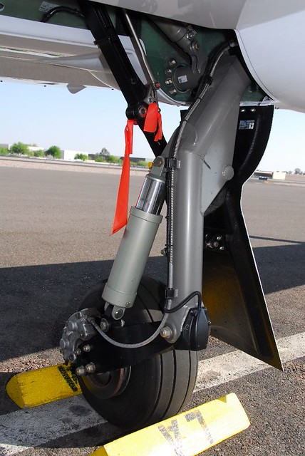
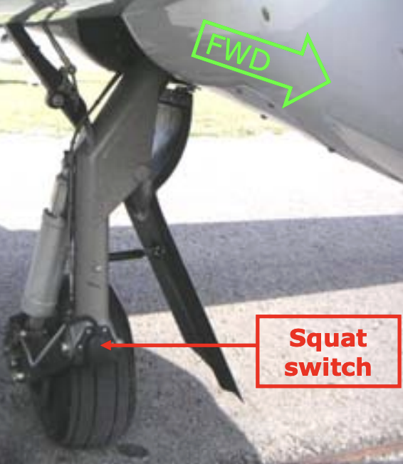
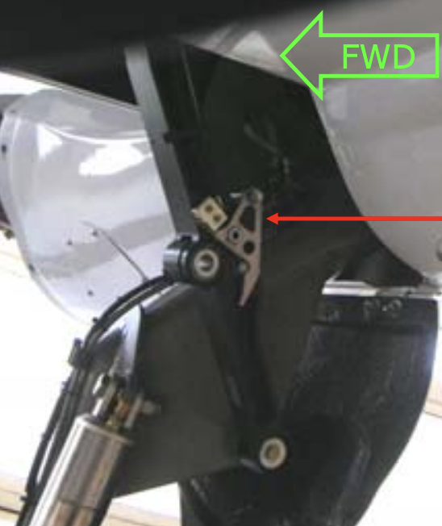
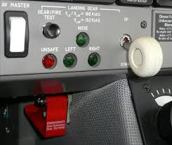
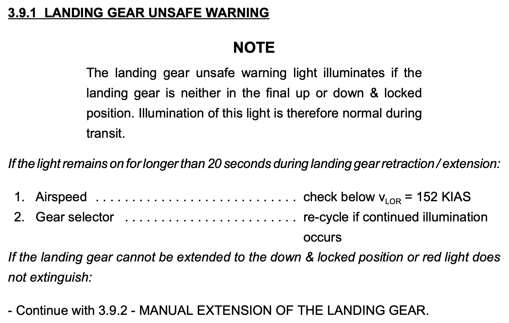
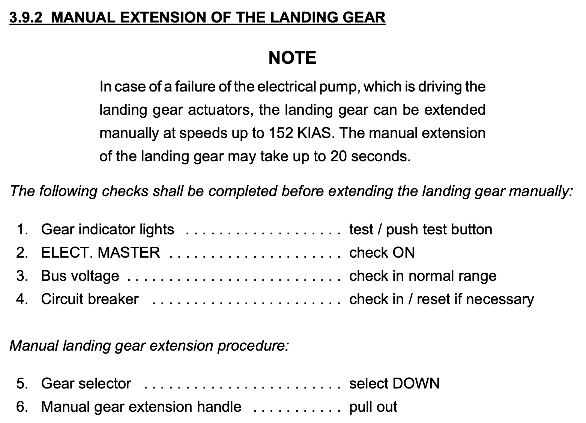
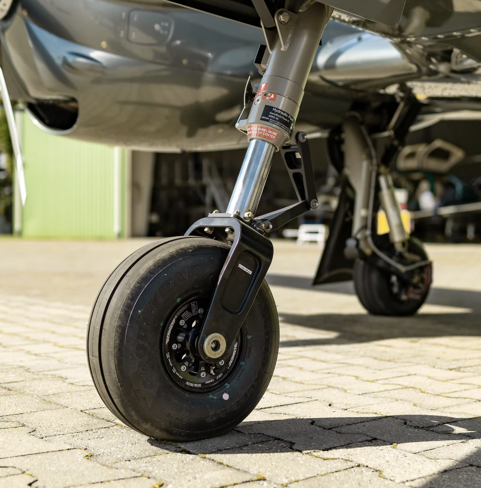

# DA42: Landing Gear

---

## Overview

- Hydraulically operated
- Electrically powered hydraulic pump
- Electrically actuated hydraulic valves operated by gear selector switch
- "Squat switch“ prevents retraction on ground

---

## Squat Switch

**LH Squat Switch**

- On ground landing gear protection

**RH squat switch**

- Stall warning heating
- Engine pre-glow
- ECU test
- TAS voice warning

---

## Downlock

- Spring loaded
- Released by hydraulic pressure for retraction
- Gear held up hydraulically
- Green lights = gear down and locked
- Red light = gear neither down nor up

<red>

Emergency operation
- free fall (by releasing hydraulic pressure)

</red>

---

## Landing Gear Unsafe Warning

<left>

</left>

---

## Manual Extension

<left>

</left>

---

## Landing Gear Warning

If gear UP, and:
- One power lever < 20% ±5%, or
- Flaps LDG

---

## Nose Wheel

Nosewheel steered with rudder pedals
Steering angle:
- 30° without use of brakes
- 52° with one wheel fully braked

