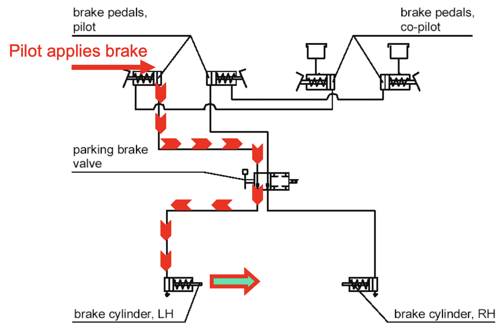

# DA42: Landing Gear

---

## Overview

<flex-col>

**UP**
- By hydraulic pressure
- Using hydraulic pump
(electrical)
- Regularly maintain pressure*

</flex-col>
<flex-col>

**DOWN**
- By spring

</flex-col>

<container>

Gear switch down => electrically actuate hydraulic valves => release pressure

</container>

<!--
When turning on master switch, hydraulic pump works for 5-20s to build pressure.
-->

---

## Squat Switch

**LH Squat Switch**

- On ground landing gear protection

**RH squat switch**

- Stall warning heating
- Engine pre-glow
- ECU test
- TAS voice warning

---

## Downlock

- Spring loaded
- Released by hydraulic pressure for retraction
- Gear held up hydraulically
- Green lights = gear down and locked
- Red light = gear neither down nor up

<red>

Emergency operation
- free fall (by releasing hydraulic pressure)

</red>

---

## Landing Gear Unsafe Warning

<left>

</left>

---

## Manual Extension

<left>

</left>

---

## Landing Gear Warning

If gear UP, and:
- One power lever < 20% ±5%, or
- Flaps LDG

---

## Nose Wheel

Nosewheel steered with rudder pedals
Steering angle:
- 30° without use of brakes
- 52° with one wheel fully braked

---

## Brake System

- Parking brake ops

