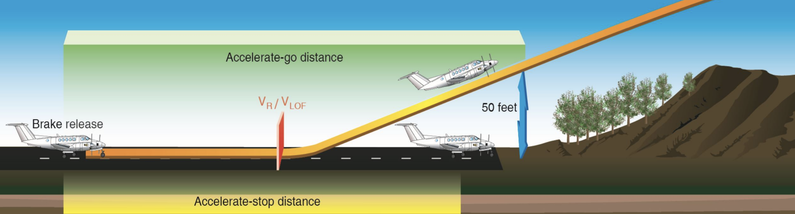
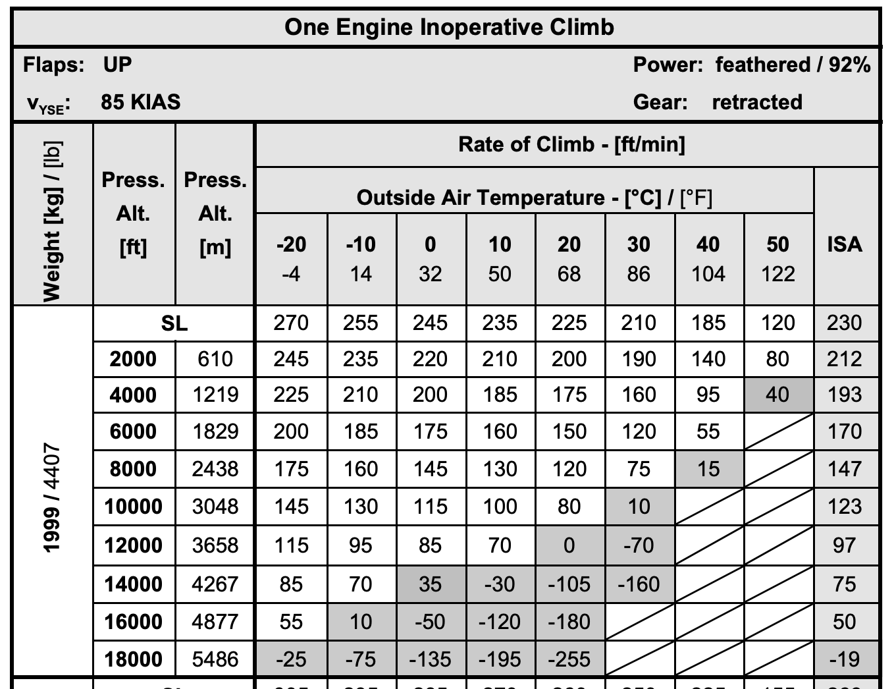
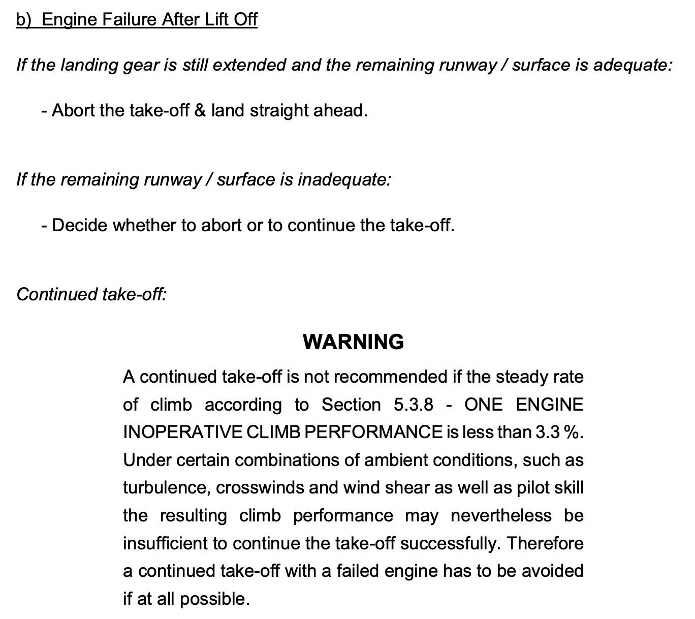

# Performance

---

## Speeds

<footnote>

* For typical training configuration (2 people, full main tank, < 4189lbs)

</footnote>

<flex-col>

|Flaps|UP|APP|
|--|--:|--:|
|VR|76|71*-74|
|VX||77*-79|
|VY|90*-92|85|
|VYSE|85||
|VREF|86*-92|84*-88|
|VGA|90||

</flex-col>
<flex-col>

||Speed|
|--|--:|
|VSO|64|
|VS|72|
|VMC|UP: 71 APP: 68|
|||

</flex-col>
<flex-col>

||Speed|
|--|--:|
|VNE|188|
|VNO|151|
|VO|112-119*-122|
|VFE|APP: 133 LDG: 113|
|VLOE/VLE|188|
|VLOR|152|
|Manual Ext.|152|

</flex-col>

---

## Service Ceiling

- **All-Engine Service Ceiling**
Highest altitude with steady climb rate of 100fpm

- **Single-Engine Service Ceiling**
Highest altitude with steady climb rate of 50fpm

---

## Takeoff Distance

**Accelerate-Stop Distance**
- 0 => VR => engine failure => stop

**Accelerate-Go Distance**
- 0 => VR => engine failure => climb to 50ft AGL

When do you abort takeoff?

    

<!--
Accelerate-go distance:
- instantaneously recognize engine failure
- react: retract landing gear
- react: identify & feather correct engine
- maintain airspeed and bank angle
- 50ft: a wingspan; if ground is level & no obstructions

Regulation: no requirement on runway length
ADM: always use runway > accelerate-go distance

Decision point: landing gear is selected up

DA42 (max weight, SL, 20C):
- Ground roll: 1400ft
- Clear 50ft: 2600ft
- Accelerate-stop: 2700ft
- Accelerate-go: 3200ft
-->

---

## One Engine Inoperative Climb Performance

Training scenario:
- 50 gal fuel
- 2 people
- 1800 lbs
- standard day @ sea level

=> 310fpm => 3.6% @ 85kts

---

## Abort or Continue?

---

## Analysis

|Abort Altitude|Takeoff roll|Distance to Climb|Distance to Descent|Landing roll|Total distance|
|:--:|:--:|:--:|:--:|:--:|:--:|
|0ft|1250ft|-|-|1200ft|2450ft|
|100ft|1250ft|800ft|1000ft|1200ft|4200ft|
|200ft|1250ft|1500ft|2000ft|1200ft|6000ft|
|300ft|1250ft|2300ft|3000ft|1200ft|7750ft|

Assuming:
- when both engines work, climb at 1200fpm
- when one engine fails, descend at 900fpm