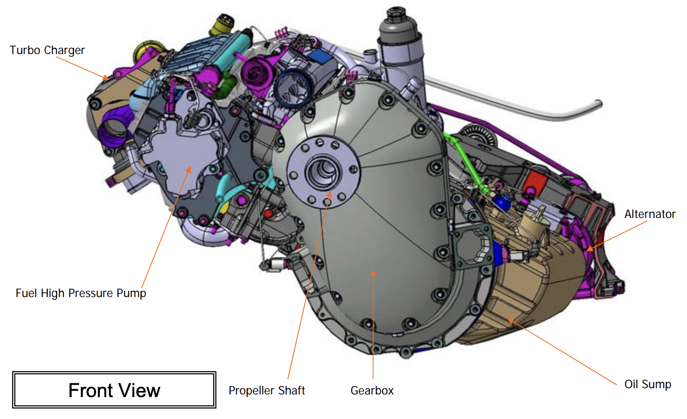
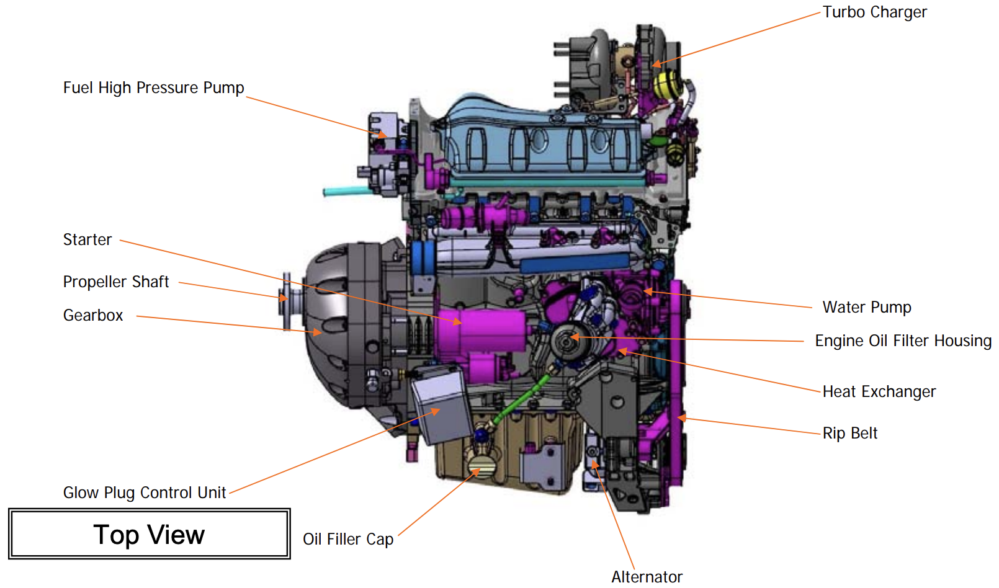
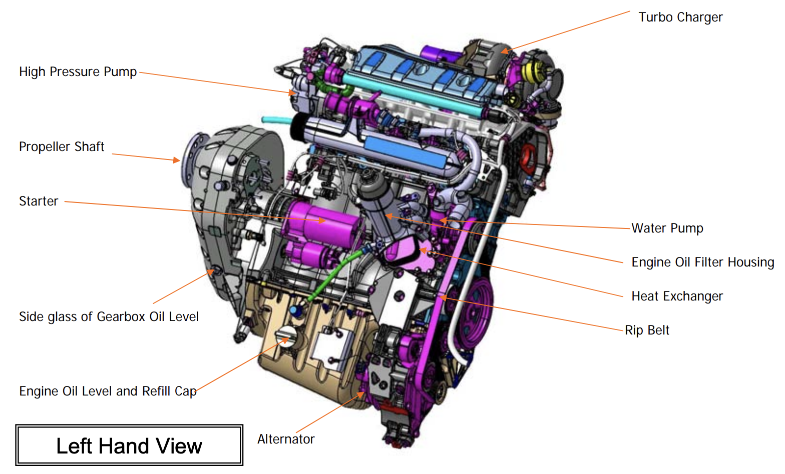
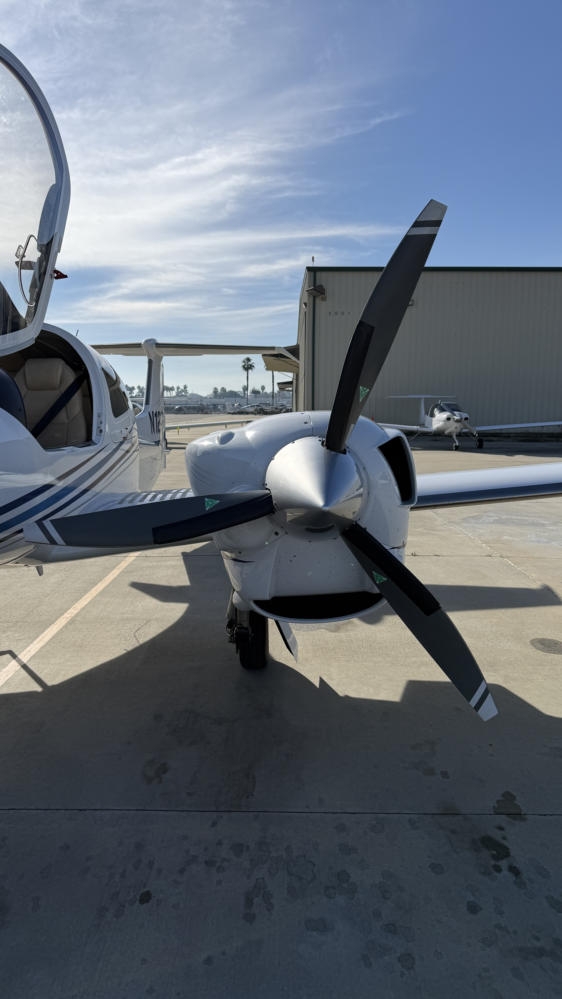

# DA42-VI: Power Plant

---

<left>

## Engine

- 2x Austro E4-C diesel engines
- 4 cylinders
- Liquid-cooled
- Common-rail direct injection
- Reduction gear 1:1.69
- Dual digital engine control unit (ECU)
- Turbocharger
- Max power: 165HP
  100% for 5min, 92% continuously

</left>
<right>

---

---

---

---

---

## Engine Control Unit (ECU)

- 2x ECU
- Voter switches (3-position)
- Default: AUTO
  - Operating hours
  - Malfunction

---

## ECU Test

Only if:
- Power leveler IDLE
- Voter switch AUTO
- Gearbox temperature in green range
- Air/ground sensor ON GROUND

   

(image: voter switch)

---

<left>

## ECU Failure

</left>
<right>

</right>

---

## Load

- Power lever selects "Load" in %

---

## Propeller

- 3-blade wooden propeller
- Constant speed
- Feathering
- Prop pitch by ECU (electro-mechanical actuator)
- Governor by gearbox oil
  - high oil pressure => low pitch (high RPM)
  - low oil pressure => high pitch (low RPM)

---

## Feathering System

When gear oil pressure is lost
- Feathering
When > 1300rpm:
- Engine master OFF => Feathering
When < 1300rpm:
- High pitch lock

Unfeathering
- Engine master ON => oil pressure from accumulator
- Starter => oil pressure build up 

---

## Failure

---

## Preflight: Air Inlet

---

## Preflight: Oil Check

- Engine oil
- Gearbox oil

     

---

## Preflight: Fire Detection System

- overheat detector in hot area of each engine
- Warning >250°C
- Test button

   

---

## Limitations

- Max overspeed: 2500RPM, 20sec
- Minimum temperature: -30°C (oil, gearbox, coolant, fuel)
- Gearbox temperature
  - Minimum at full load: 35°C
- Coolant temperature
  - minimum at full load: 60°C

---

## Starter Limitations

On ground:
- < 10 sec
- 60 sec cool down

In the air:
- < 5 sec
- 30 sec cool down
- <= 3 attempts

---

## Inflight Engine Restart

<red>NO intentional shutdown <3000ft AGL or >10,000ft pressure altitude</red>
 

<left>

- < 10,000ft: within 2min
- 10,000 - 18,000ft: immediate

If MÄM 42-938 is installed:
|OAT|Max engine OFF time|
|:--:|:--:|
|<-15°C|2min|
|-15 to -5°C|5min|
|>-5°C|10min|

</left>
<right>

with starter:
- <100 KIAS or stationary prop

windmilling restart:
- 125-145 KIAS

</right>

---

<left>

## Alternate Air

</left>
<right>

(image: alternate air lever)

</right>

---

## Engine Shutdown

On ground:
- <10% for 1min
- Engine master OFF

