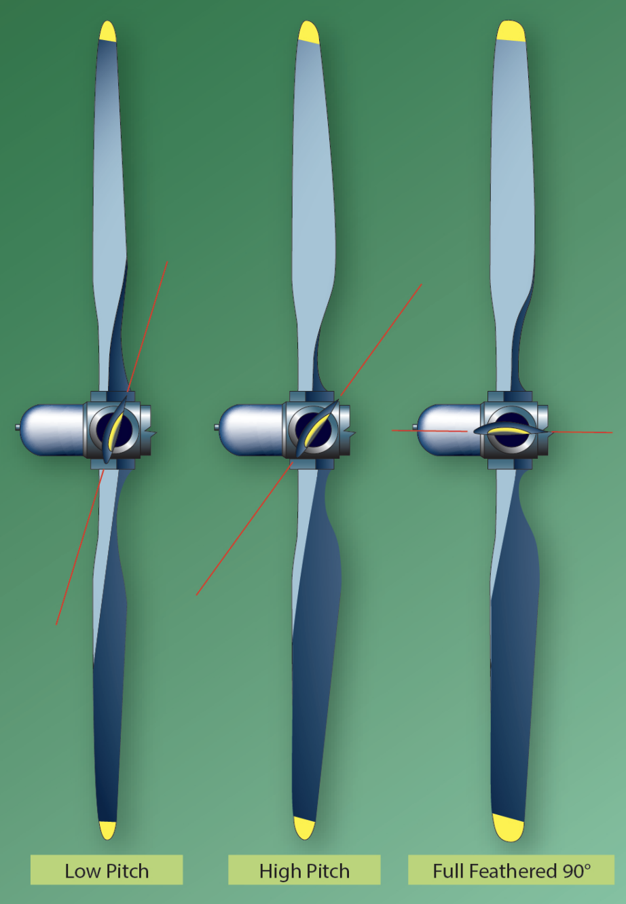
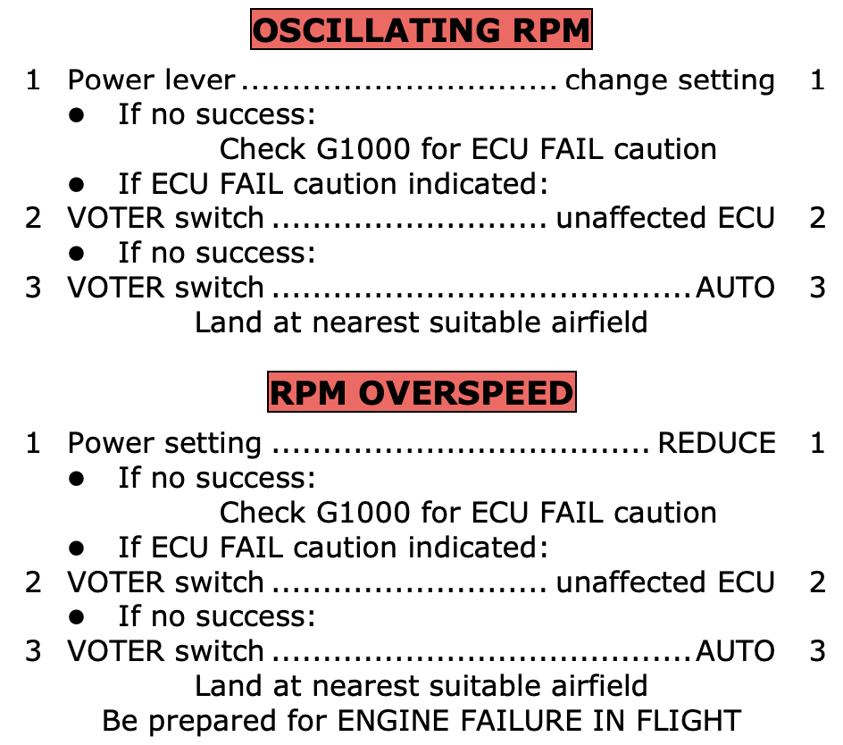

# DA42-VI: Propeller

---

## Constant-Speed Propeller

<!--
Propeller:
- parasite drag (as much as from entire airframe)

Propeller advance ratio: forward speed / rotational speed
-->

---

## Constant-Speed Propeller

Fail-Safe Design: when oil pressure from one engine is lost...

<col-2>

**Single-engine airplane**
- prop shall keep working
- Hub spring => low pitch
- Oil pressure => high pitch

</col-2>
<col-2>

**Multi-engine airplane**
- prop shall stop with minimum drag
- Hub spring => high pitch (feather)
- Oil pressure => low pitch

</col-2>

<!--
- single-engine: no need to fly fast; need to land
-->

---

## Multi-Engine Propeller

- Aerodynamic force + oil pressure => low pitch
- counterweights (centrifugal force) => high pitch
- spring / high pressure air => full feathered

---

## DA42 Propeller

- 3-blade wooden propeller
- Constant speed
- Feathering
- Prop pitch by ECU (electro-mechanical actuator)
- Governor by gearbox oil
  - high oil pressure => low pitch (high RPM)
  - low oil pressure => high pitch (low RPM)

---

## Feathering System

When gear oil pressure is lost
- Feathering
When > 1300rpm:
- Engine master OFF => Feathering
When < 1300rpm:
- High pitch lock

Unfeathering
- Engine master ON => nitrogen/oil accumulator release pressure
- Starter => oil pressure build up 

---

## Failure

