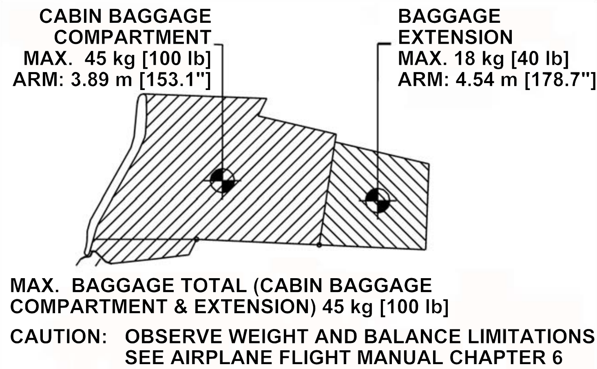
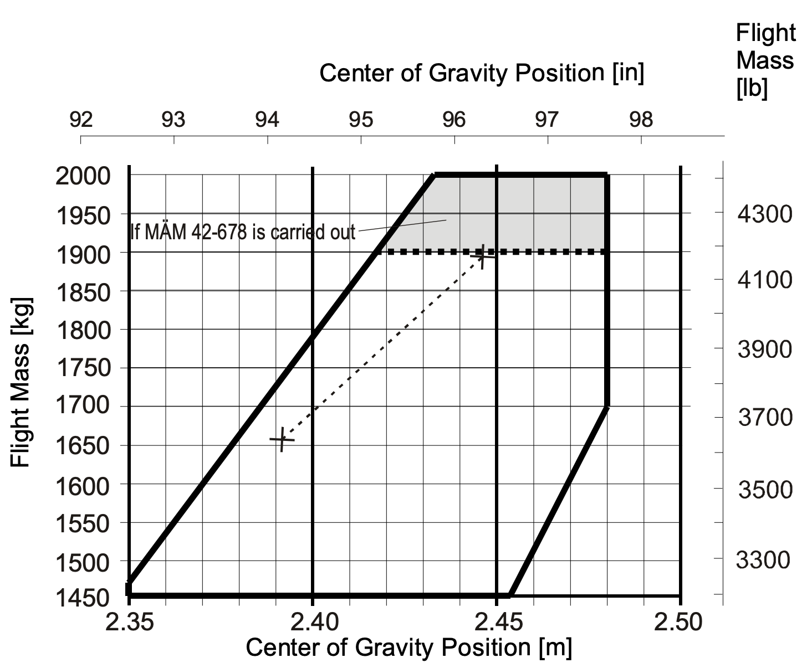

# DA42: Weight Balance

---

## Weight

<col-2>

**Aircraft Weight**

||Weight|
|--|--:|
|Empty|3278lbs (example)|
|Max Takeoff|4407lbs[1]|
|Max Zero Fuel|4045lbs[2]|
|Max Landing|4407lbs[2]|

<footnote>

[1] if MÄM 42-678 is installed
[2] if MÄM 42-659 is installed

</footnote>

</col-2>
<col-2>

Empty Weight includes:
- Brake fuild
- Hydraulic fluid (gear)
- Engine oil
- Coolant
- Gearbox oil
- Unuseable fuel (main tank: 2x1gal)
- Unuseable fuel (aux tank: 2x0.5gal)

</col-2>

---

## Weight

**Baggage Compartment**

||Weight|
|--|--:|
|Nose|66lbs|
|Cabin Baggage |100lbs|
|Baggage Extension|40lbs|
|Cabin Baggage + Extension|100lbs|

---

## Weight

**Fuel**

- JET A1: 6.7 lbs/gal
- Diesel: 7.0 lbs/gal
- <non-key>AVGas: 6lbs/gal

---

## Balance

