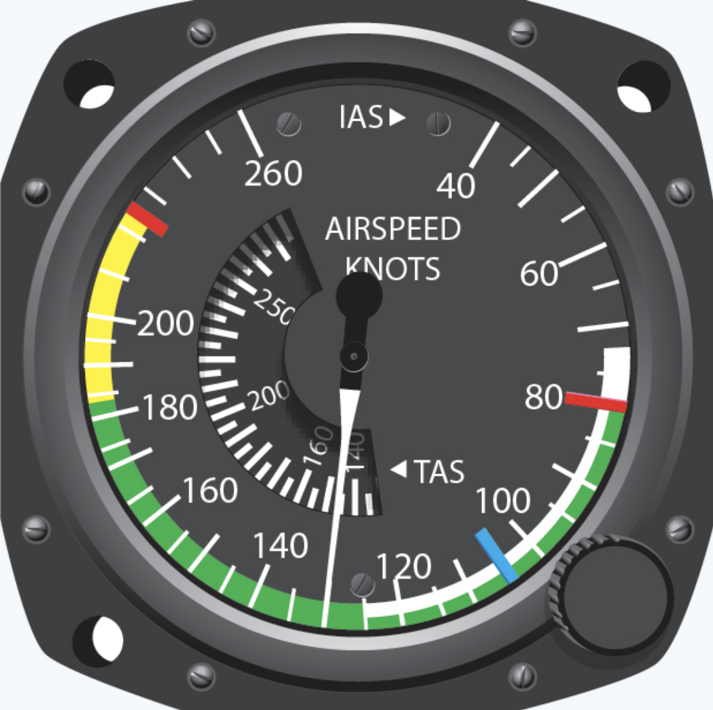

# Definitions

---

"small" multi-engine airplane: MTOW < 12,500 lbs
"light-twin": MTOW < 6,000 lbs

One Engine Inoperative (OEI)
- performance
  - -50% power
  - -80-90% climb performance
- control

---

## V-Speeds

- VR - rotation speed
- VLOF - lift-off speed
- VXSE - best angle-of-climb speed with OEI
- VYSE - best rate-of-climb speed with OEI (<blue>blue radial line</blue>)
- VSSE - safe (minimum), single-engine speed
- VMC - minimum control speed with OEI (<red>red radial line</red>)

<footnote>* at sea level, standard day, max takeoff weight</footnote>

<!--
- VYSE - minimum rate of sink if above single-engine absolute ceiling.
- VSSE - to intentionally render critical engine inoperative
- VMC - to maintain straight (not necessarily level / climb-able) flight with bank angle <= 5°; only directional control.
-->

---

## Certification for Normal Category Airplane

(for <= 19 passenger seats & MTOW ≤ 19,000 lbs)

**Certification Level**

- Level 1: 0-1 passenger seats
- Level 2: 2-6 passenger seats
- Level 3: 7-9 passenger seats
- Level 4: 10-19 passenger seats

**Performance Level**

- Low Speed: VNO ≤ 250 kts
- High Speed: VNO > 250 kts

---

**Climb Performance Requirements**

(For Type certificate after 2/4/1991)
- Level 2 Low Speed
  - All engine operative & initial climb configuration: >= 8.3% (landplanes)
  - OEI: >= 1.5% at 5000ft pressure altitude

<reference>

[14 CFR Part 23.2120][1]

[1]: https://www.ecfr.gov/current/title-14/section-23.2120

</reference>
