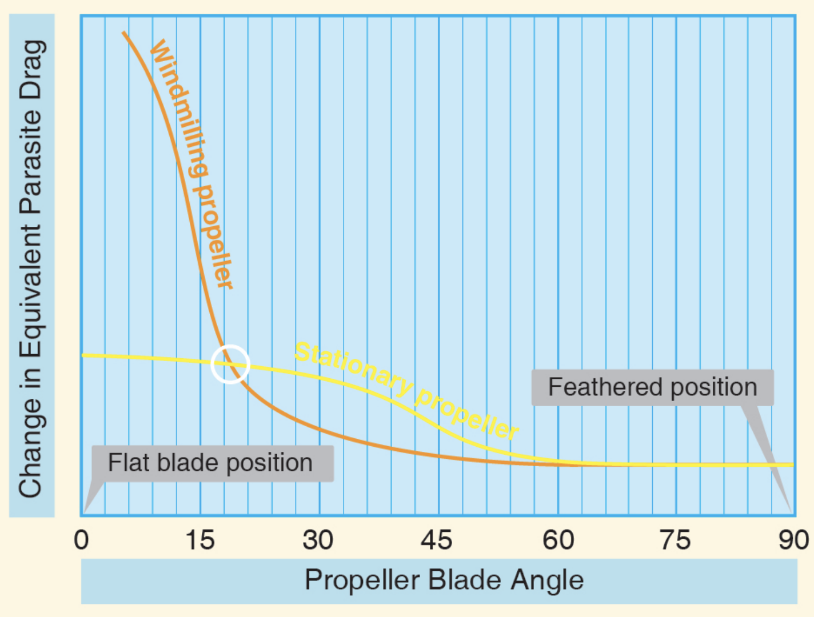

"small" multi-engine airplane: MTOW < 12,500 lbs
"light-twin": MTOW < 6,000 lbs

One Engine Inoperative (OEI)
- performance
  - -50% power
  - -80-90% climb performance
- control

---

## V-Speeds

- VR - rotation speed
- VLOF - lift-off speed
- VXSE - best angle-of-climb speed with OEI
- VYSE - best rate-of-climb speed with OEI (<blue>blue radial line</blue>)
- VSSE - safe (minimum), single-engine speed
- VMC - minimum control speed with OEI (<red>red radial line</red>)

<footnote>* at sea level, standard day, max takeoff weight</footnote>

<!--
- VYSE - minimum rate of sink if above single-engine absolute ceiling.
- VSSE - to intentionally render critical engine inoperative
- VMC - to maintain straight (not necessarily level / climb-able) flight with bank angle <= 5°; only directional control.
-->

---

## Certification for Normal Category Airplane

(for <= 19 passenger seats & MTOW ≤ 19,000 lbs)

**Certification Level**

- Level 1: 0-1 passenger seats
- Level 2: 2-6 passenger seats
- Level 3: 7-9 passenger seats
- Level 4: 10-19 passenger seats

**Performance Level**

- Low Speed: VNO ≤ 250 kts
- High Speed: VNO > 250 kts

---

**Climb Performance Requirements**

(For Type certificate after 2/4/1991)
- Level 2 Low Speed
  - All engine operative & initial climb configuration: >= 8.3% (landplanes)
  - OEI: >= 1.5% at 5000ft pressure altitude

<reference>

[14 CFR Part 23.2120][1]

[1]: https://www.ecfr.gov/current/title-14/section-23.2120

</reference>

---

# Operation of Systems

---

## Constant-Speed Propeller

- Single-engine: oil pressure => high pitch
- Multi-engine: oil pressure => low pitch

<!--
- reduce parasite drag
(from propeller, as much as parasite drag of entire airframe)
-->

---

## Multi-Engine Propeller

- Aerodynamic force + oil pressure => low pitch
- counterweights (centrifugal force) => high pitch
- spring / high pressure air => full feathered

---

## Feathering

0. Propeller: > 800 RPM
1. Prop control: full aft
2. Governor: dump Oil
3. Counterweights: drive towards feather
4. Sprint / high pressure air: force prop into feather

[image: prop control in aft position]

<!--
Complete secure of engine:
- fuel mixture
- boost pump
- fuel selector
- ignition
- alternator
- cowl flaps
- air bleed
might manipulate the incorrect switch
-->

---

## Unfeathering

0. Prop control: out of feathered position
1. Unfeathering accumulator (engine oil): release
2. Propeller: windmilling
3. Fuel & ignition: start engine
4. Unfeathering accumulator: recharge

(Electric start as backup)

[image: prop control in start position]

---

## Engine Shutdown

why propeller doesn't feather after shutdown?
- Anti-feather lock pin: ON when < 800 rpm

[image: lock pin]

---

## Propeller Synchronization

- Prop synchronizer: match rpm
- Prop synchrophaser: match blade position

[image: synchronizer]
[image: synchrophaser]
[image: spin disk]

<!--
Reduce noise & vibration
-->

---

## Fuel Crossfeed

- As emergency procedure
- As normal operation*

**Before Takeoff Check**
1. ON; 1min with > 1500 RPM
1. OFF; 1min with > 1500 RPM

[image: fuel switch]

---

## Combustion Heater

- Gas furnace
- For cabin comfort and windshield defogging
- Automatic over-temperature protection (thermal switch)
- Cool-down before shutting down

---

## Yaw Damper

- Yaw Rate => Gyro / accelerometer => Servo => Rudder
- OFF during takeoff / landing

---

## Nose Baggage Compartment

- Weight & balance
- Secure load
- Secure door latches

[image: nose baggage compartment]

<!--
Don't become preoccupied when open door; fly the airplane
-->

---

## Anti-Icing

- Heated pitot tube
- Heated static port
- Heated fuel vents
- Electrothermal boots / alcohol slingers for propeller blades
- Heated
- Heated / alcohol-sprayed windshield
- Heated lift detector
- Heated air intake lip
- Sweeping wing

Actuate before icing condition

---

## Deicing

- Pneumatic boots for wing and tail leading edges

---

## Flight into Known Icing Condition

- Avoid using flaps
- No autopilot
- No severe icing
- No indefinite flight

---

# Performance

---

## Definitions

- **Accelerate-Stop Distance**
0 => VR => engine failure => stop

- **Accelerate-Go Distance**
0 => VR => engine failure => climb to 50ft AGL

<!--
Accelerate-go distance:
- instantaneously recognize engine failure
- react: retract landing gear
- react: identify & feather correct engine
- maintain airspeed and bank angle
- 50ft: a wingspan; if ground is level & no obstructions

Regulation: no requirement on runway length
ADM: always use runway > accelerate-go distance

Decision point: landing gear is selected up
-->

---

## Definitions

- **All-Engine Service Ceiling**
Highest altitude with steady climb rate of 100fpm

- **Single-Engine Service Ceiling**
Highest altitude with steady climb rate of 50fpm

---

# Weight Balance

---

## Complications

- Nose baggage compartment
- Aft baggage compartment
- Nacelle lockerd
- Main fuel tanks
- Aux fuel tanks
- Nacelle fuel tanks
- Seating options

---

## Terms

Standard empty weight + Optional equipment = Basic empty weight

 

<col-2>

**Standard empty weight**
- full hydraulic fluid
- unuseable fuel
- full oil

</col-2>
<col-2>

**Optional equipment**
equipment installed beyond standard

</col-2>

---

## Weight Limits

- **Zero Fuel Weight**

  Useful Load = Max Takeoff Weight - Basic Empty Weight
  Payload = Max Takeoff Weight - Zero Fuel Weight

[drawing: C172 vs DA42]

---

## Weight Limits

- **Ramp Weight**
- **Max Landing Weight**

---

# Operations

---

## Taxi

- Longer wingspan
- Differential power for turning
  <red>no sharp turn</red>
- Cowl flaps: OPEN

<!--
not designed for pivoting about inbound wheel/landing gear.
-->

---

## Before Takeoff

takeoff distance with 50ft clearance + stopping distance with 50ft clearance

---

## Takeoff

- <red>NO</red> sharp turn onto runway + rolling takeoff

If turbocharged, set throttle:
- Hold brake
- Advance smoothly
- Below red line manifold pressure

During takeoff roll:
- Check both engines
  (manifold pressure, rpm, fuel flow, fuel pressure, EGT, oil pressure)

<!--
unporting fuel tank
-->

---

## Takeoff (cont.)

- < VMC
  If one engine fails: reject takeoff; close both throtle; use rudder & brake.
- VR: rotate
- (initial climb speed to 50ft)
- VY

<!--
- < VMC: no directional control
-->

---

## Initial Climb

- Apply brake after liftoff
- Retract landing gear when:
  - insufficient runway available
  - positive rate of climb
  - before VYSE

- transition to enroute climb speed after 500 AGL

<!--
Once gear is up, commit to GO
-->

---

## Short-Field Takeoff

- If VX within 5kts of VMC: reconsider
- If airborne before VMC + 5kts: use soft-field takeoff technic

---

## Rejected Takeoff

- Maintain control

---

## Short-Field Landing

<red>Cautious</red>
- sudden reduction of power => high sink rate
- retract flaps during rollout => chance of retracting landing gear instead

---

## Touch-and-Go

<red>DISCOURAGED</red>

<!--
due to risk of accidentally retracting landing gears.
-->

---

## Go-Around

1. Takeoff power
1. Pitch (as needed)
1. (Positive rate of climb)
1. Flaps: TO (<red> before flaps retraction speed</red>)
1. Landing Gears: UP
1. Accelerate to VX/VY
1. Flaps: UP

---

## Inflight

Vertical speed is more sensitive to power settings

---

## Simulated Engine Failure

**During Takeoff Roll**
- < 50% VMC

**After Takeoff**
- \> 400 AGL
