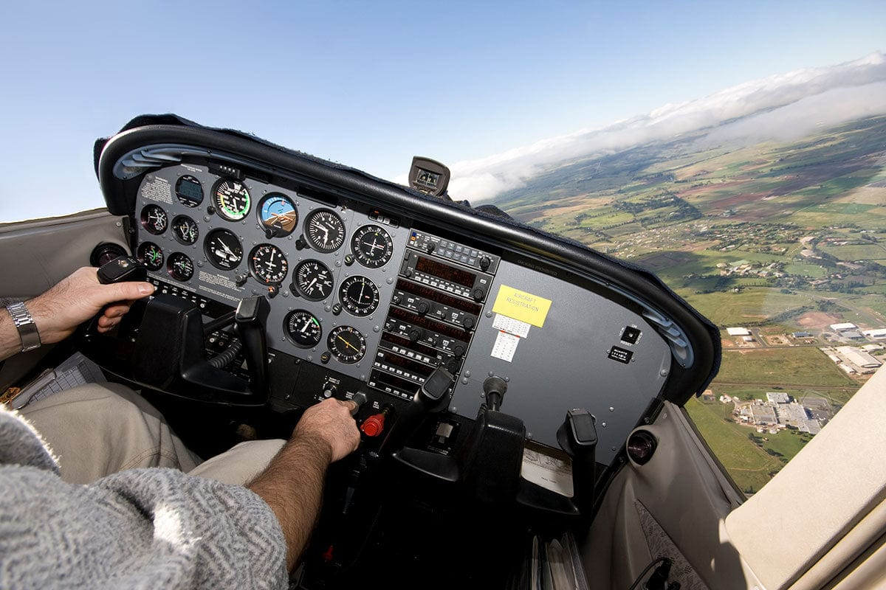

# Steep Turns

---

## Purpose

Demonstrate load factor during turns.

## Outcome

Be able to perform turns without altitude loss.

---

## Setup

1. <red>Clearing Turn</red>

<flex-col>

**Airspeed**
- VA

</flex-col>
<flex-col>

**Heading**
- Select

</flex-col>
<flex-col>

**Altitude**
- Select
- Recover >1500 AGL (ASEL)
- Recover >3000 AGL (AMEL)

</flex-col>

---

<col-2>

## Entry

1. Power: +5%
1. Bank: 45° (50° for commercial)
1. Pitch: increase

Upon reaching initial heading:
1. Pitch: reduce
1. Rollout
1. Repeat in opposite direction

</col-2>
<col-2>

---

## Exit

1. Power: 50%
1. Resume straight & level flight

---

## ACS Standard

||Airspeed|Heading|Altitude|Bank|
|--|:--:|:--:|:--:|:--:|
|Private Pilot|±10 kts|± 10°|± 100ft|± 5°|
|Commercial Pilot|±10 kts|± 10°|± 100ft|± 5°|
|Flight Instructor|±10 kts|± 10°|± 100ft|± 5°|
