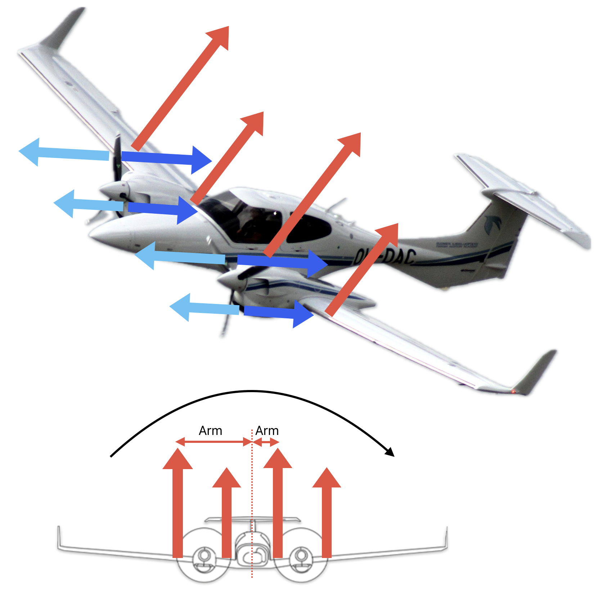
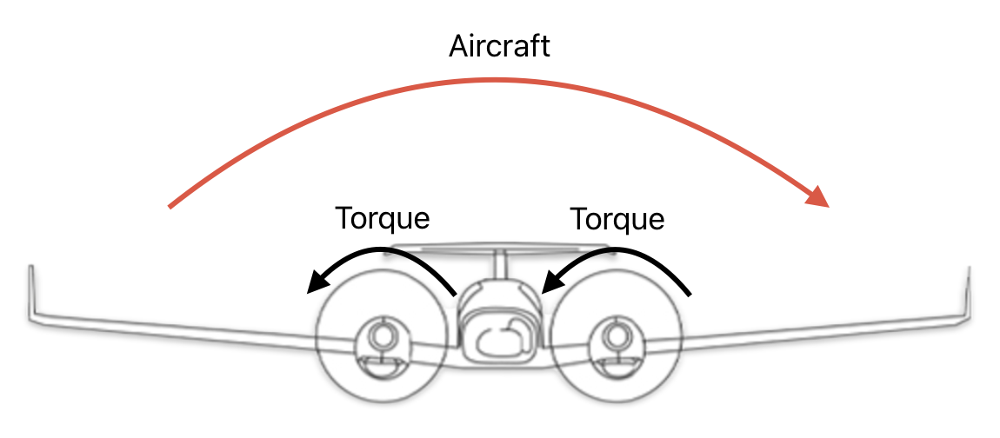
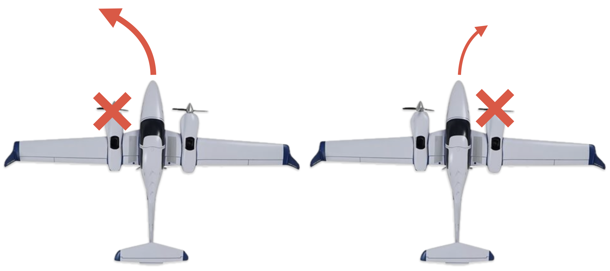
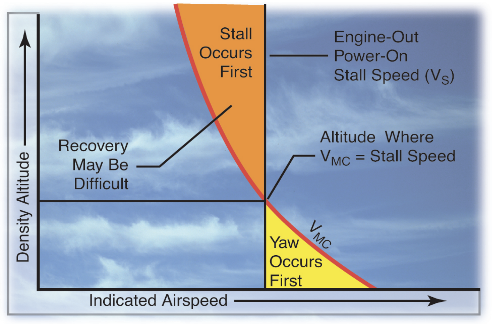

# Single-Engine Operation

---

## Aerodynamic Factors

- P-factor
- Accelerated slipstream
- Spiraling slipstream
- Torque

---

## P-Factor

- Descending blade: more thrust
- Ascending blade: less thrust

|Left engine fails|Right engine fails|
|:--:|:--:|
|More yaw to left|Less yaw to right|

---

## Accelerated Slipstream

Due to P-factor...

- Descending blade: more airflow
- Ascending blade: less airflow

|Left engine fails|Right engine fails|
|:--:|:--:|
|More roll to left|Less roll to right|

<!--
slipstream => about 12% faster airflow
-->

---

## Spiraling Slipstream

Due to P-factor...

- Descending blade: lower pressure
- Ascending blade: higher pressure

=> Slipstream drift to right

|Left engine fails|Right engine fails|
|:--:|:--:|
|Less airflow over rudder|same airflow over rudder|

---

## Torque

<non-key>

Newton's 3rd law: for every action there's an equal and opposite reaction.

</non-key>

|Left engine fails|Right engine fails|
|:--:|:--:|
|Torque amplifies left roll|Torque offset right roll|

---

## Critical Engine

Most adverse effect on directional control upon failure

||Left engine fails|Right engine fails|
|--|:--:|:--:|
|P-factor|+ left yaw|- right yaw|
|Accelerated  Slipstream|+ left roll|- right roll|
|Spiraling  Slipstream|- rudder authority|no change|
|Torque|Amplifies Left roll|Offset right roll|

---

## Control

If using rudder only...

---

## Control

If using bank only...

<!--
Excessive bank:
- uncomfortable
- reduce performance (more drag, less vertical lift)
-->

---

## Zero Sideslip

With both engines operative:
- Coordinated flight (0° bank, ball centered)

With OEI:
- bank 2-3° towards good engine
- ball one-half towards good engine

=> Best climb performance

  

---

## Minimum Control Speed: VMC

- Maintain control of airplane
- Maintain straight flight with bank angle < 5°

 

Increases, when:
- Drag ↑ on inoperative engine (windmilling, high rpm)
- Power ↑
- CG moves aft
- Weight ↓
- Flaps & landing gear UP
- Bank angle ↓

<!--
lower weight:
  => lower inertia / momentum
  => lower lift => lower horizontal component of lift when banking => less force to counter turns towards inop engine

-1° bank angle => +3kts VMC

Flaps: increase drag on operating engine's wing, counteracts yaw
-->

---

## VMC Determination

- Windmilling propeller at takeoff position (low pitch, high rpm)
- Aft-most CG
- Lowest weight
- Landing gear up
- Flaps: TO
- Trim: TO
- No ground effect
- Bank angle: 5°

---

## VMC Determination

Static condition
- Maintain straight flight with bank angle < 5°

Dynamic condition
- Max power
- Climbing
- Cut power
- Pitch down to maintain speed
- Maintain directional control within 20° of the original entry heading

---

## VMC Demo

<col-2>

**Enter**
- Landing gear: UP
- Flaps: TO
- Slow down to VYSE + 10kts
- Trim
- Prop: HIGH
- Throttle: L-Idle, R-TO
- Rudder: Right
- Bank: right, up to 5°
- Pitch: UP, to slow down by 1kts / sec

</col-2>
<col-2>

**Recover**

(Upon recognizing uncontrollable yaw)
- Throttle: REDUCE
- Pitch: REDUCE
- Straight flight, entry heading, VYSE
- Throttle: INCREASE

</col-2>

---

## VMC Demo

As altitude increases:
- VMC decreases towards VS

<red>Avoid stall by immediately...</red>
- Reduce pitch
- retard throttle

<!--
High altitude...
=> decrease power (normally aspirated engine)
=> less asymmetric thrust

DA42: turbochargers maintain sea-level power up to 8000ft
-->

---

# Low Altitude Engine Failures

---

## Low Altitude Engine Failures

**After takeoff, before landing gear is UP**

1. Keep nose straight
1. Throttle: BOTH IDLE
1. Maintain airspeed
1. Descend to runway

---

## Low Altitude Engine Failures

**After takeoff and gear UP, inadequate climb performance**

Landing under control

<!--
DA42: ~2.6% climb rate with single engine.

very high success rate of off-airport engine inoperative landings when the airplane is landed under control.
-->

---

## Low Altitude Engine Failures

**After takeoff and gear UP, sufficient climb performance**

<flex-col>

Control
1. Rudder: maintain directional control
1. Aileron: 5-10° => 2-3° bank
1. (Power: reducing if needed)
1. Pitch: \> VMC
1. Trim

</flex-col>
<flex-col>

Configuration
...

</flex-col>
<flex-col>

Climb
...

</flex-col>
<flex-col>

Checklist
...

</flex-col>

<!--
- Only use aileron after rudder
-->

---

## Low Altitude Engine Failures

**After takeoff and gear UP, sufficient climb performance**

<flex-col>

Control
...

</flex-col>
<flex-col>

Configuration
1. Pitch: VYSE
1. Power: Takeoff
1. Flaps: Retract
1. Failed engine: Identify*
1. Failed engine: Verify*
1. Prop: Feather

<!--
- Identify: by control input, not gauges. ("dead foot, dead engine")
- Verify: retard throttle

-->

</flex-col>
<flex-col>

Climb
...

</flex-col>
<flex-col>

Checklist
...

</flex-col>

---

## Low Altitude Engine Failures

**After takeoff and gear UP, sufficient climb performance**

<flex-col>

Control
...

</flex-col>
<flex-col>

Configuration
...

</flex-col>
<flex-col>

Climb
1. Aileron: 2-3° bank
1. Rudder: one-half ball
1. Pitch: VYSE
1. Turn: above 400 AGL, shallow

</flex-col>
<flex-col>

Checklist
...

</flex-col>

---

## Low Altitude Engine Failures

**After takeoff and gear UP, sufficient climb performance**

<flex-col>

Control
...

</flex-col>
<flex-col>

Configuration
...

</flex-col>
<flex-col>

Climb
...

</flex-col>
<flex-col>

Checklist
1. Secure engine

</flex-col>

---

# Inflight Engine Failures

---

## Inflight Engine Failures

- Fly the airplane
- Use Checklist

<col-2>

**Non-catastrophic failures**
- fuel starvation
- carb ice
- mixture
- fuel vapor

Leave the engine running

</col-2>
<col-2>

**Catastophic failures**
- heavy vibration
- smoke
- blistering paint
- trails of oil

Secure engine and divert

</col-2>

---

## Other Considerations

For extended signle-engine operation
- Crossfeed

If above single-engine absolute ceiling
- Fly VYSE

During single-engine descent
- Deceiving: absence of dramatic yaw & performance loss
- Upon suspected failure, advance both engine mixture / throttle / prop to identify

---

# Engine Inoperative Approach and Landing

---

## General Procedure

Same procedure.

**Be aware of**
- Asymmetrical thrust
- Higher-than-normal power settings
- \> VYSE

---

## Downwind

Performance permitting, Ok to...
- extend landing gear
- extend initial flaps
- descent from TPA
- fly LH or RH traffic pattern

---

## Base

- Intermediate flaps if performance is adequate
- \> VYSE

---

## Final

- 3° glidepath
- Avoid sudden power change
- \> VYSE until landing is assured
- 1.3 VSO
- Expect rudder trim change*
- Expect more floating

<footnote>

consider resetting rudder trim to neutral on final

</footnote>

<!--

- Steeper approach may be acceptable
- Avoid long, flat, low approach

-->

---

## Go Around

May not be possible.