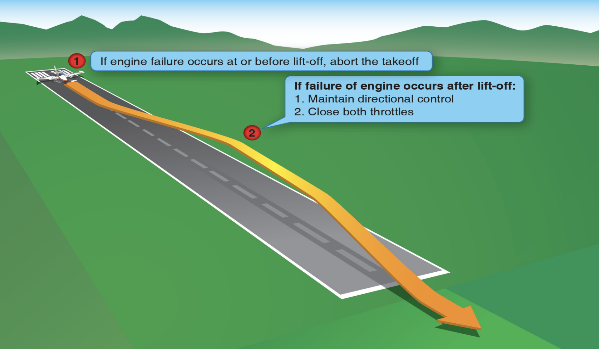
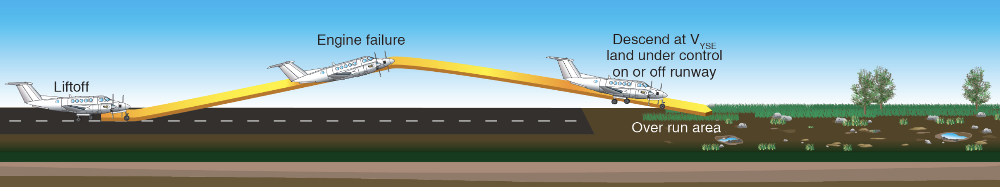
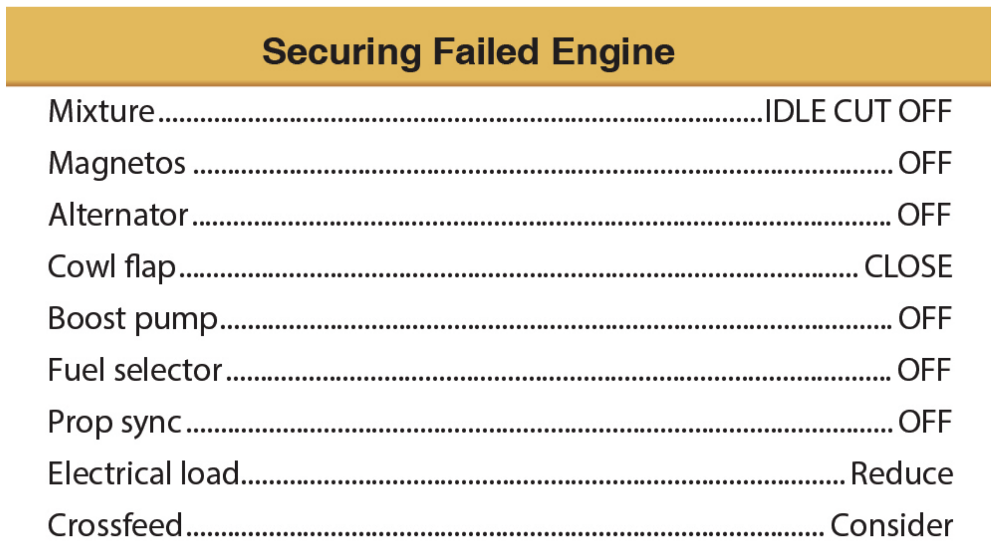

# Single-Engine Operation

---

## Low Altitude Engine Failures

**After takeoff, before landing gear is UP**

1. Keep nose straight
1. Throttle: BOTH IDLE
1. Maintain airspeed
1. Descend to runway

---

## Low Altitude Engine Failures

**After takeoff and gear UP, inadequate climb performance**

Landing under control

<!--
DA42: ~2.6% climb rate with single engine.

very high success rate of off-airport engine inoperative landings when the airplane is landed under control.
-->

---

## Low Altitude Engine Failures

**After takeoff and gear UP, sufficient climb performance**

<flex-col>

Control
1. Rudder: maintain directional control
1. Aileron: 5-10° => 2-3° bank
1. (Power: reducing if needed)
1. Pitch: \> VMC
1. Trim

</flex-col>
<flex-col>

Configuration
...

</flex-col>
<flex-col>

Climb
...

</flex-col>
<flex-col>

Checklist
...

</flex-col>

<!--
- Only use aileron after rudder
-->

---

## Low Altitude Engine Failures

**After takeoff and gear UP, sufficient climb performance**

<flex-col>

Control
...

</flex-col>
<flex-col>

Configuration
1. Pitch: VYSE
1. Power: Takeoff
1. Flaps: Retract
1. Failed engine: Identify*
1. Failed engine: Verify*
1. Prop: Feather

<!--
- Identify: by control input, not gauges. ("dead foot, dead engine")
- Verify: retard throttle

-->

</flex-col>
<flex-col>

Climb
...

</flex-col>
<flex-col>

Checklist
...

</flex-col>

---

## Low Altitude Engine Failures

**After takeoff and gear UP, sufficient climb performance**

<flex-col>

Control
...

</flex-col>
<flex-col>

Configuration
...

</flex-col>
<flex-col>

Climb
1. Aileron: 2-3° bank
1. Rudder: one-half ball
1. Pitch: VYSE
1. Turn: above 400 AGL, shallow

</flex-col>
<flex-col>

Checklist
...

</flex-col>

---

## Low Altitude Engine Failures

**After takeoff and gear UP, sufficient climb performance**

<flex-col>

Control
...

</flex-col>
<flex-col>

Configuration
...

</flex-col>
<flex-col>

Climb
...

</flex-col>
<flex-col>

Checklist
1. Secure engine

</flex-col>

---

# Inflight Engine Failures

---

## Inflight Engine Failures

- Fly the airplane
- Use Checklist

<col-2>

**Non-catastrophic failures**
- fuel starvation
- carb ice
- mixture
- fuel vapor

Leave the engine running

</col-2>
<col-2>

**Catastophic failures**
- heavy vibration
- smoke
- blistering paint
- trails of oil

Secure engine and divert

</col-2>

---

## Other Considerations

For extended signle-engine operation
- Crossfeed

If above single-engine absolute ceiling
- Fly VYSE

During single-engine descent
- Deceiving: absence of dramatic yaw & performance loss
- Upon suspected failure, advance both engine mixture / throttle / prop to identify

---

# Engine Inoperative Approach and Landing

---

## General Procedure

Same procedure.

**Be aware of**
- Asymmetrical thrust
- Higher-than-normal power settings
- \> VYSE

---

## Downwind

Performance permitting, Ok to...
- extend landing gear
- extend initial flaps
- descent from TPA
- fly LH or RH traffic pattern

---

## Base

- Intermediate flaps if performance is adequate
- \> VYSE

---

## Final

- 3° glidepath
- Avoid sudden power change
- \> VYSE until landing is assured
- 1.3 VSO
- Expect rudder trim change*
- Expect more floating

<footnote>

consider resetting rudder trim to neutral on final

</footnote>

<!--

- Steeper approach may be acceptable
- Avoid long, flat, low approach

-->

---

## Go Around

May not be possible.