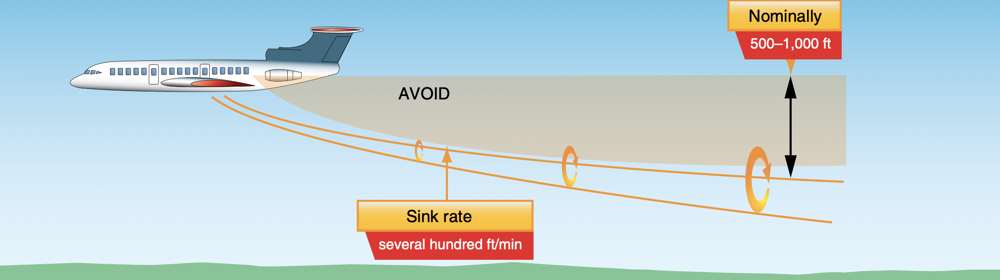

# Drag

---

## Drag Formula

$$
Drag = \frac{1}{2} \times \rho \times V^2 \times C_D \times S
$$

 

Coefficient of Drag ($C_D$):
- Airfoil
- Angle of Attack

---

## Parasite Drag

- Friction Drag
- Form Drag
- Interference Drag

---

## (Lift) Induced Drag

<!--
Like a boat sailing on water.

Below the wing: pressure near root of wing > pressure near tip of wing.
Above the wing: pressure near root of wing < pressure near tip of wing.
Consequence:
  - air flows outboard below the wing
  - air flows inboard above the wing
  - air twist at trailing edge to form vortices
  - strongest vortices at wingtip
-->

---

## Wake Turbulence

---

## Wake Turbulence

- Do NOT fly through... 
- Do NOT fly within 1000ft below...

...another aircraft's flight path.

---

|Glider|Winglet|
|--|--|
|||

---

## Parasite Drag

 

|Friction|Form Drag|Interference Drag|
|--|--|--|
||||
---

## Drag Curve

---

## Takeaway

- Faster => more energy
- Slower => more energy

<!--
During final approach to land, higher power settings may be used.
-->