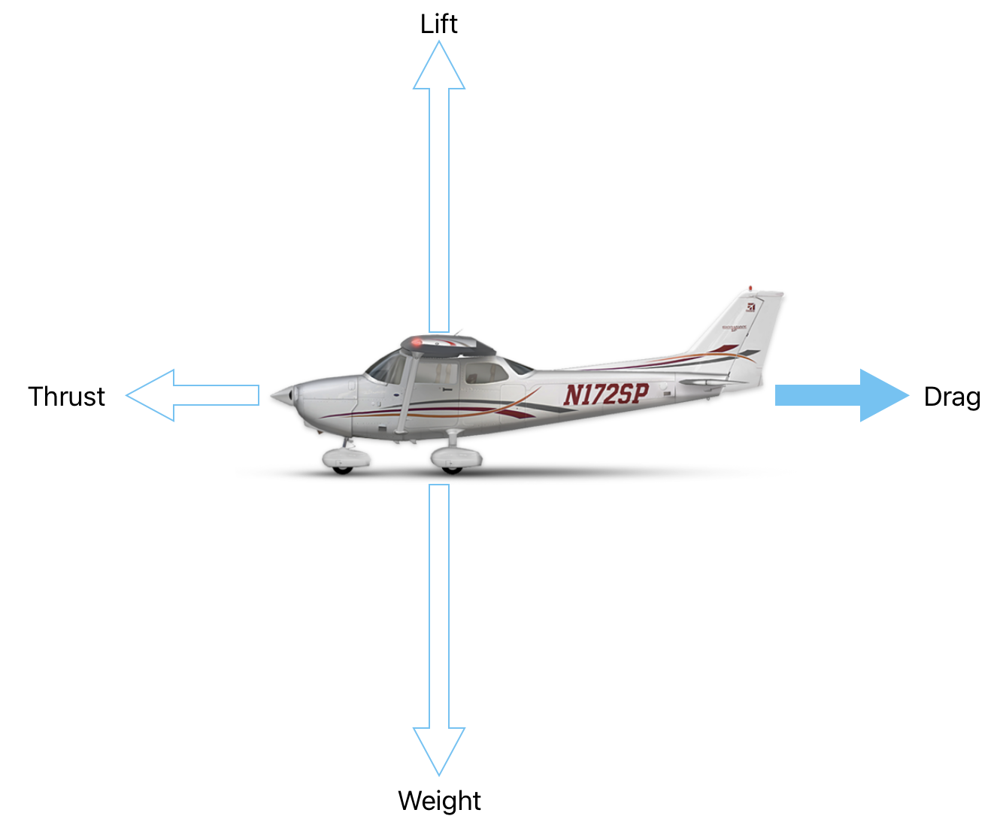
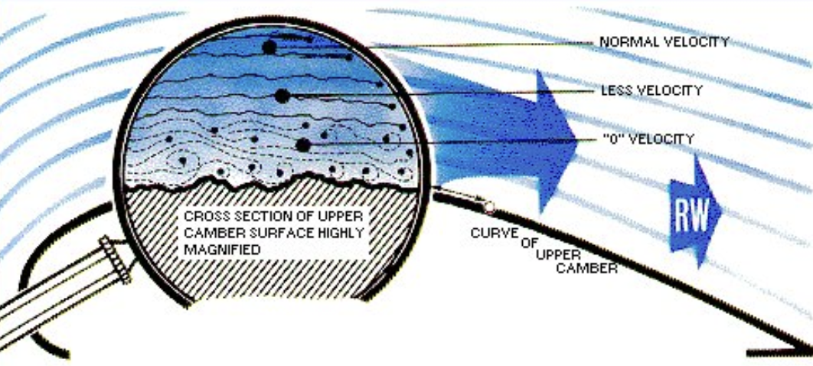
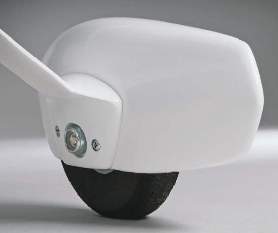
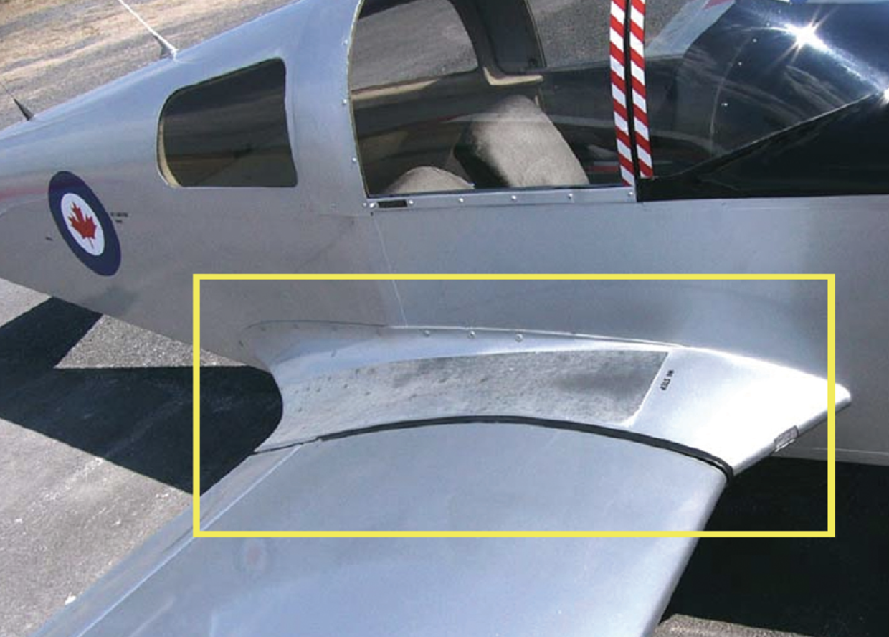
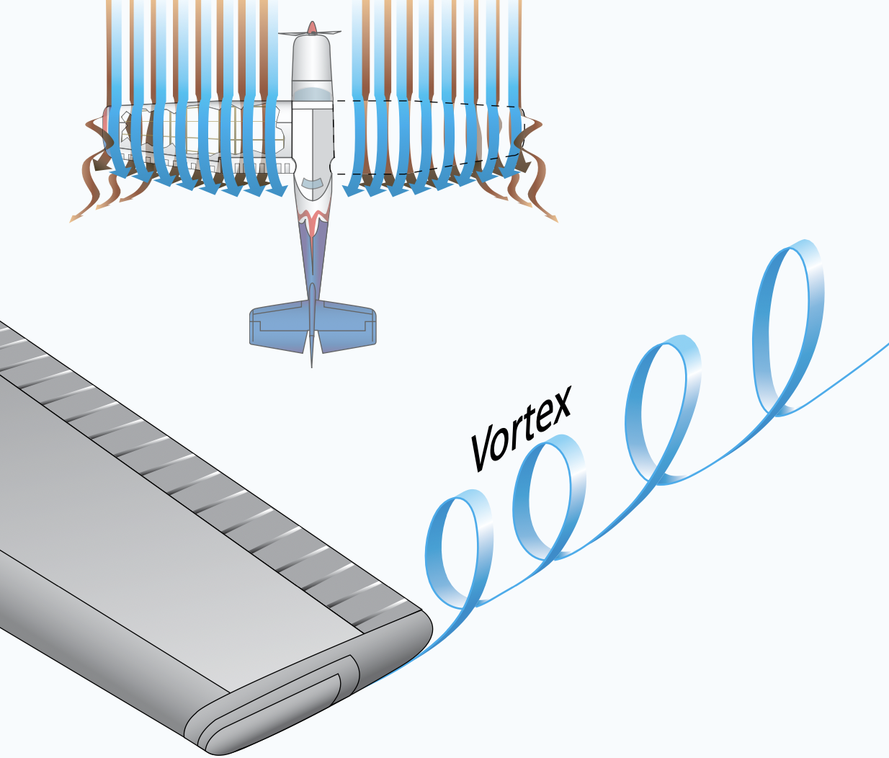
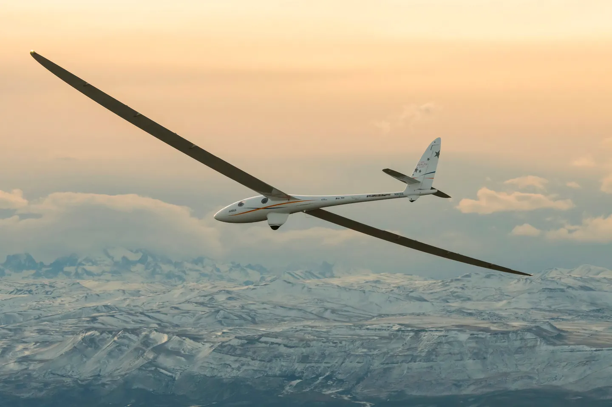
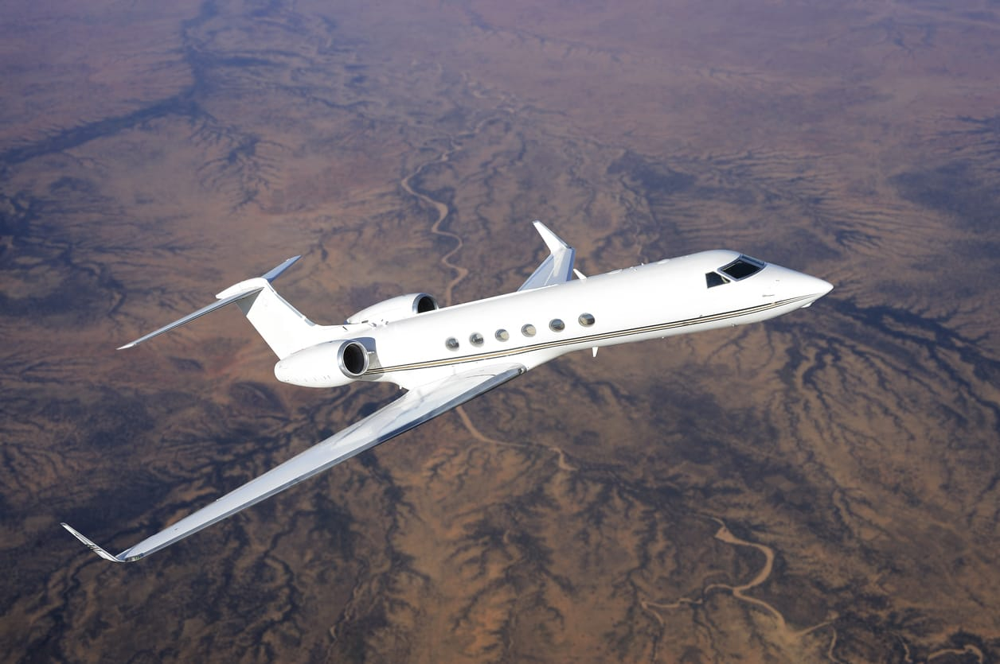
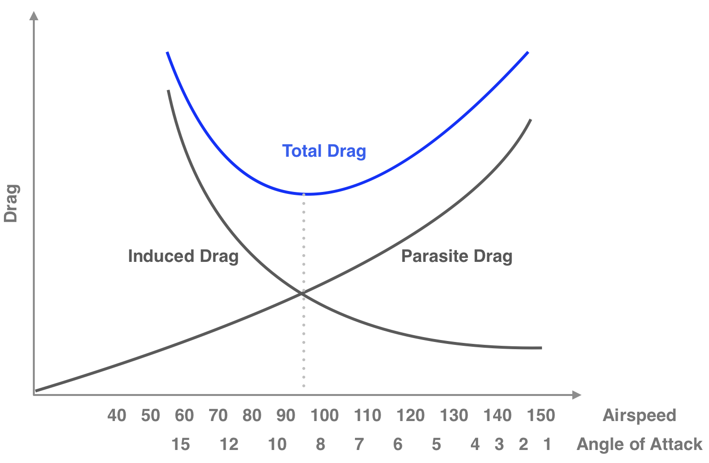

# Drag

---

## Drag Formula

$$
Drag = \frac{1}{2} \times \rho \times V^2 \times C_D \times S
$$

 

Coefficient of Drag ($C_D$):
- Airfoil
- Angle of Attack

<timer>00:01</timer>

---

## Types of Drag

- Induced drag
- Parasite drag

---

## Parasite Drag

 

|Friction|Form Drag|Interference Drag|
|--|--|--|
||||

<timer>00:03</timer>

---

## (Lift) Induced Drag

<timer>00:05</timer>

<!--
Like a boat sailing on water.

Below the wing: pressure near root of wing > pressure near tip of wing.
Above the wing: pressure near root of wing < pressure near tip of wing.
Consequence:
  - air flows outboard below the wing
  - air flows inboard above the wing
  - air twist at trailing edge to form vortices
  - strongest vortices at wingtip
  - downwash
  - tilted lift
-->

---

|Glider|Winglet|
|--|--|
|||

<!--
Glider: high apsect ratio reduced wake turbulence, but too heavy and difficult to maneuver.
-->

---

## Drag Curve

<timer>00:07</timer>

---

## Takeaway

- Faster => more energy
- Slower => more energy

<!--
During final approach to land, higher power settings may be used.
-->