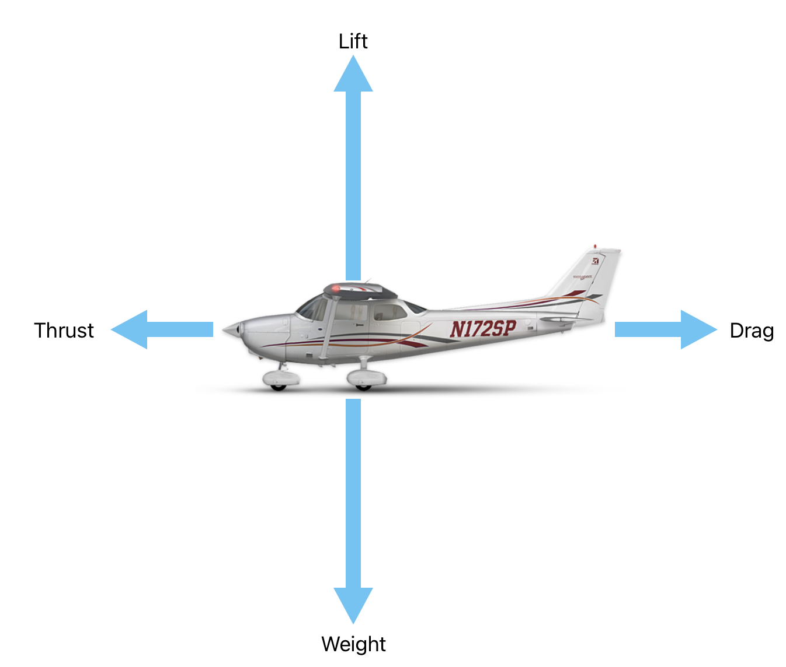

# Aerodynamics

Bowen Zhang | Dream of Flight, Inc

---

## Objective

A comprehensive understanding of all physics happened behind the scene of a flight.

---

## Prep

- Read "Pilot's Handbook of Aeronautical Knowledge":
  - [Chapter 5: Aerodynamics of Flight][1]

[1]: https://www.faa.gov/regulationspolicies/handbooksmanuals/aviation/phak/chapter-5-aerodynamics-flight

<!--
Instructor prep:
  - gyro demo kit
  - propeller
  - chinese medicine scale

-->
---

- [1. Lift, Weight and Load](lift-weight-load.md)
- [2. Drag](drag.md)
- [3. Thrust](thrust.md)
- [4. Stability](stability.md)

