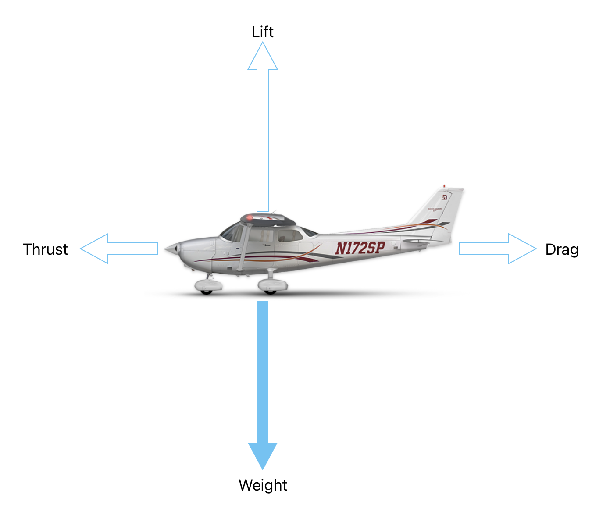
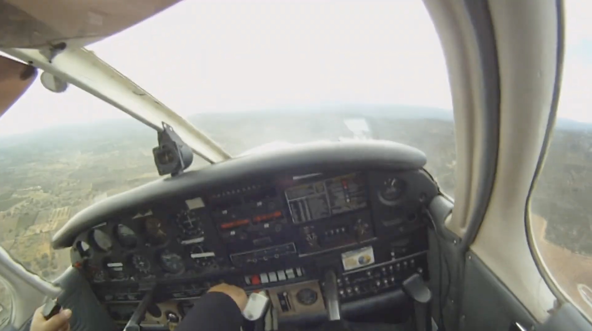
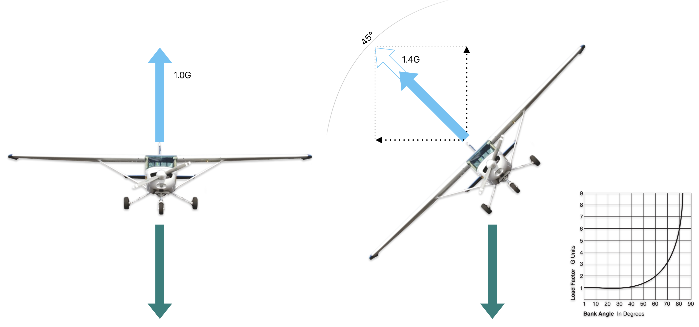
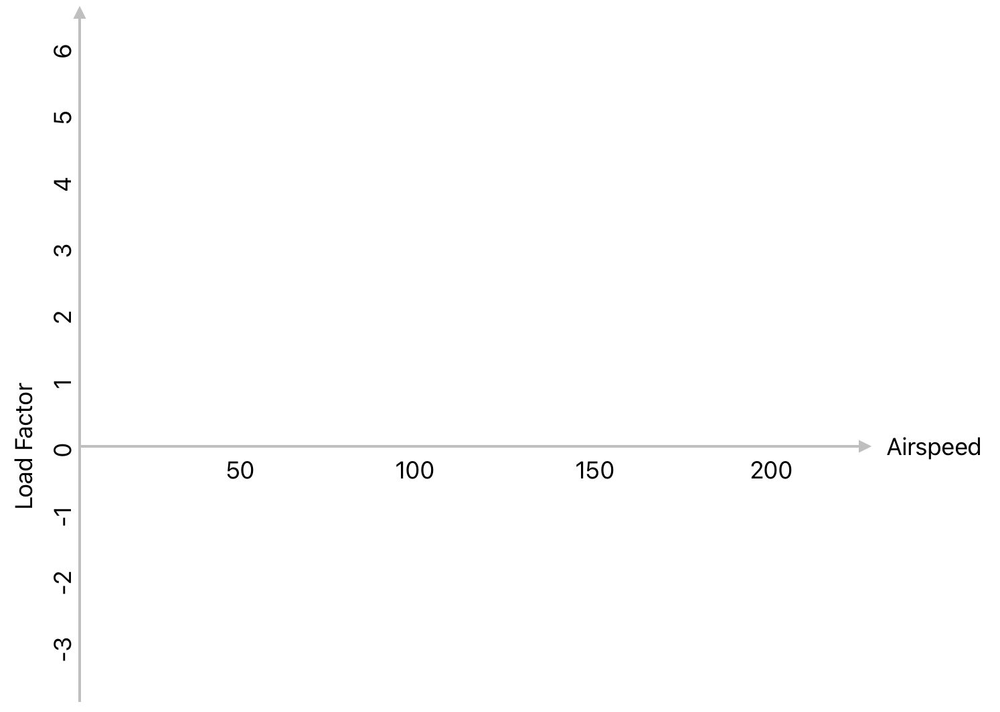
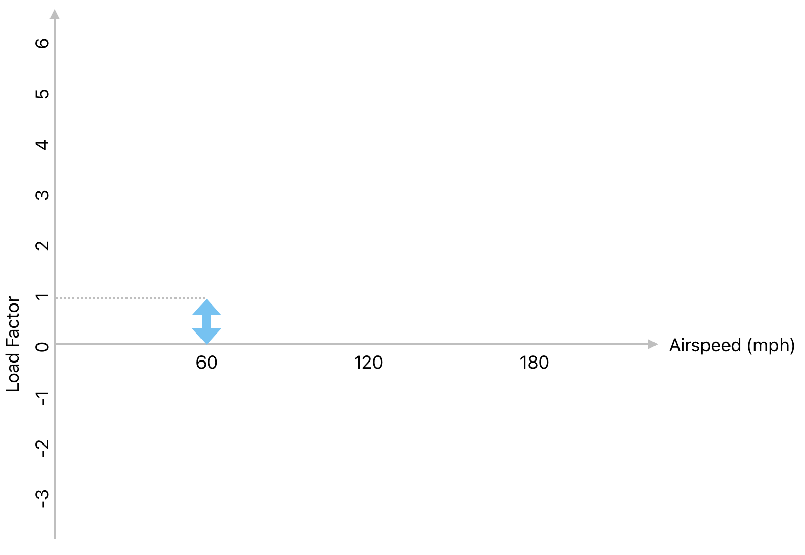
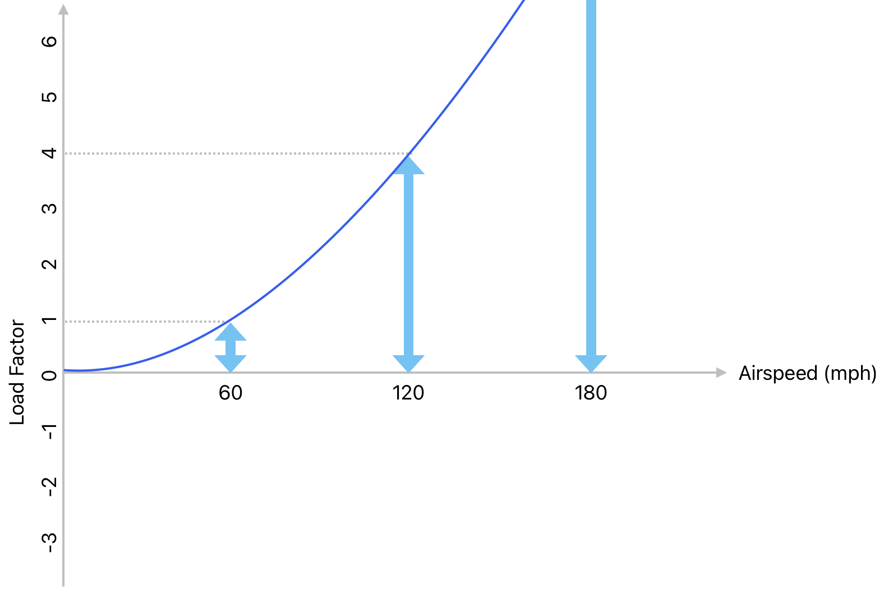
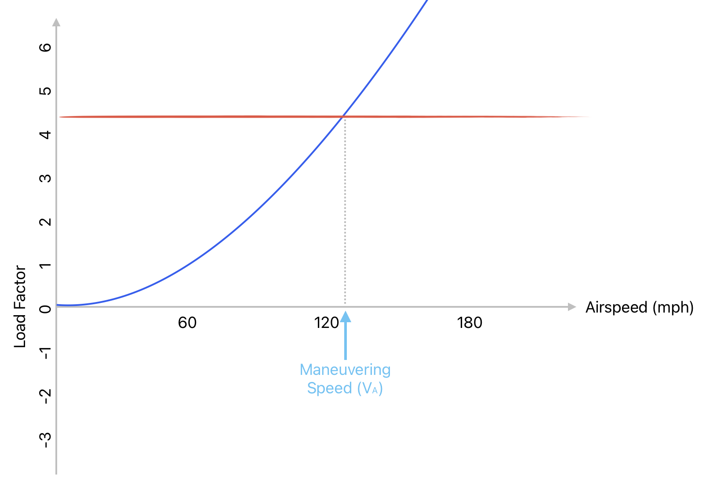
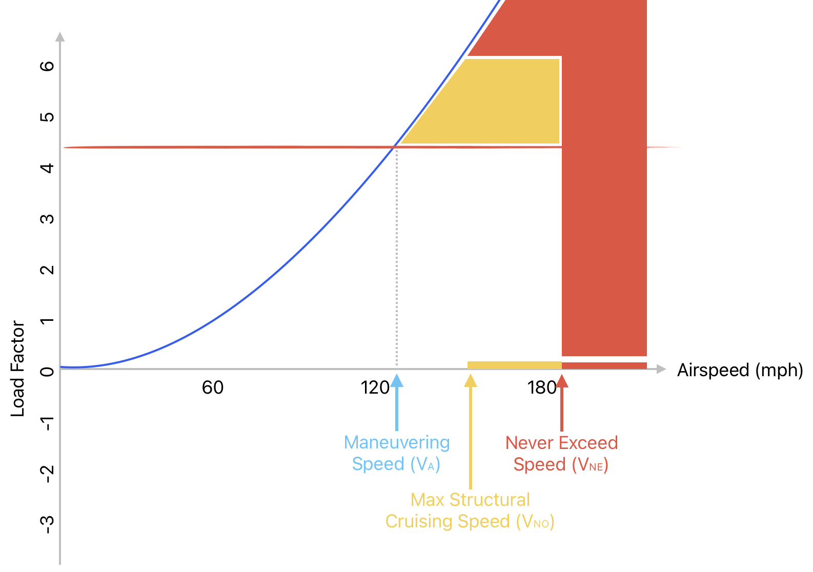

# Lift, Weight and Load

---

## Weight

$$Load Factor = \frac{Lift}{Weight}$$

---

## Load Factor $==$ 1

Whenever there's no vertical **acceleration**:
- Crusing
- Climbing
- Descending

<timer>00:01</timer>

<!--
Newton's 1st law: A body remains at rest, or in motion at a constant speed in a straight line, unless it is acted upon by a force.
-->

---

## Load Factor $\neq$ 1

|Turbulence|Turns/Rolls|
|--|--|
|||

<timer>00:04</timer>

<!--
Question: does lift always equal to weight? When would it not?
Answers:
  - Whenever vertical speed changes
    - Initiation of climb / descent
    - Leveling off from climb / descent
  - Turns
  - Turbulence

-->

---

## Load During Turns

<timer>00:05</timer>

<!--
Question: how is increased lift generated?
Answer: higher speed, or higher AoA.

-->

---

## Speed and Angle of Attack

$$Lift = \frac{1}{2} \times \rho \times V^2 \times C_L \times S$$

 
<left>

For an airplane with:
  - weight of 2000lbs
  - wings of a particular airfoil

</left>

<left>

|Speed|Angle of Attack|
|:--:|:--:|
|100mph|1.8°|
|80mph|6.1°|
|70mph|10.0°|
|65mph|14.5° (max)|

<footnote>[Airfoil Simulation](https://www1.grc.nasa.gov/beginners-guide-to-aeronautics/foilsimstudent/)</footnote>

</left>

<timer>00:06</timer>

<!--
https://www1.grc.nasa.gov/beginners-guide-to-aeronautics/foilsimstudent/
Simulation parameters:
  - Shape: Airfoil, flat bottom
-->

---

## Load and Minimum Speed

$$Lift = \frac{1}{2} \times \rho \times V^2 \times C_L \times S$$

 

|Bank Angle|Load|Normal Speed @ AoA|Minimum Speed @ Max AoA|
|:--:|:--:|:--:|:--:|
|0°|1x|100mph @ 1.8°|65mph @ 14.5°|
|30°|1.2x|100mph @ 3.3°|71mph @ 14.5°|
|45°|1.4x|100mph @ 4.8°|77mph @ 14.5°|
|60°|2.0x|100mph @ 9.7°|92mph @ 14.5°|

<footnote>*AoA: angle of attack</footnote>

<timer>00:07</timer>

---

## Load Limit

|Category|Min Limit|Max Limit|
|--|--|--|
|Normal|-1.52G|3.8G|
|Utility|-1.76G|4.4G|
|Acrobatic|-3.0G|6.0G|

<!--
Categories:
  - Normal: passenger airplanes
  - Utility: training airplanes
  - Acrobatic: acrobatic airplanes
-->

<timer>00:08</timer>

---

## Vg Diagram

[Airfoil Simulation](https://www1.grc.nasa.gov/beginners-guide-to-aeronautics/foilsimstudent/)

<timer>00:09</timer>

<!--
Exercise: how much lift can be generated at speed 0, 60, 80, 100, 120, 140, 160mph? Say at 60mph, it generates 2000lbs, and the airplane weigh 2000lbs. What does it mean when you fly with highest angle of attack at 40mph vs 160mph?
  - 40mph: stall
  - 160mph: overload
-->

---

<timer>00:10</timer>

---

<timer>00:11</timer>

---

<timer>00:12</timer>

---

<timer>00:13</timer>

<!--

- Va: prevent structural damage when maneuvering
- Vno: prevent structural damage when cruising with turbulence
- Vne: prevent structural failure

-->
