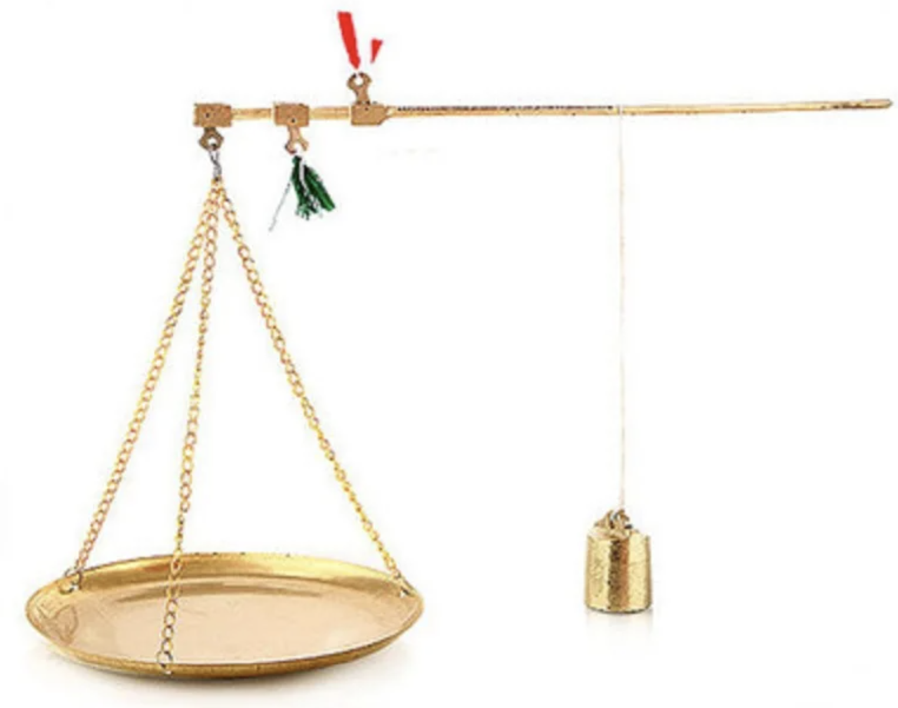
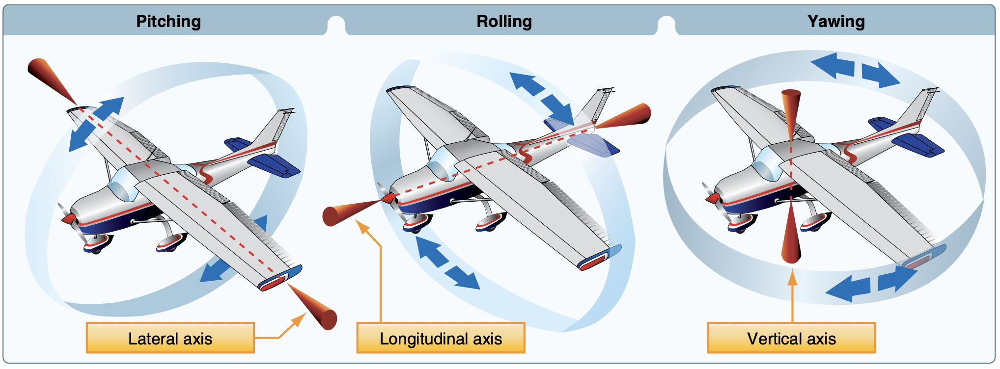
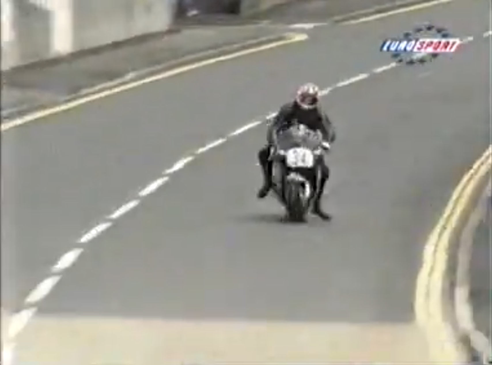
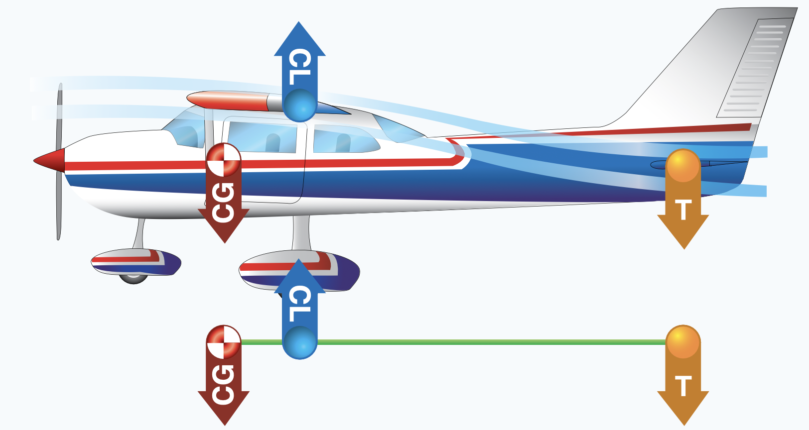
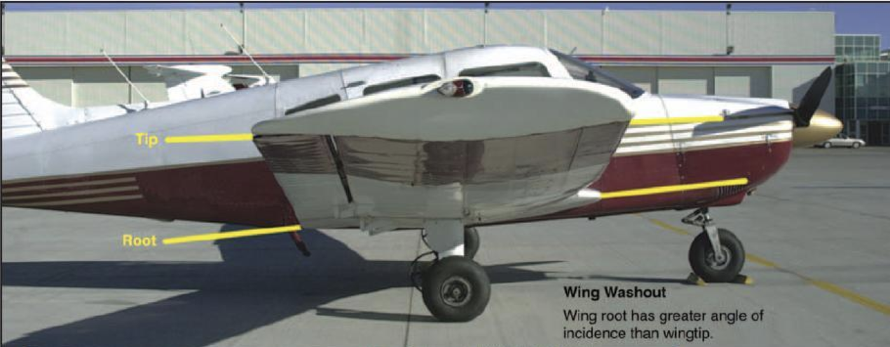
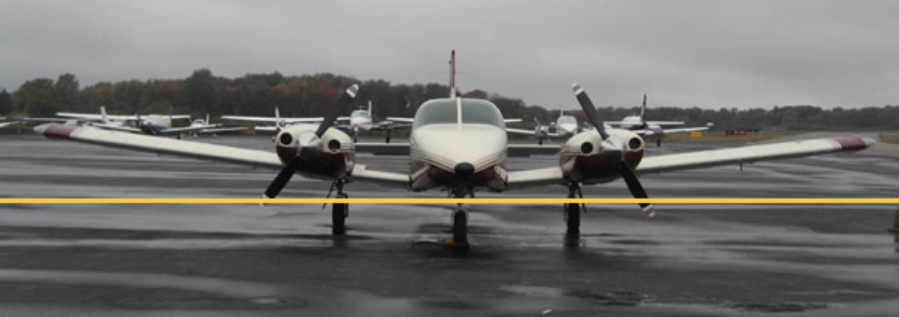
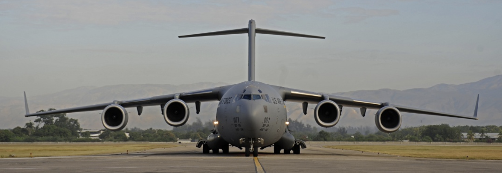
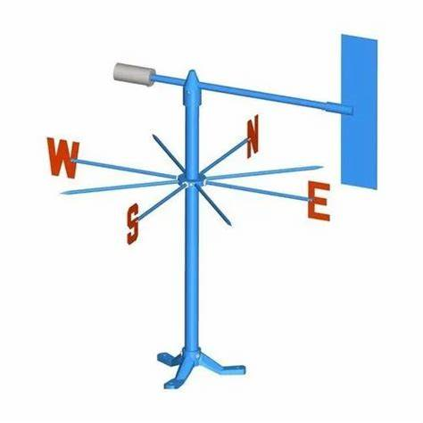
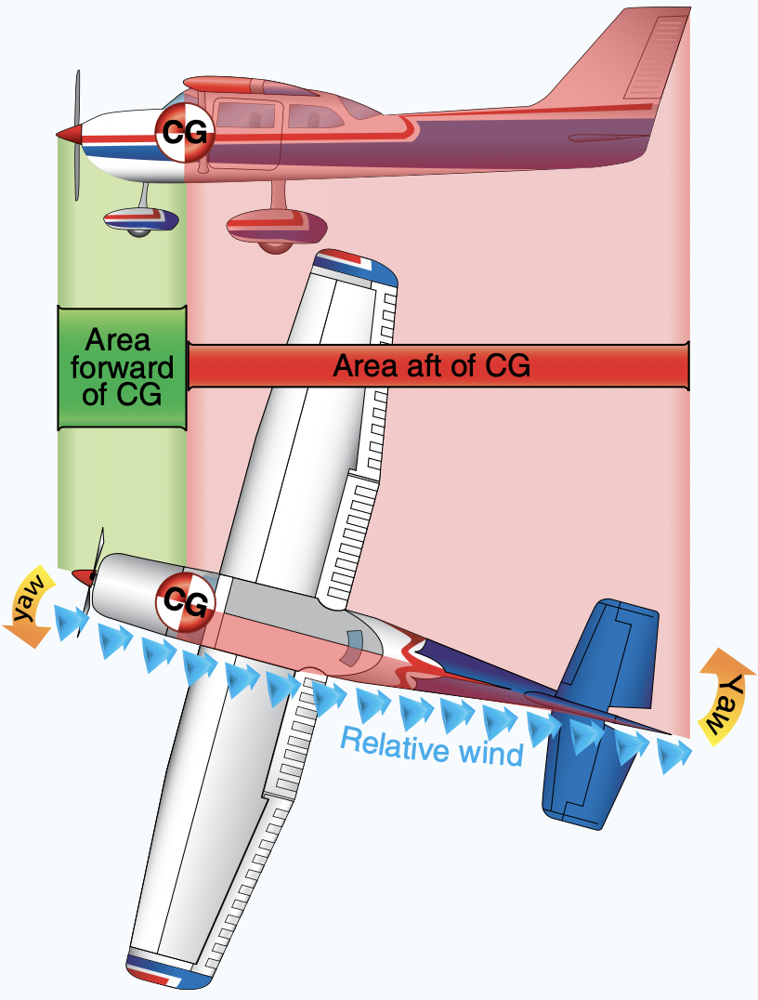

# Stability

---

## Axes of Aircraft

<timer>00:01</timer>

---

## Stability

- Static Stability: initial tendency back to equilibrium
  - Positive
  - Neutral
  - Negative
- Dynamic Stability: tendency back to equilibrium over time
  - Positive
  - Neutral
  - Negative

<timer>00:03</timer>

<!--
Static stability: the initial tendency to
return to equilibrium that the aircraft displays after being
disturbed from its trimmed condition

Dynamic stability: response over time when disturbed.
-->

---

<timer>00:04</timer>

---

## Longitudinal (Pitch) Stability

<timer>00:06</timer>

---

## Lateral (Roll) Stability

- Angle of incidence
- Dihedral
- Keel effect / Weight distribution

<timer>00:08</timer>

<!--
Angle of incidence:
  AOI at wingtip is less than AOI at wing root.
  This reduces arm when lift becomes different between left and right wings.

Dihedral:
  During initial rolling...
    - vertical component of lift at outboard wing decreases
    - vertical component of lift at inboard wing increases
  Together, it resists rolling / restores leveling.

Keel Effect:
  like boat or pendulum

-->
---

## Vertical (Yaw) Stability

<timer>00:09</timer>

---

## Takeaway

- Airplanes are designed to fly well by itself