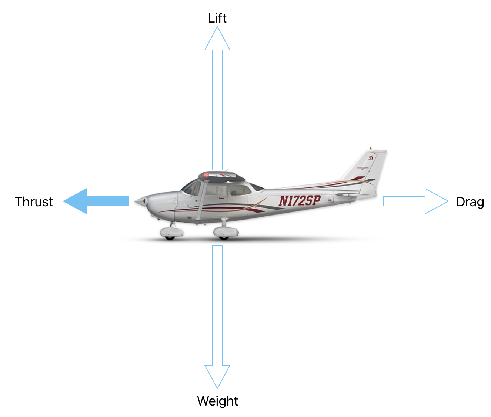
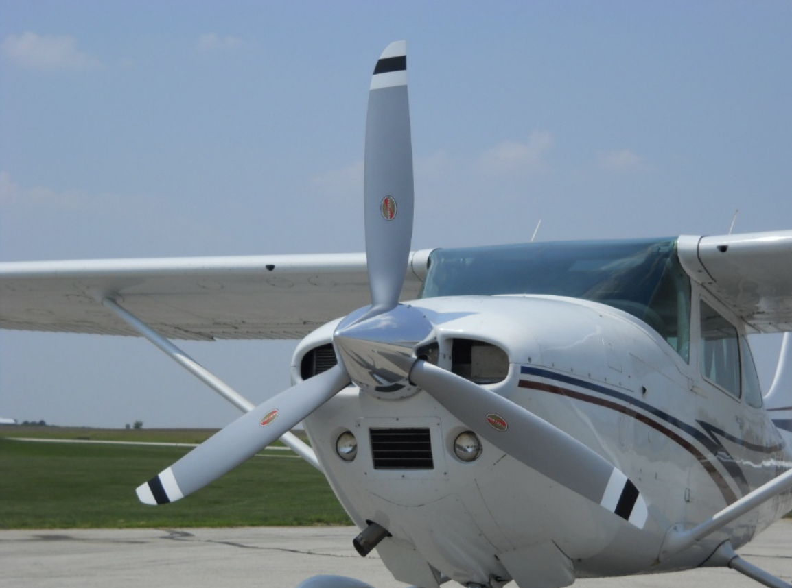
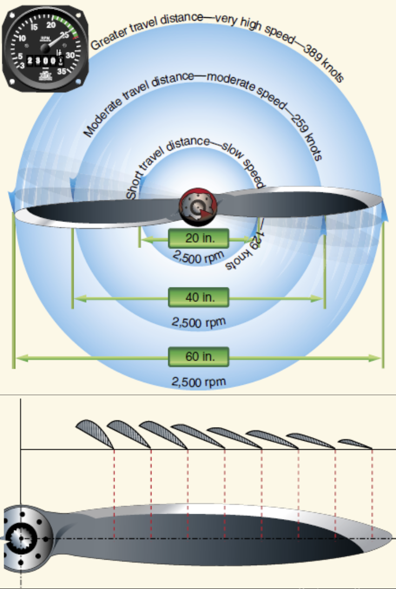
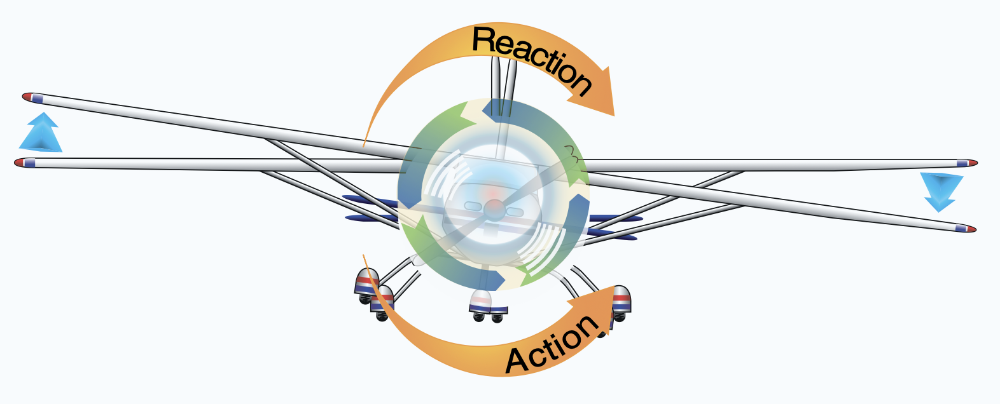
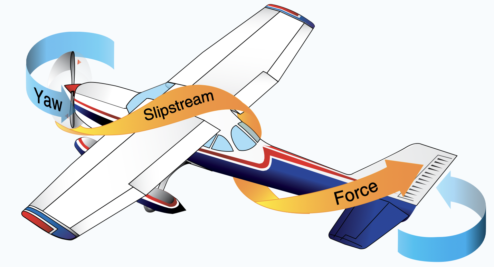
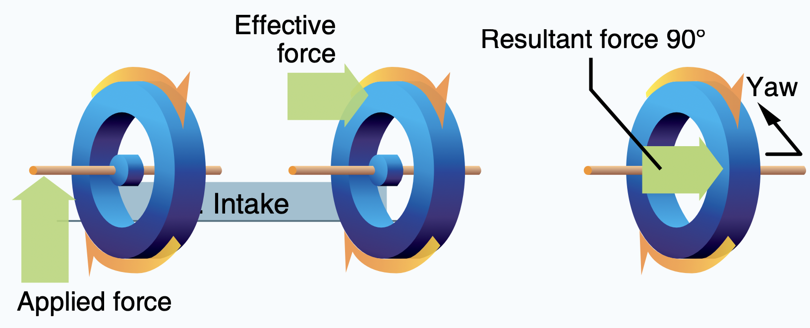
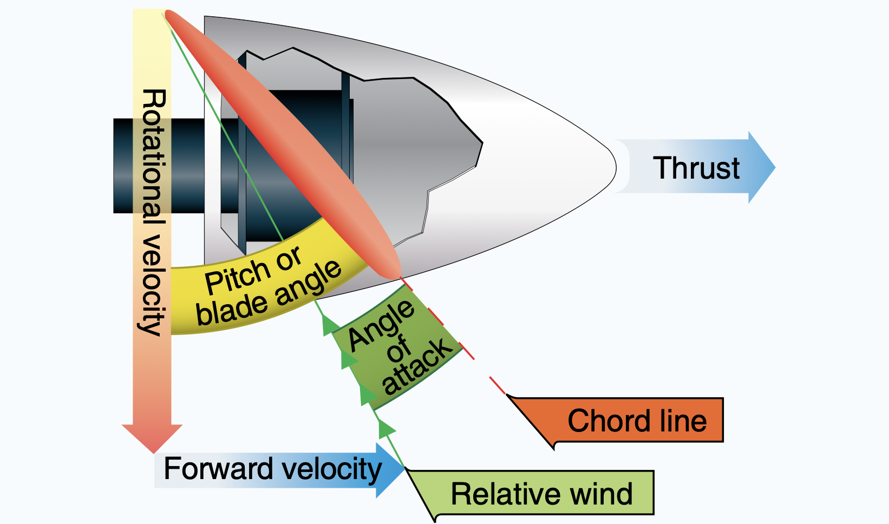
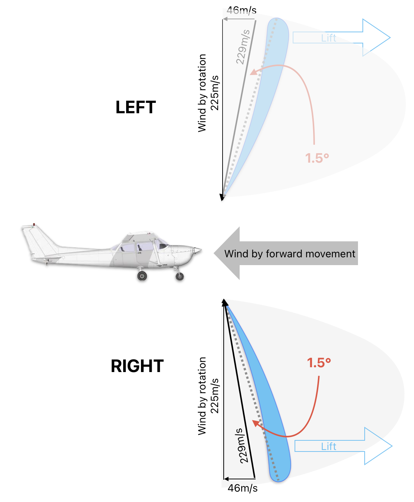
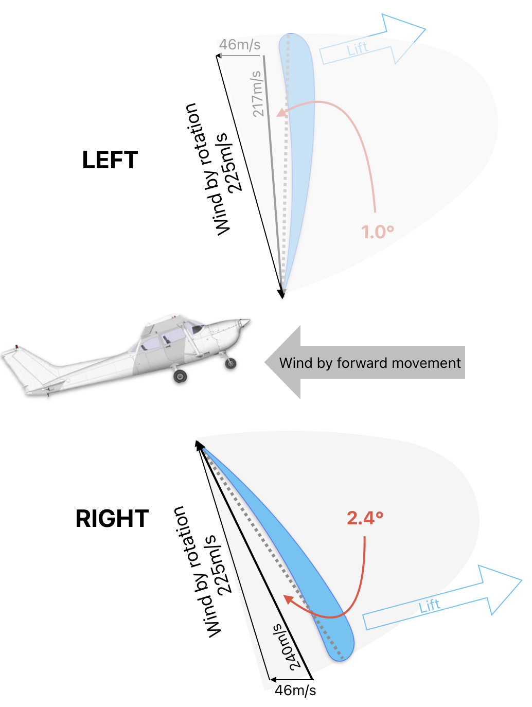

# Thrust

---

## Thrust vs Power

$Power = Force \times Velocity$

&nbsp;&nbsp;&nbsp;&nbsp;&nbsp;&nbsp;&nbsp;&nbsp;&nbsp;&nbsp;&nbsp;&nbsp;&nbsp;&nbsp;&nbsp;&nbsp;&nbsp;&nbsp;&nbsp;&nbsp;&nbsp;&nbsp;&nbsp;&nbsp;&nbsp;&nbsp;&nbsp;&nbsp;|

&nbsp;&nbsp;&nbsp;&nbsp;&nbsp;&nbsp;&nbsp;&nbsp;&nbsp;&nbsp;&nbsp;&nbsp;&nbsp;&nbsp;&nbsp;&nbsp;&nbsp;&nbsp;&nbsp;&nbsp;&nbsp;&nbsp;&nbsp;$Drag = \frac{1}{2} \times \rho \times V^2 \times C_D \times S$

 

$Power = f(V^3)$

---

<invert>

## Propeller

$Lift = \frac{1}{2} \times \rho \times V^2 \times C_L \times S$

</invert>

        

---

## Propeller Design

a 60in propeller @ 2500 RPM...
- Tip speed: 200m/s
- Root speed: 66m/s

 

$Lift = \frac{1}{2} \times \rho \times V^2 \times C_L \times S$

---

## Torque Effects

- Reaction
- Slipstream
- Gyroscopic Action
- P-Factor (asymmetric load)

---

## Reaction

<!--
Engine manufacturered in U.S.: clockwise rotation.
Consequence: left roll tendency
Mitigation: off-center mounting
-->

---

## Slipstream

<!--
Consequence: left yaw tendency.
-->

---

## Gyroscopic Action

<!--
Demo: gyroscope
  Spin a gyroscope and put the tip of axis on a pivot point.
Demo: bicycle wheel
  Hold handles mounted on a bicycle wheel, then spin it.

- Consequence:
  - When pitching up, yaw to the right;
  - When pitching down, yaw to the left;
- Mitigation: coordinated rudder input
-->

---

## P-Factor

---

## P-Factor

For an airplane flying at 90kts,
with a 74" propeller at 2400RPM...

 

When leveling:

---

## P-Factor

For an airplane flying at 90kts,
with a 74" propeller at 2400RPM...

 

When pitching up 15°:

---

## Torque Effects - Summary

  
||Crusing|High Power|Low Power|Pitching Up|Pitching Down|
|--|--|--|--|--|--|
|Reaction|Left Roll|Left Roll +|Left Roll --|
|Slipstream|Left Yaw -|Left Yaw +|Left Yaw --|
|Gyroscope||||Right Yaw|Left Yaw|
|P-Factor||||Left Yaw +|Right Yaw +|

 

<footnote>For typical U.S. single engine aircraft with clockwise rotating propeller.</footnote>

---

## Takeaway

- Keep airplane straight when changing pitch & power