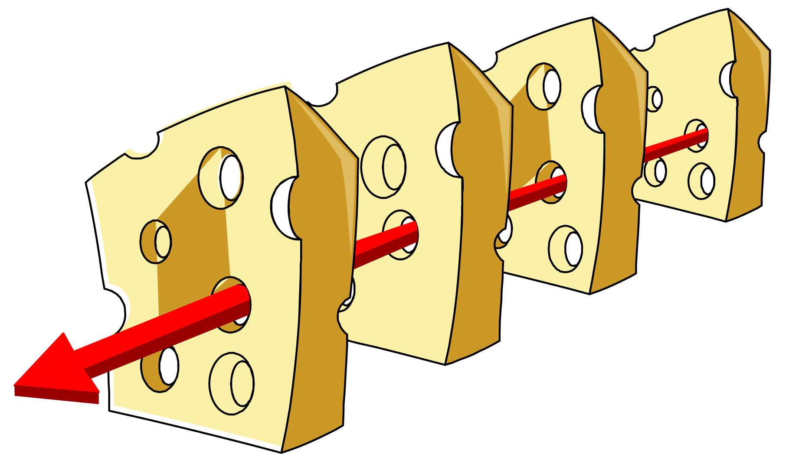
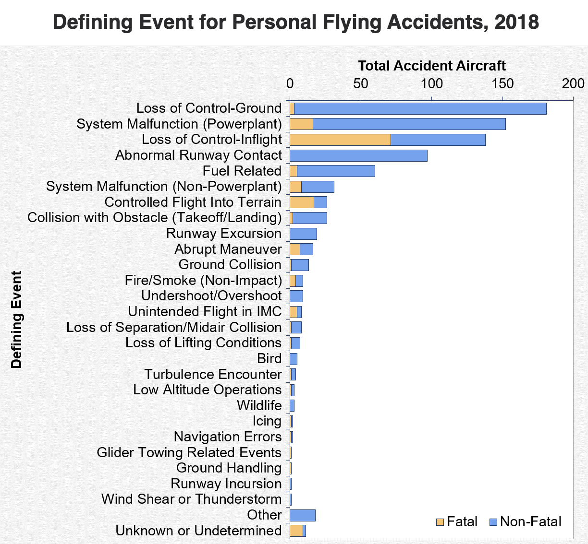
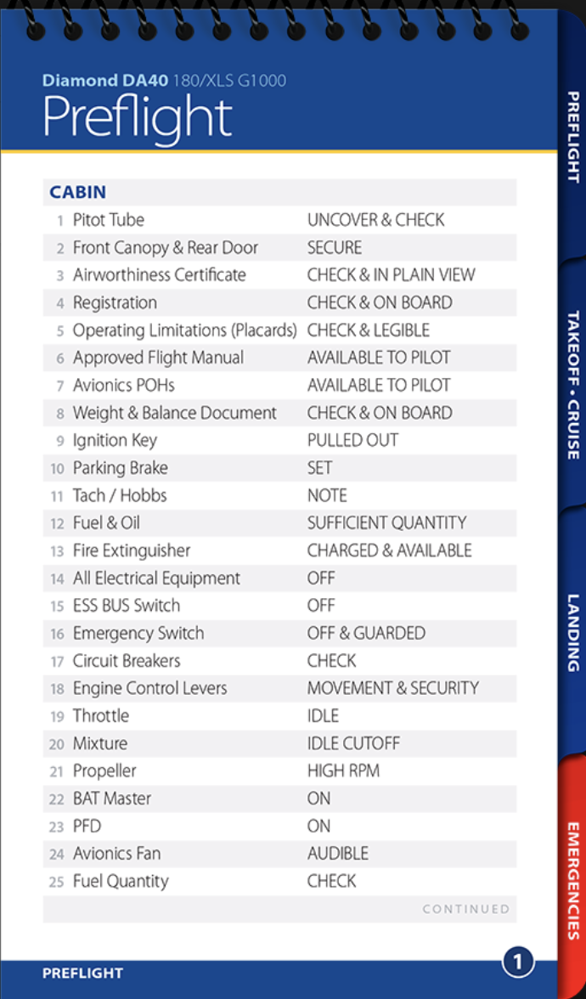
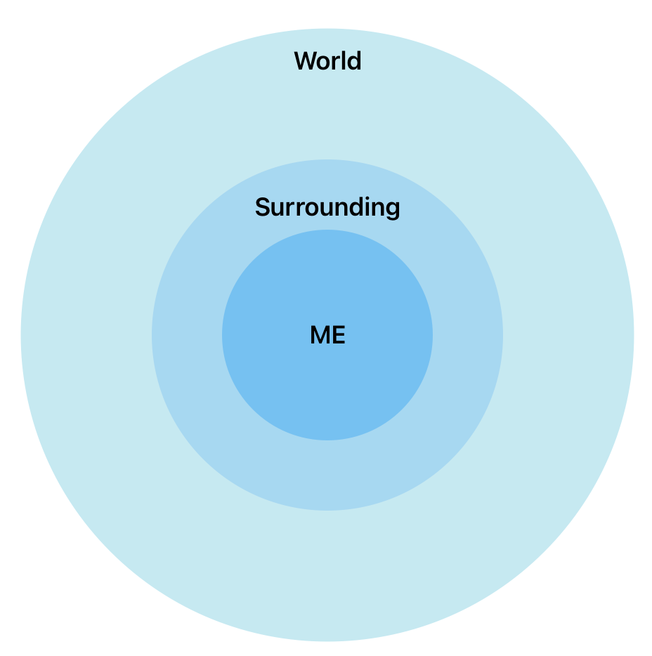
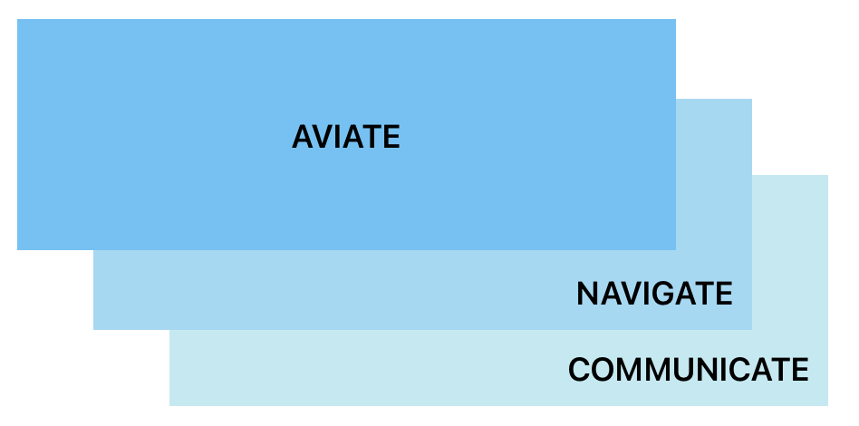
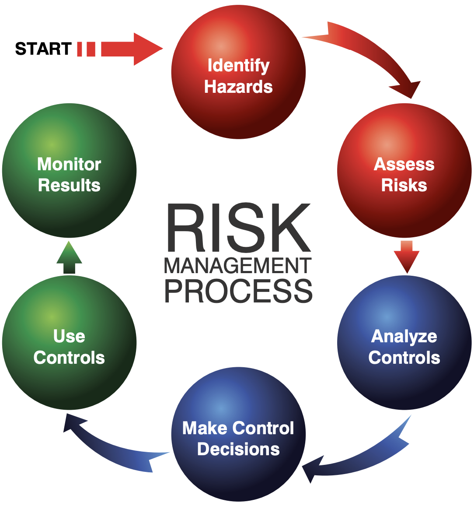
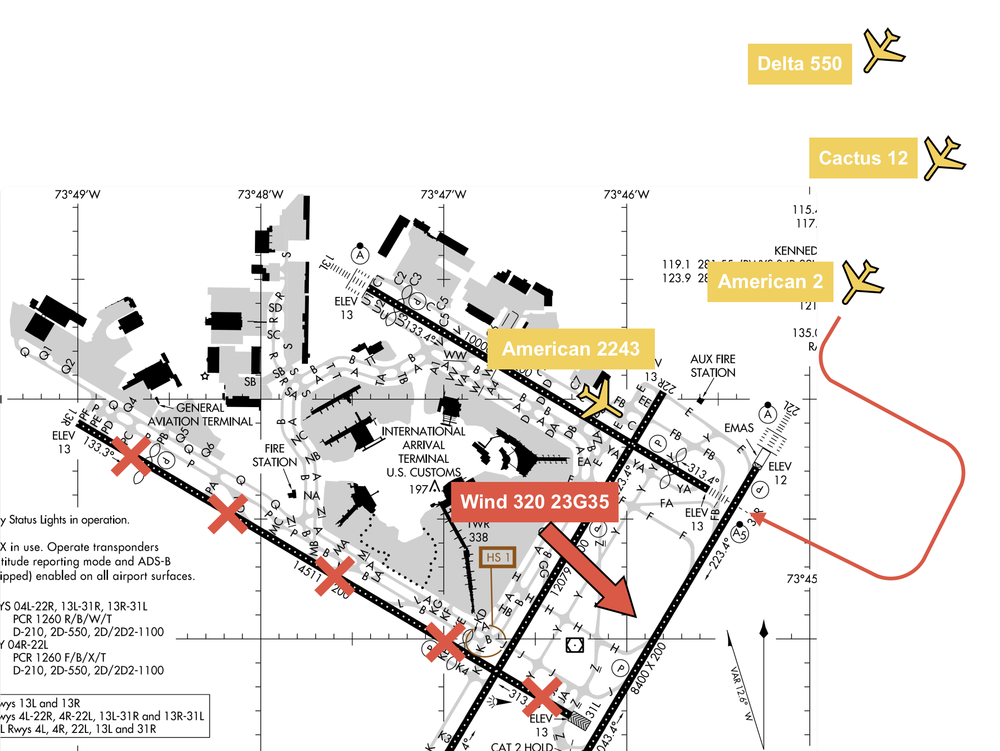
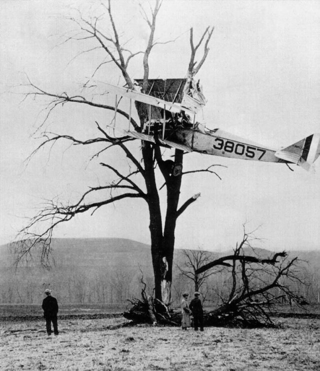

# Aeronautical Decision Making

 
<quote>

In flying I have learned that carelessness and overconfidence are usually far more dangerous than deliberately accepted risks.

— Wilbur Wright, September 1900

---

## Objectives

Becomes a knowledgeable person in management of tasks, situation, resources, risks.

---

## Prep

- Read "Pilot's Handbook of Aeronautical Knowledge":
  - [Chapter 2: Aeronautical Decision Making][1]

[1]: https://www.faa.gov/sites/faa.gov/files/04_phak_ch2.pdf

<!--
Instructor prep:
-->

---

<!--
Flash Airline Flight 604
1/3/2004
Egypt to Paris

Accident chain:
- Night
- Fatigue
- Cloud
- Inop instruments
-->

---

## Accident Chain

<!--
Break the chain.

Question: what can we do?
-->

---

## Human Error

---

## 5 Hazardous Attitudes

<left>

- **Anti-authority**: <non-key>"Don't tell me"</non-key>
- **Impulsivity**: <non-key>Do it quickly</non-key>
- **Invulnerability**: <non-key>"It won't happen to me"</non-key>
- **Macho**: <non-key>"Watch this"</non-key>
- **Resignation**: <non-key>"What's the use?"</non-key>

</left>
<right>

- Follow rules.
- Think first.
- “It could happen to me”
- Foolish.
- “I can make a difference”

</right>

---

## Risk Management - Checklist

---

## Risk Management - Assessment

<col-4>

### **P**ilot

- **I**llness
- **M**edical
- **S**tress
- **A**lcohol
- **F**atique
- **E**motion

 

- Last flight

</col-4>
<col-4>

### **A**ircraft

- AROW
- ADs
- Inop
- Familiarity
- Maintenance
- Last flight

</col-4>
<col-4>

### en**V**ironment

- Wind
- Ceiling
- Visibility
- Turbulence
- Runway
- Airport
- Elevation
- Terrain

</col-4>
<col-4>

### **E**xternal

- Passenger
- Mission
- Schedule
- Alternative

</col-4>

<reference>

[PAVE][1] | [Assessment](https://drive.google.com/file/d/1yctwW-Q2BxU-bCpPRVImVz2YgPe1vYsa/view?usp=sharing)

[1]: https://www.faa.gov/sites/faa.gov/files/2022-11/PAVE_0.pdf

</reference>

---

## Situational Awareness

---

## Task Management

---

## Resource Management

- Copilot
- Passengers
- Checklist
- GPS
- Autopilot
- ATC

---

## Automation Management

Knowing...
- when to use / when not to use
- what to expect
- how to monitor
- what action to take
- what modes are engaged/armed
- what automation can/cannot do

<!--
- No autopilot below 800AGL duirng takeoff, below 200AGL during instrument approach
- Participate its next actions
- SUSP button during hold
- ROLL vs HEAD, PIT vs ALT
- Throttle settings
-->

---

## Execution

<left>

- **D**etect changes
- **E**stimate need to counter changes
- **C**hoose outcome
- **I**dentify actions
- **D**o actions
- **E**valuate effects of actions

</left>
<right>

</right>

---

---

<quote>
Aviation in itself is not inherently dangerous. But to an even greater degree than the sea, it is terribly unforgiving of any carelessness, incapacity or neglect.
</quote>

