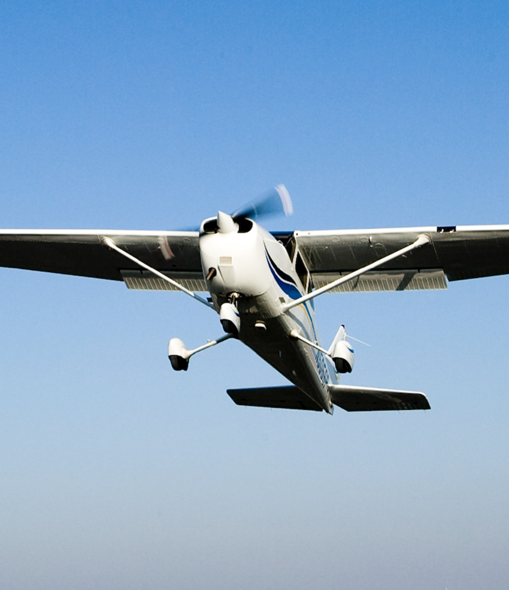
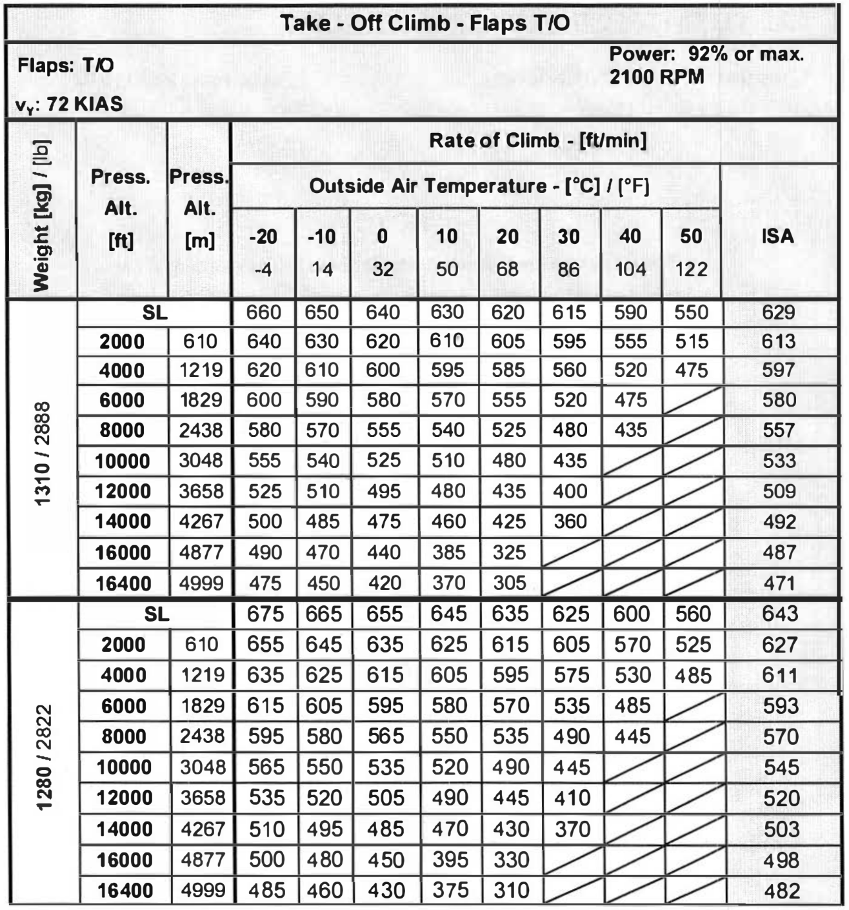
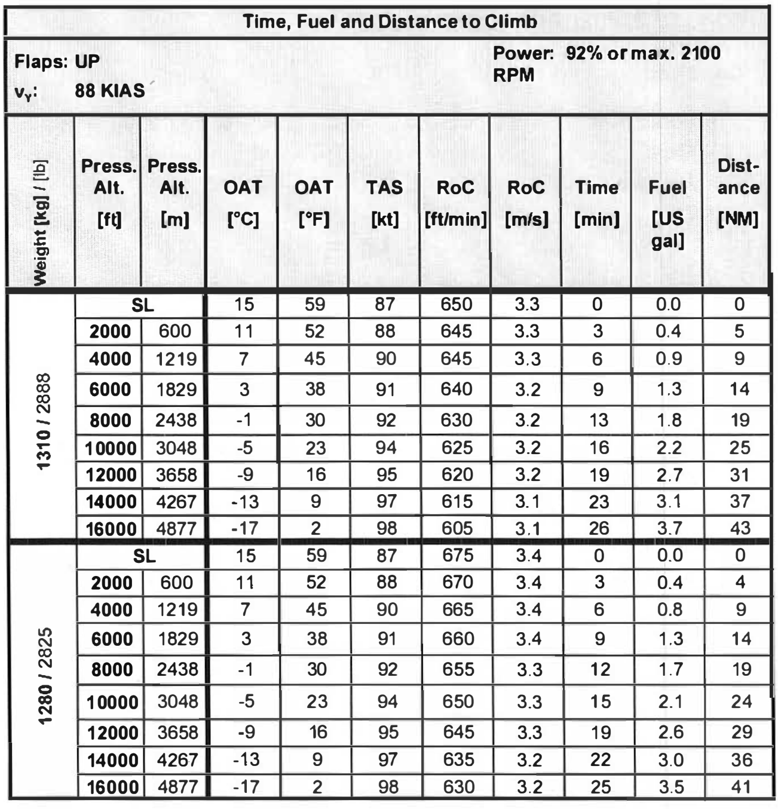
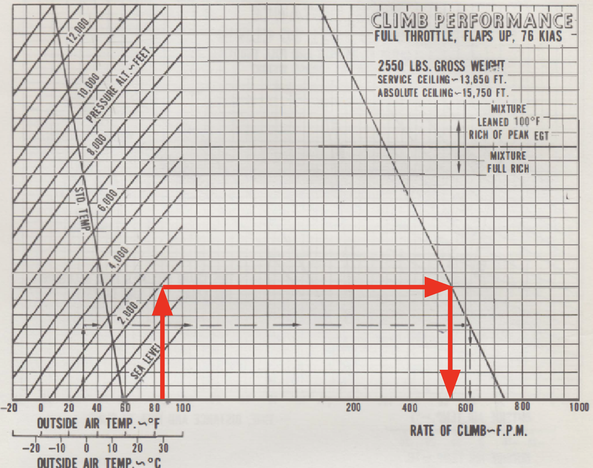

# Climb Performance

---

## How fast can you climb?

---

## Climb Rate Calculation

- Power Setting
- Flaps
- Airspeed

 

Exercise:
- Weight: 2855lbs
- Pressure altitude: 2000ft
- OAT: 25°C

---

## Climb Time/Distance/Fuel Calculation

Exercise:
- Weight: 2888lbs
- Takeoff pressure altitude: 2000ft
- Cruise pressure altitude: 16000ft

---

<left>

## Climb Rate Calculation (PA28)

Exercise:
- Weight: 2500lbs
- Pressure altitude 2000ft
- OAT: 30°C
- Wind: 5kts headwind

</left>
</right>

</right>

---

## Takeaway

- Know your climb rate at both beginning and end of the climb