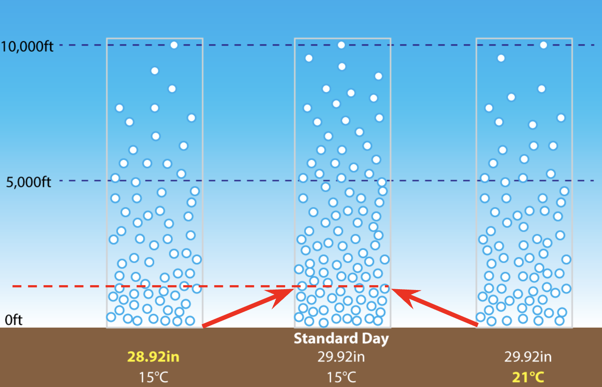
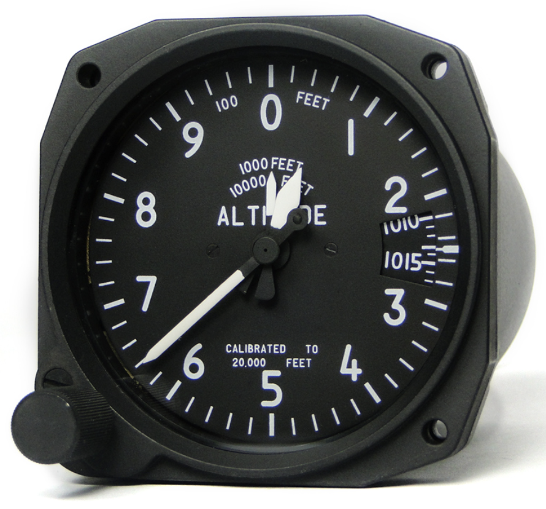
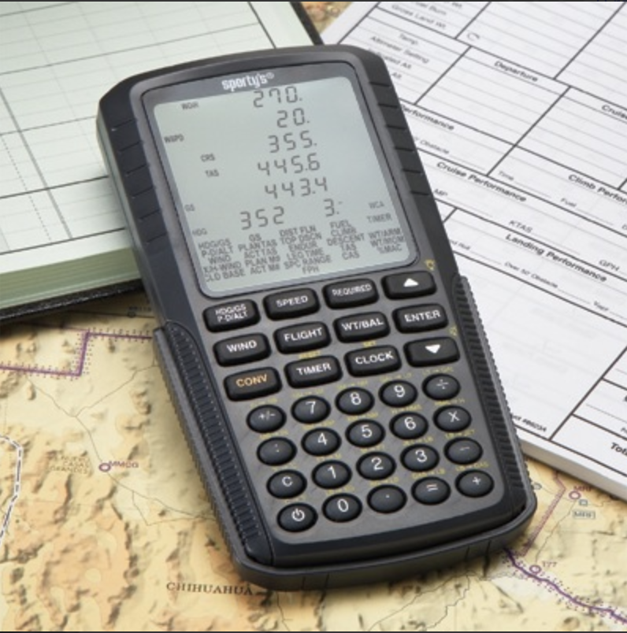
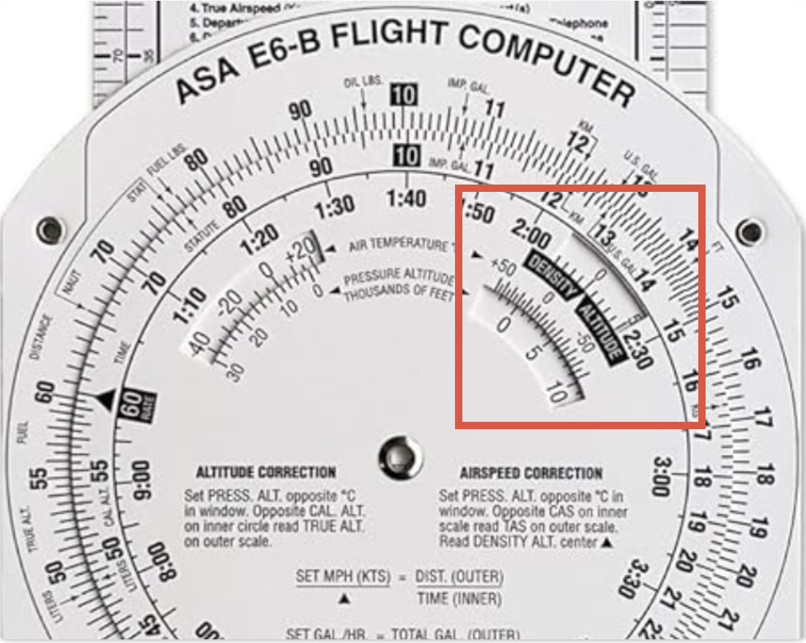

# Environmental Factors

---

## Origin of Performance

- Wing
- Engine
- Propeller

---

<left>

## Air Density

Correlate with:
- Pressure
- 1/Temperature
- 1/Humidity

</left>
<right>

</right>

<!--
- Pressure: pumping air into a bike tire
- Temperature: hot balloon 
-->

---

<left>

## Pressure Altitude

altitude of corresponding pressure of std. atm.

 

## Density Altitude

Pressure altitude, corrected for non-standard 
temperature.

</left>
<right>

</right>

---

## Density Altitude Calculation

<left>

Inputs:
- Pressure altitude
- Outside air temperature (OAT)

 

 

</left>
<right>

</right>

---

## Density Altitude Calculation - Exercise

- KSJC (elevation: 62ft MSL)
  - altimeter reading at 29.92in: -28ft
  - OAT: 18°C

- KASE (elevation: 7838ft MSL)
  - altimeter reading at 29.92in: 7768ft
  - OAT: 25°C

- CYCB (elevation: 102ft MSL)
  - altimeter reading at 29.92in: -88ft
  - OAT: 9°C

  <!--
  Density altitude:
    - KSJC: 343ft
    - KASE: 10800ft
    - CYCB: -777ft
  -->