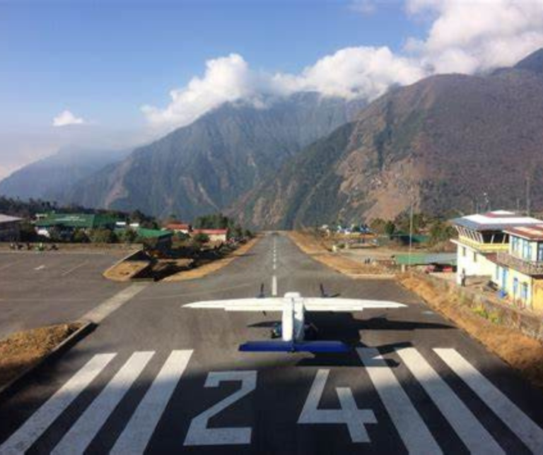
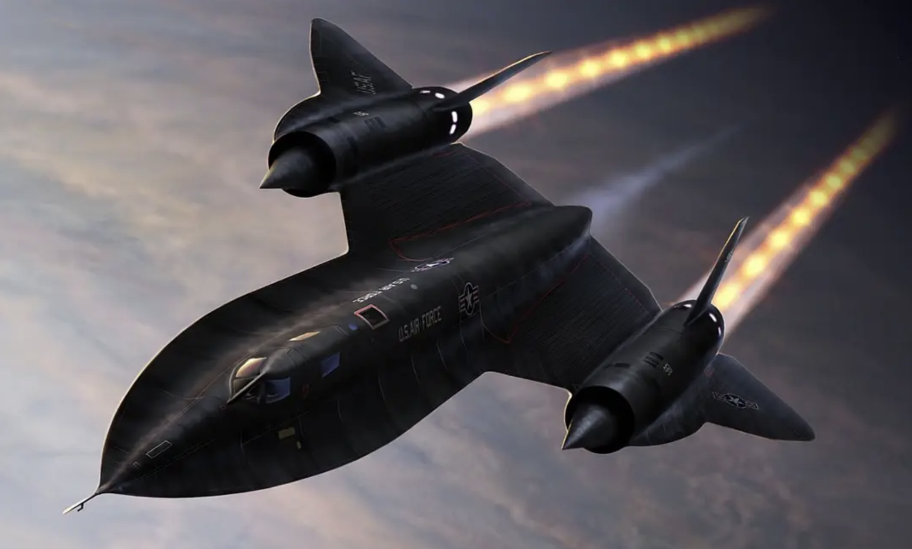
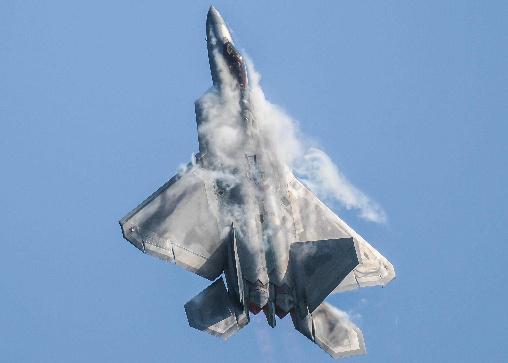
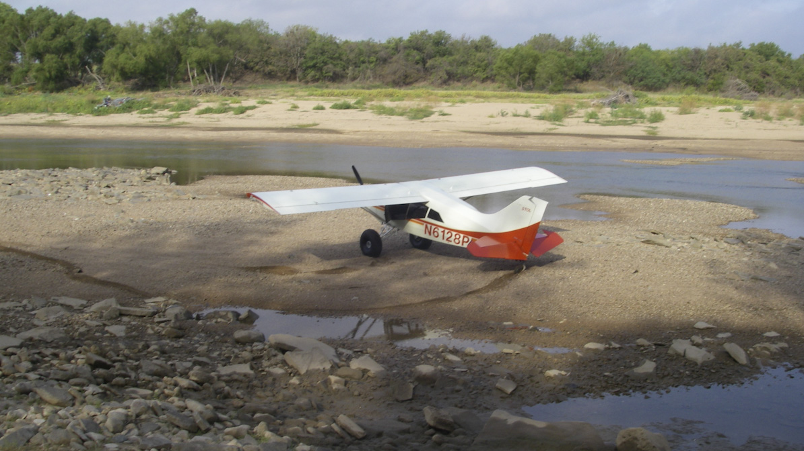
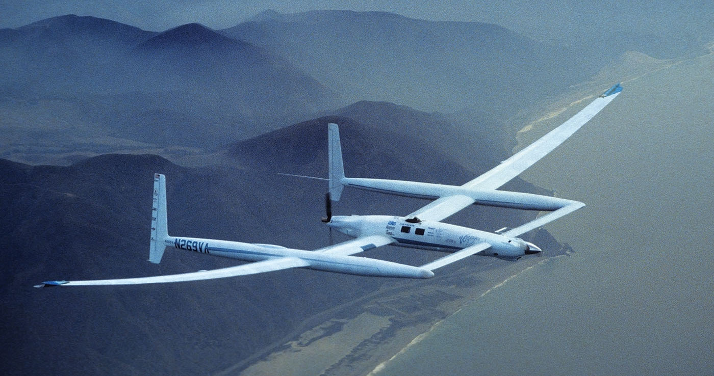

# Aircraft Performance

Bowen Zhang | Dream of Flight, Inc

---

## Objective

Understand and always anticipate the impact of the environment to airplane's performance.

---

## Prep

- Read "Pilot's Handbook of Aeronautical Knowledge":
  - [Chapter 11: Aircraft Performance][1]

[1]: https://www.faa.gov/regulationspolicies/handbooksmanuals/aviation/phak/chapter-11-aircraft-performance

<!--
Instructor prep:
  - Aircraft flight manual
  - E6B
-->

---

## Performance

   

<!--
Question: what does performance mean to aircraft?

- Take-off: distance
- Climb: rate
- Cruise speed, range, fuel efficiency
- Landing: distance, crosswind
-->

---

## Topics

- [Environmental Factors](environmental-factors.md)
- [Take-off Performance](take-off-performance.md)
- [Climb Performance](climb-performance.md)
- [Cruise Performance](cruise-performance.md)
- [Landing Performance](landing-performance.md)

