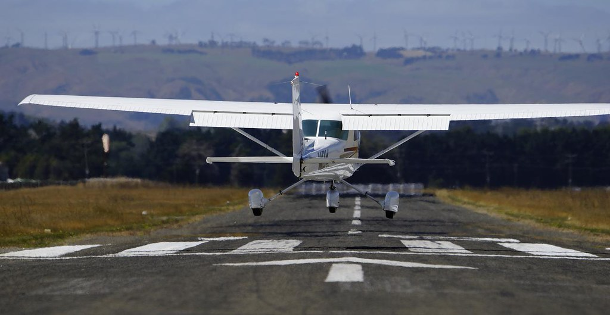
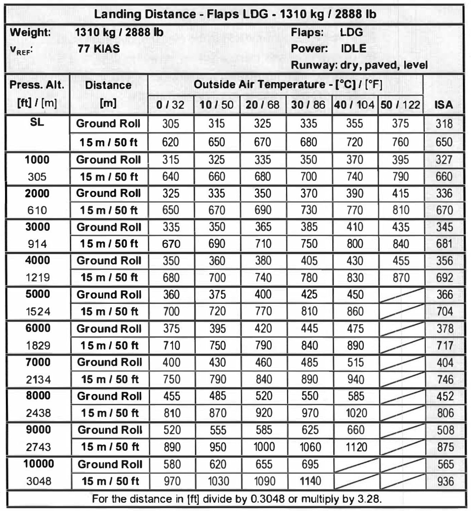
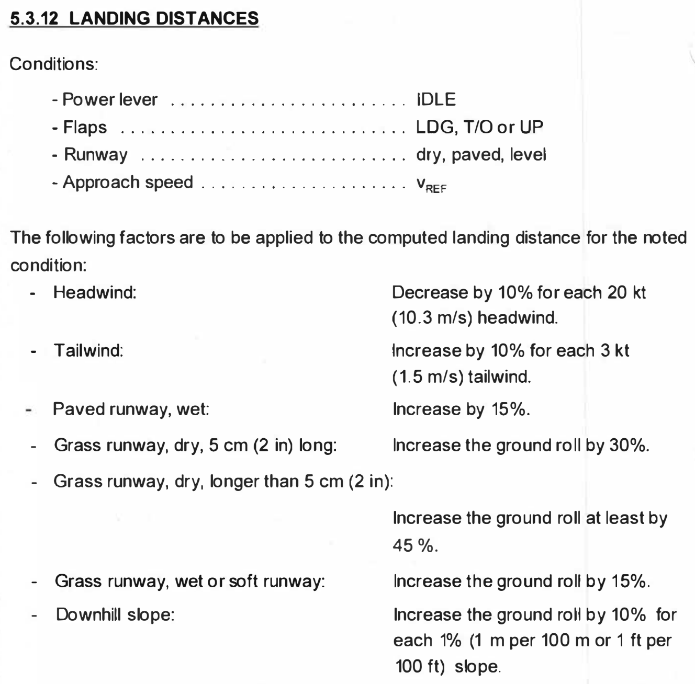
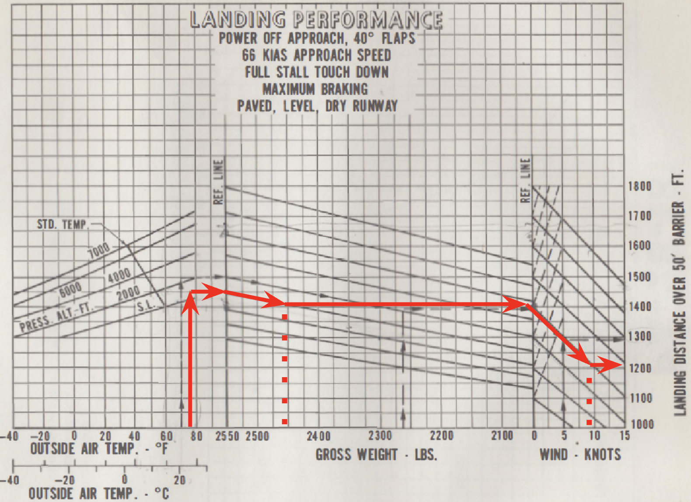
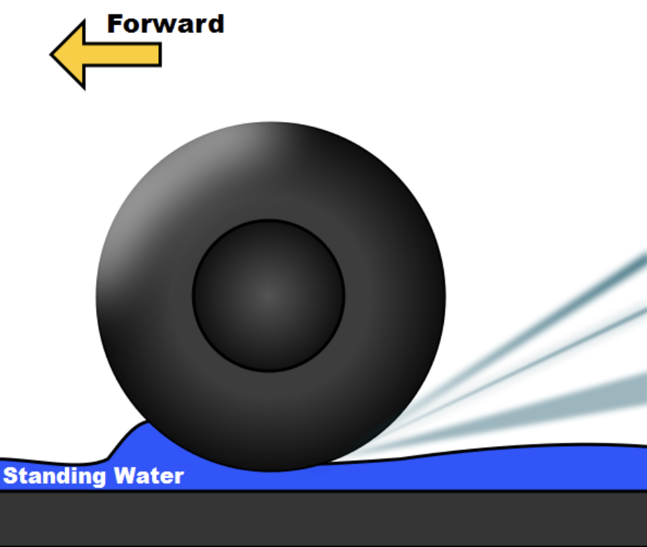
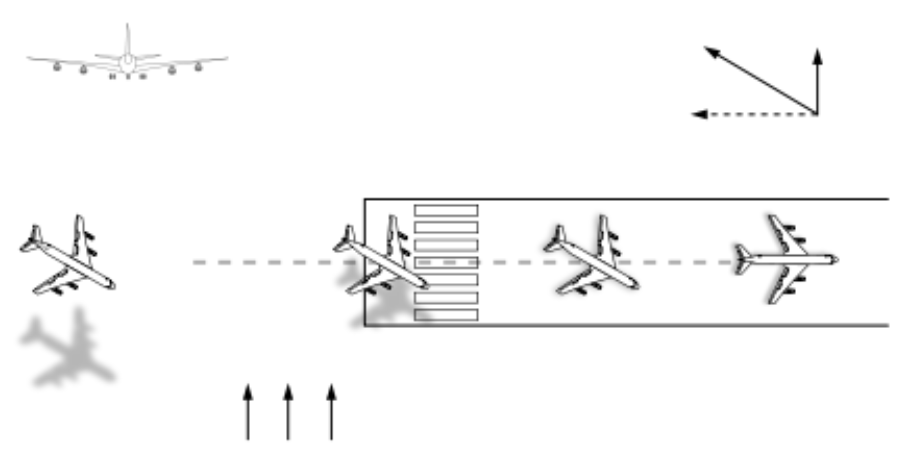
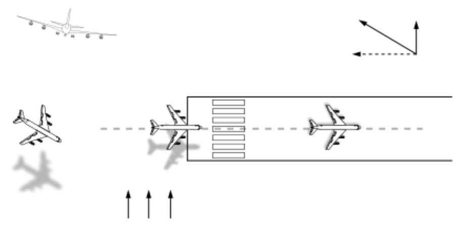
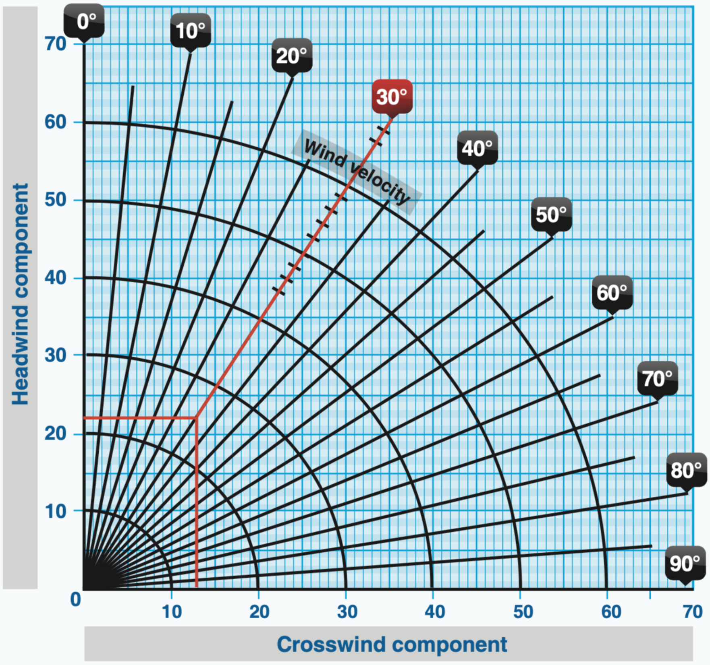

# Landing Performance

---

## How short can you land and stop?

---

## Landing Distance Calculation

- 50ft clearance distance 
- Ground roll distance

 

Exercise:
- Weight: 2888lbs
- Airport elevation: 5800ft
- Altimeter settings: 29.72in
- OAT: 25°C

---

## Landing Distance Calculation

Conditions
- Flaps
- Approach speed
- Power settings
- Touch down point

Corrections
- Wind
- Runway (surface, condition, slope)

<!--
+10% landing speed => +21% landing distance
-->

---

## Landing Distance Calculation (PA28)

<left>

Exercise
- Weight: 2450lbs
- Pressure altitude 500ft
- OAT: 25°C
- Wind: 10kts headwind

</left>
<right>

</right>

---

## Dynamic Hydroplaning

Minimum dynamic hydroplaning speed = $9 \times \sqrt{Tire\text{ }Pressure (psi)}$

 

<left>

Diamond DA40NG
- Nose wheel: 45psi => 60kts
- Main wheel: 48psi => 62kts

</left>
<right>

</right>

<!--
DA40NG: stall speed @ max weight: 58 KCAS

https://www.youtube.com/watch?v=v6aJ4CvnNDo
-->

---

## Crosswind

<left>

</left>
<right>

</right>

<!--
DA40NG: max crosswind 25kts
-->

---

<!--
3/1/2008, Hamburg, Germany. Storm Emma.
Lufthansa A320-200. Runway 23. 
-->