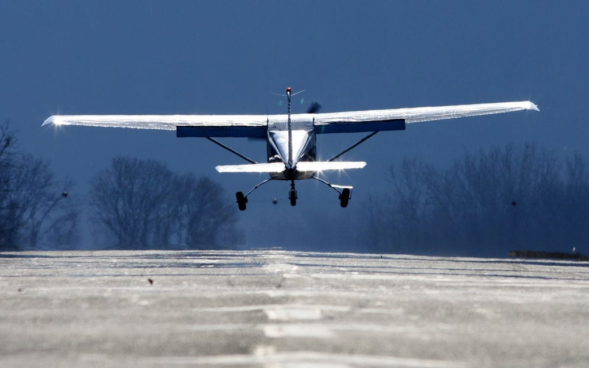
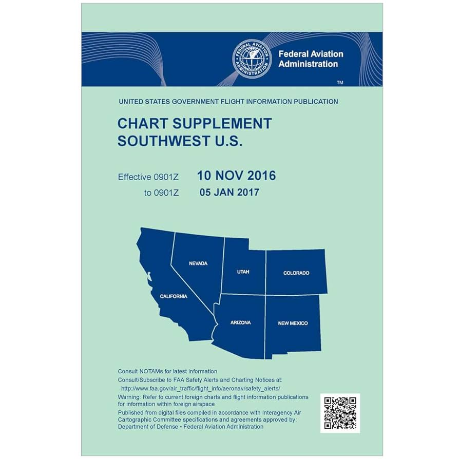
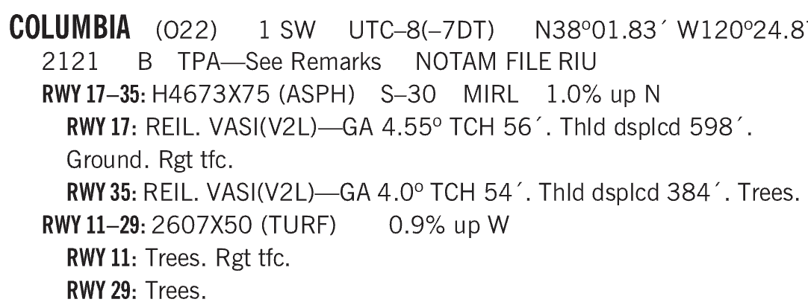
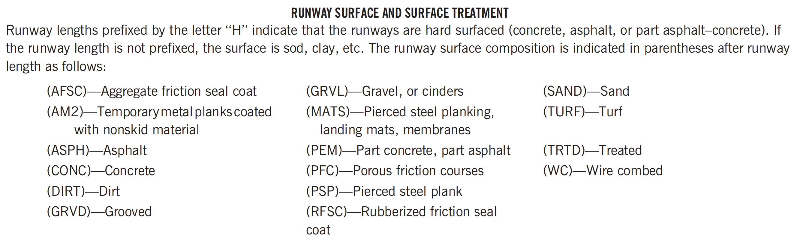
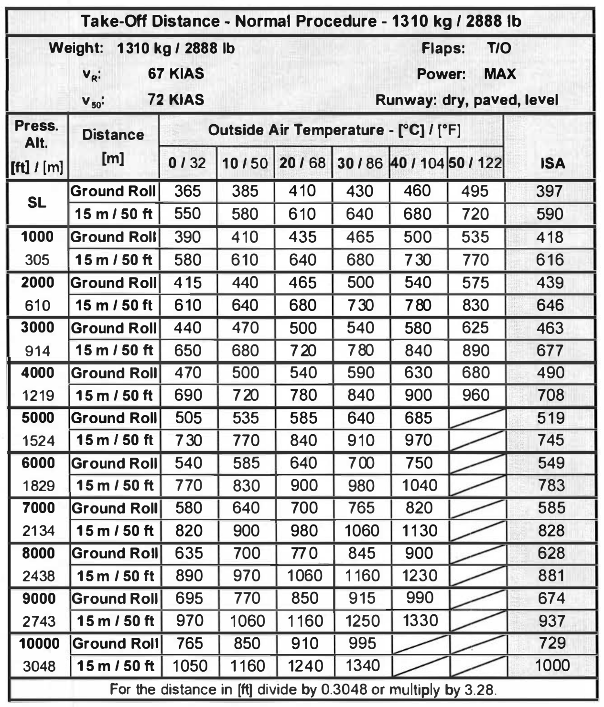
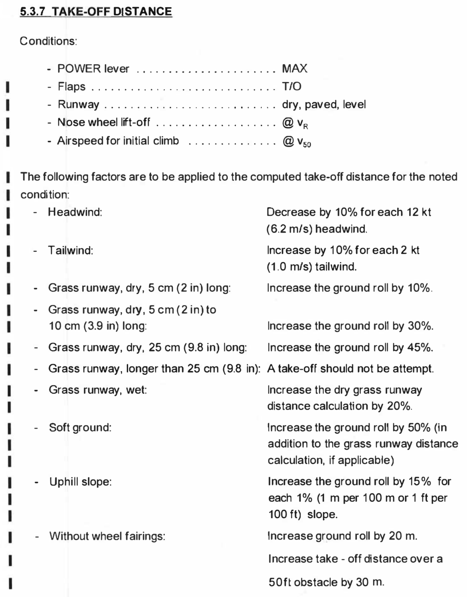
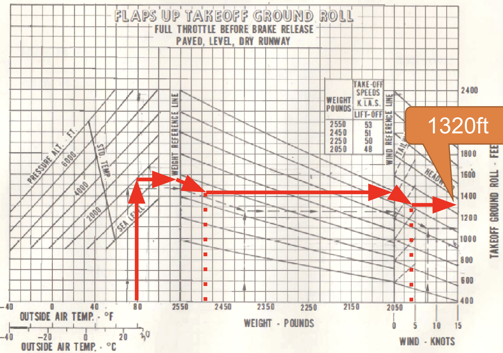

# Take-off Performance

---

## How short can you take-off?

---

## Factors

- Weight
  - Acceleration
  - Lift-off speed
- Wind
- Density altitude
- Runway condition
  - Surface: paved / grass / gravel
  - Water: dry / wet
  - Slope: level / uphill / downhill 

---

---

## Runway Condition

<left>

FAA Chart Supplement

</left>
<right>

 

</right>

<!--
Runway 17-35: hard surface, 4673x75ft, asphalt, single wheel up to 30000lbs, 1% up north.
Runway 11-29: turf, 2600x50ft, 0.9% up west.
-->

---

## Distance Calculation

- Ground roll distance
- 50ft clearance distance

 

Exercise:
- Pressure altitude: 1500ft
- OAT: 25°C

---

## Distance Calculation

Conditions
- Start: beginning of runway
- Flaps
- Max power before brake release
- Lift at minimum safe speed

Corrections
- Wind
- Surface
- Slope

---

## Distance Calculation (PA28)

<left>

Exercise:
- Pressure altitude: 2000ft
- OAT: 30°C
- 5kts headwind

</left>
<right>

</right>

---

## Takeaway

- Always know your take-off distance before take-off
- Monitor distance as airplane rolls
- Take action if airplane doesn't lift off as planned
- Do NOT force airplane to leave ground