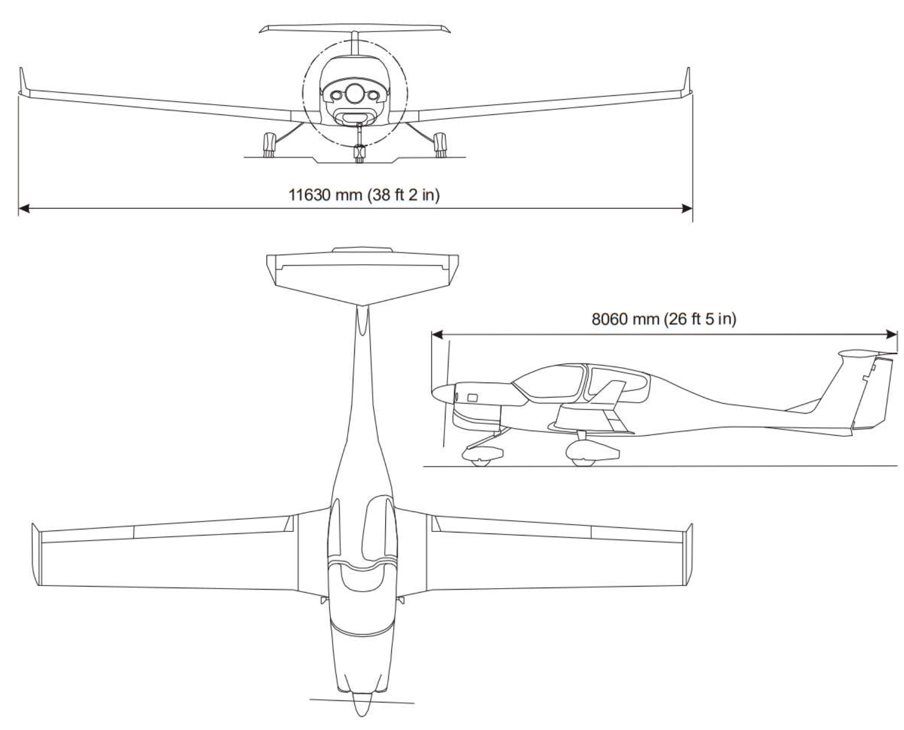
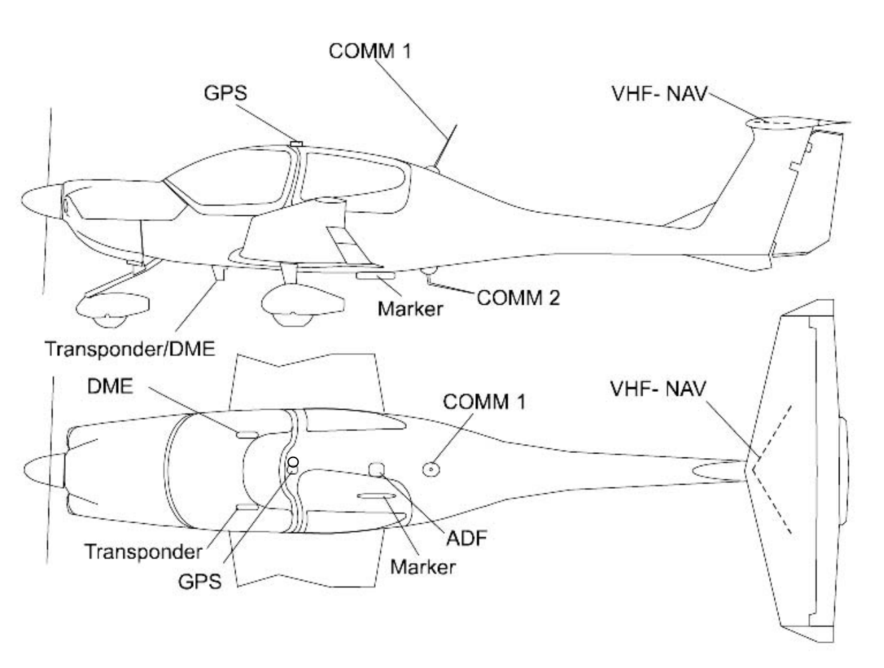

# Exterior

---

<!--
Wider wingspan (Cessna 172: 36'1")
-->

---

## Antennas

- GPS
- COM 1
- COM 2
- VHF NAV 1 & 2
- Transponder
- DME
- ADF
- Marker

---

## Antenna

[placeholder: GPS]
[placeholder: COM1]
[placeholder: COM2]
[placeholder: NAV]
[placeholder: Transponder]
[placeholder: DME]
[placeholder: ADF]
[placeholder: Marker]

---

## Pitot-Static

[placeholder: Pitot tube]
[placeholder: static port]

---

## Lift Detector (Stall Warning)

[placeholder: lift detector]
[placeholder: test tool]

<!--
Removing water with test tool
-->

---

## Lights

[placeholder: Landing / taxi light]
[placeholder: strobe / position light]

---

## Air Inlets (7)

<left>

Front
- Cabin heat / gearbox cooler
- Intercooler
- Coolant radiator (engine cooling)

RH Side
- Engine air intake
- Copilot ventilation

LH Side
- Pilot ventilation

</left>
<right>

[placeholder: front air inlets]
[placeholder: RH side air inlets]
[placeholder: LH side air inlets]

</right>

<!--
- intercooler: cool compressed air from turbocharger
-->

---

## Air Inlets (cont.)

<left>

Under Wing
- Rear passenger ventilation

</left>
<right>

[placeholder: rear ventilation]
[placeholder: rear ventilation baffle]

<red>MUST BE REMOVED</red> if OAT > 15°C at takeoff

</right>

---

## Coolant Radiator Inlet Baffle

[placeholder: inlet baffle]

<red>MUST BE INSTALLED</red> if OAT < -30°C at takeoff
<red>MUST BE REMOVED</red> if OAT > 0°C at takeoff

---

## Oil Inspections

- Engine Oil
- Gearbox Oil

[placeholder: engine oil]
[placeholder: gearbox oil]