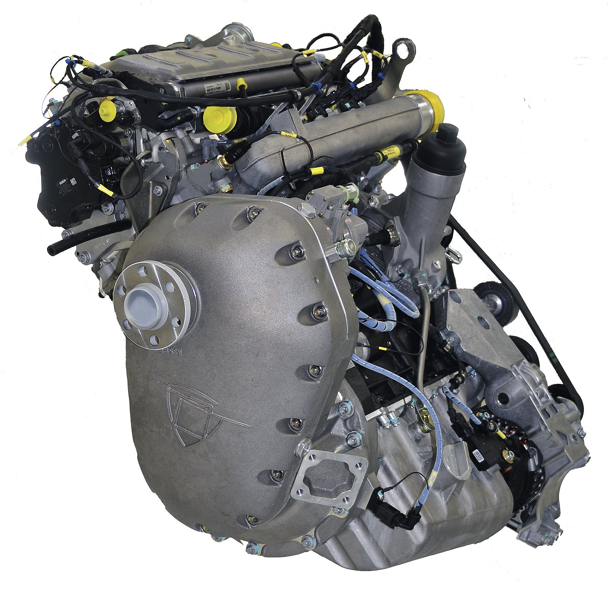
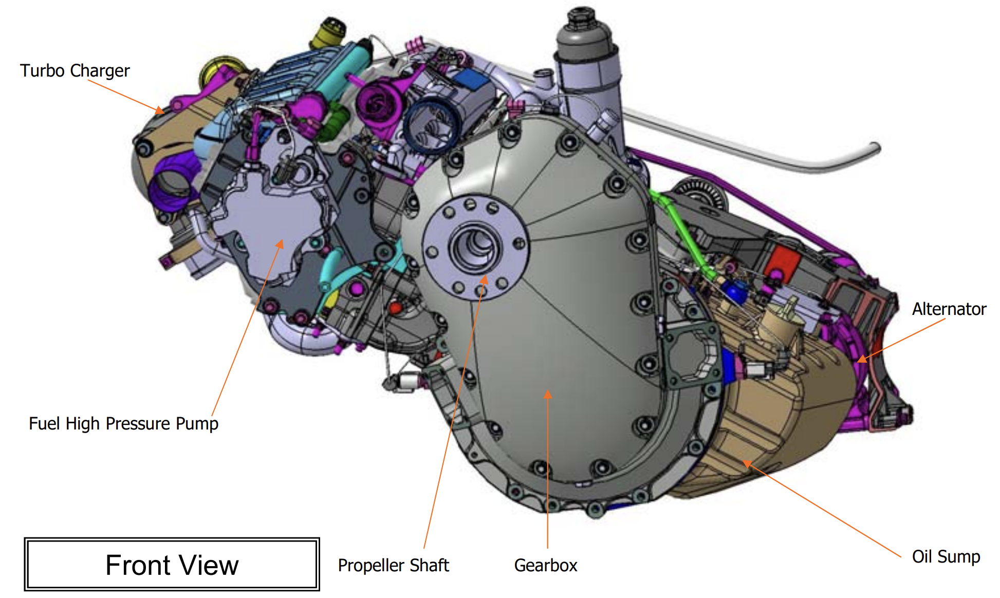
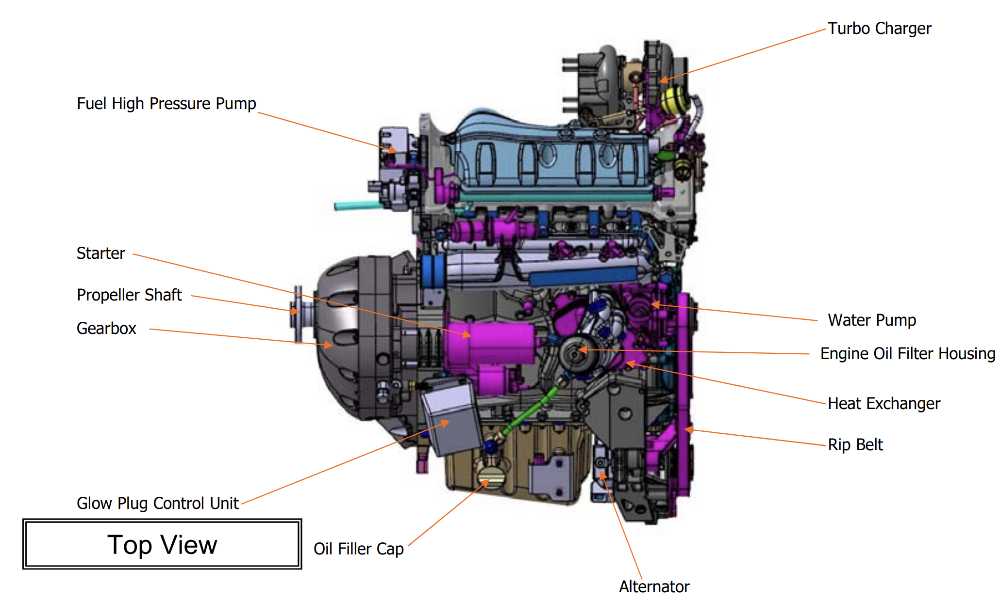
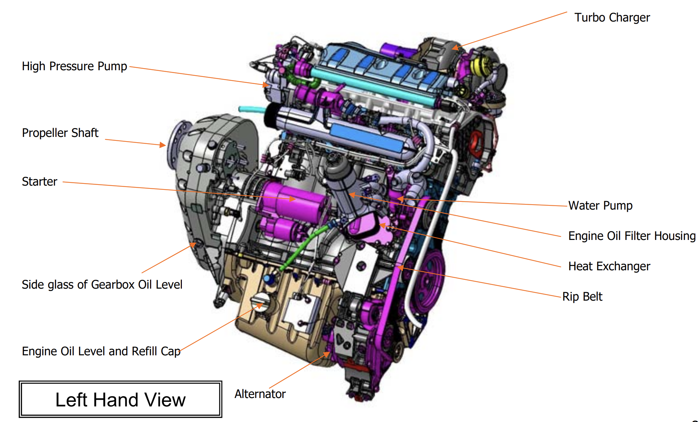
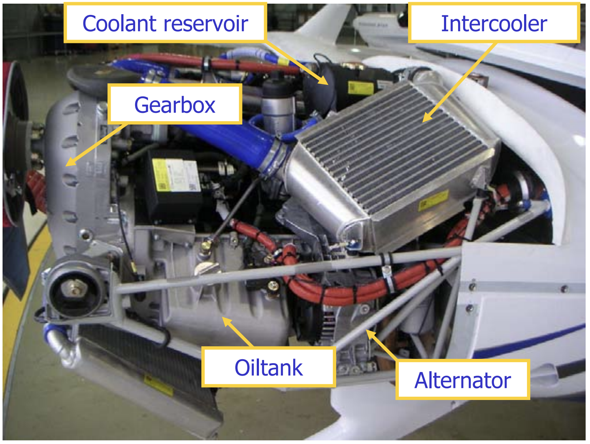
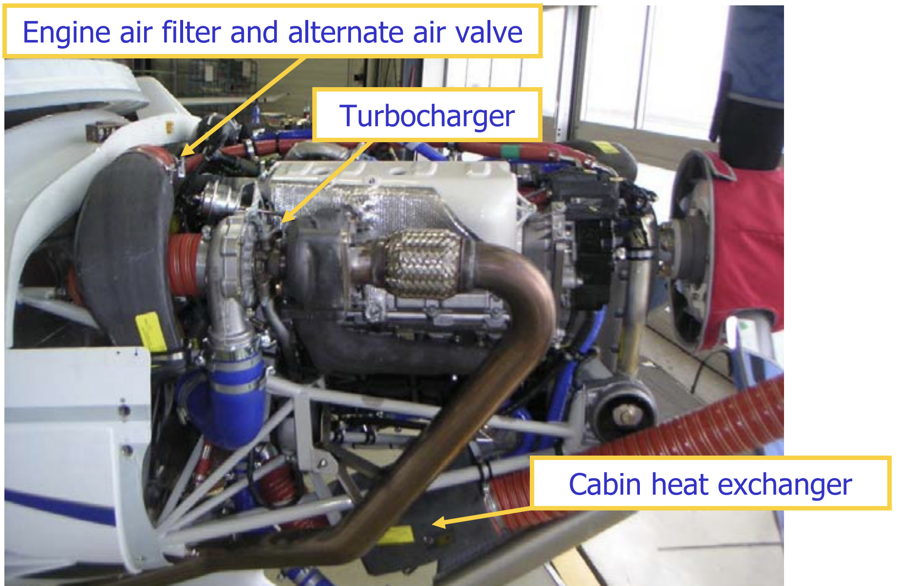

# Aircraft System (DA40NG)

Bowen Zhang | Dream of Flight, Inc

---

**Objective**
Understand how each of all systems on aircraft work behind the scene

<!--
-->

---

## Power Plant

- 1x Austro Engine E4 (AE300)
- Liquid cooled
- Inline
- 4-cylinder (2.0L)
- 4-stroke
- Diesel

---

## Engine

- Common-rail direct injection
- Reduction gear
- 2x Electronic control unit (ECU)
- Turbocharger
- Torsion vibration damper

---

- 168HP
- Max power: 100% at 2300rpm (5-minute limit)
- Max continuous power: 92% at 2100rpm

---

---

---

---

---

---

## How Diesel Engine Works

