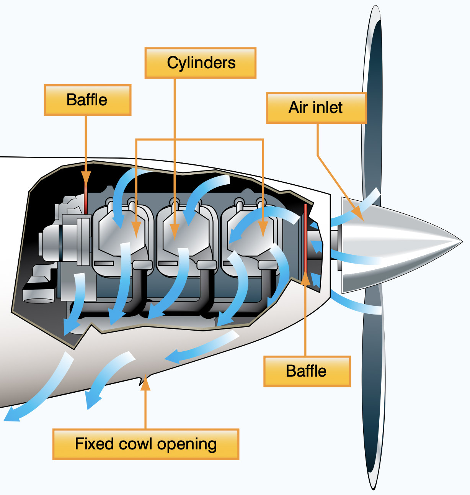
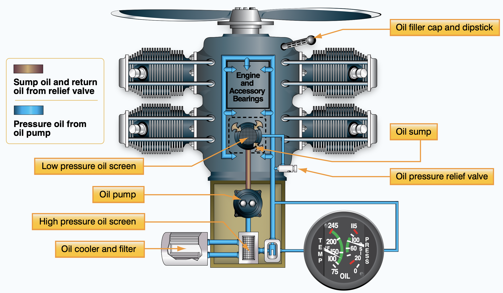
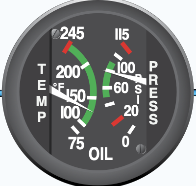
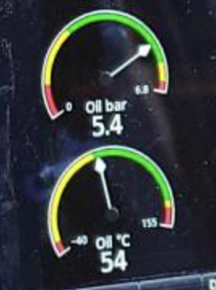

# Engine Cooling

---

## Cooling Systems

- Air cooling
- Oil cooling
- Water cooling

---

## Air Cooling

- Low speed (climb): less effective
- High speed (descend): shock cooling

<!--
Simple. But ineffective and vulnerable at certain conditions. 

Mitigation: cowl flaps on Cessna 182.
-->

---

## Oil Cooling

---

## Oil Cooling

- Cool engine
- Lubricate engine
- Remove contaminants
- Seal

---

## Oil Instruments

<left>

Oil Pressure Gauge

<key>

- High: clogged oil line, thick (cold) oil
- Low: bad pump, low quantity / oil leak

</key>

Oil Temperature Gauge

- <key>High: clogged oil line, low oil quantity,
blocked oil cooler</key>
- Low: improper oil viscosity

</left>

<right>

</right>