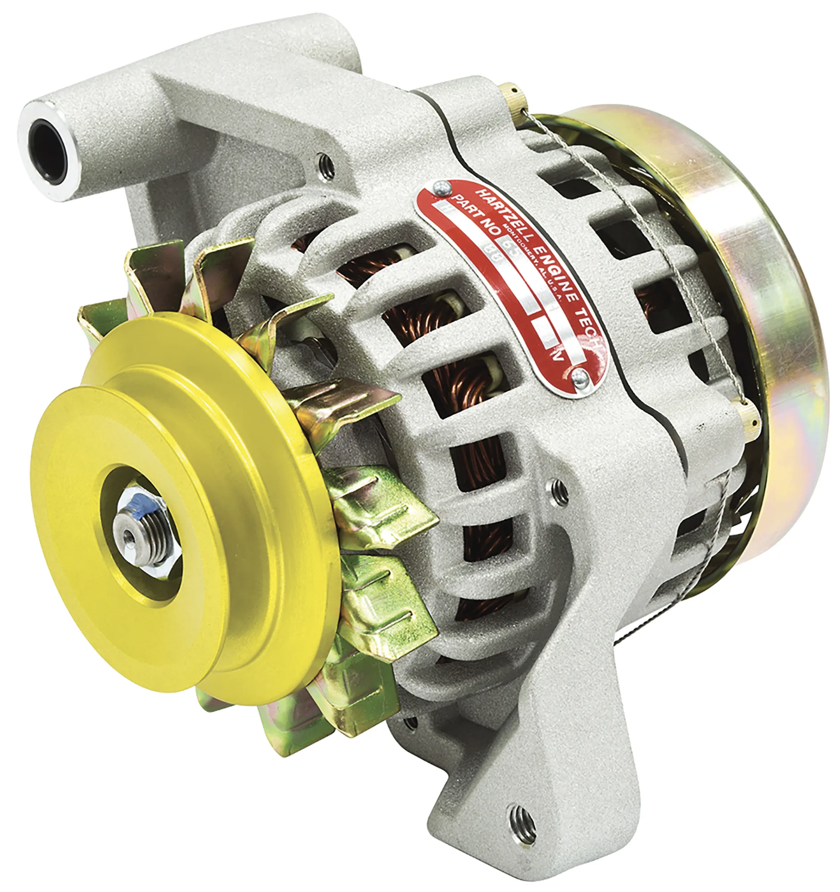
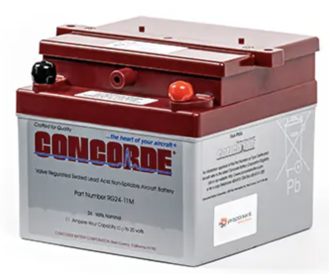
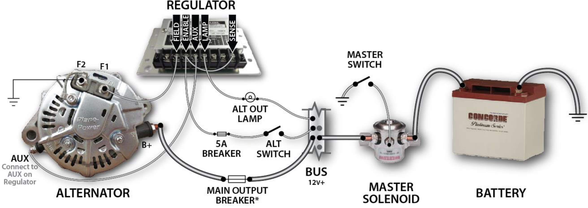
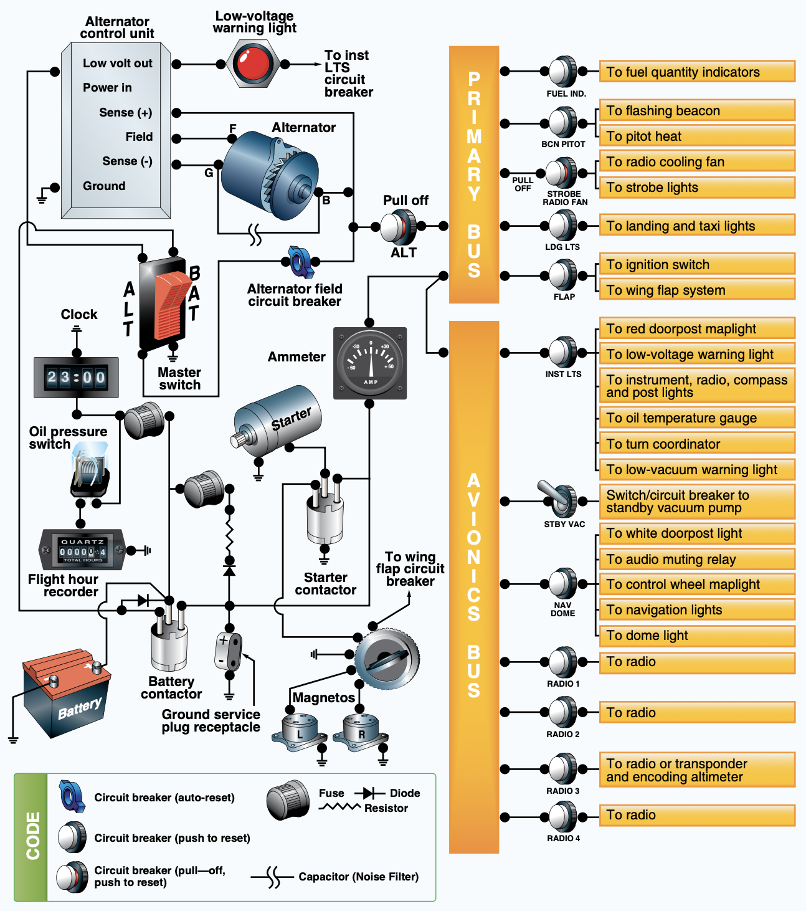
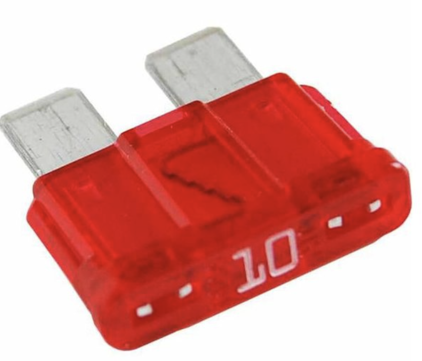
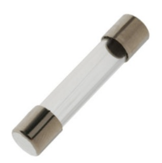
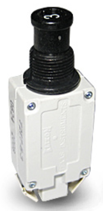
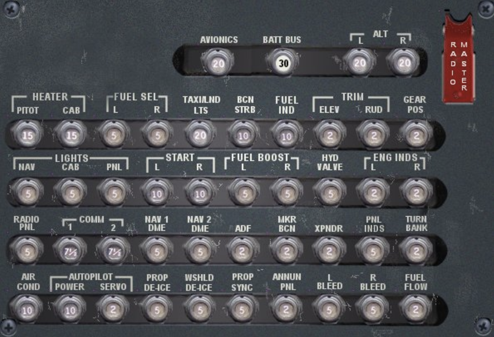
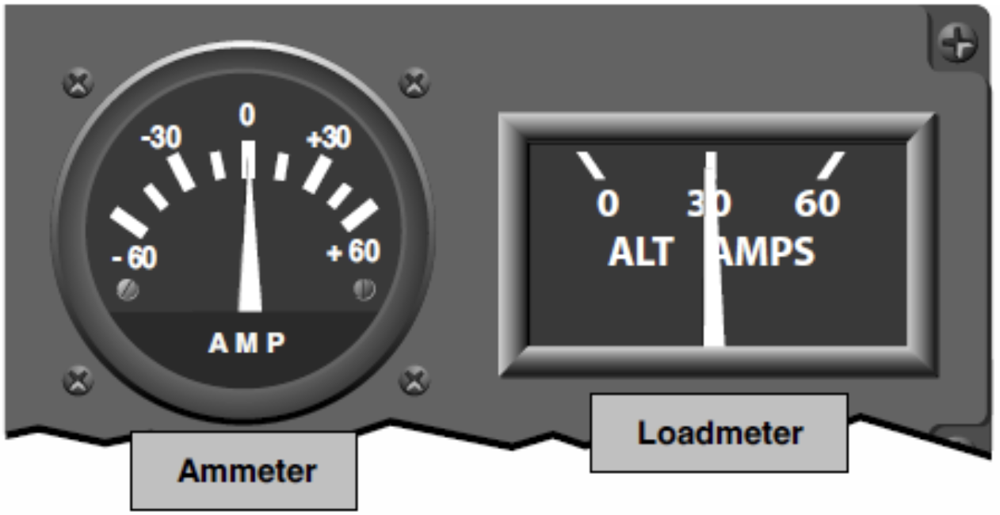

# Electrical System

---

## Alternator 

- 14/28V, AC
- Transformer Rectifier Unit
AC => DC

---

## Battery

- 12/24V, DC

---

## Connections

---

## Bus

---

## Protection

- Fuse
- Circuit Breaker

  

---

## Instruments

- Ammeter
- Loadmeter

