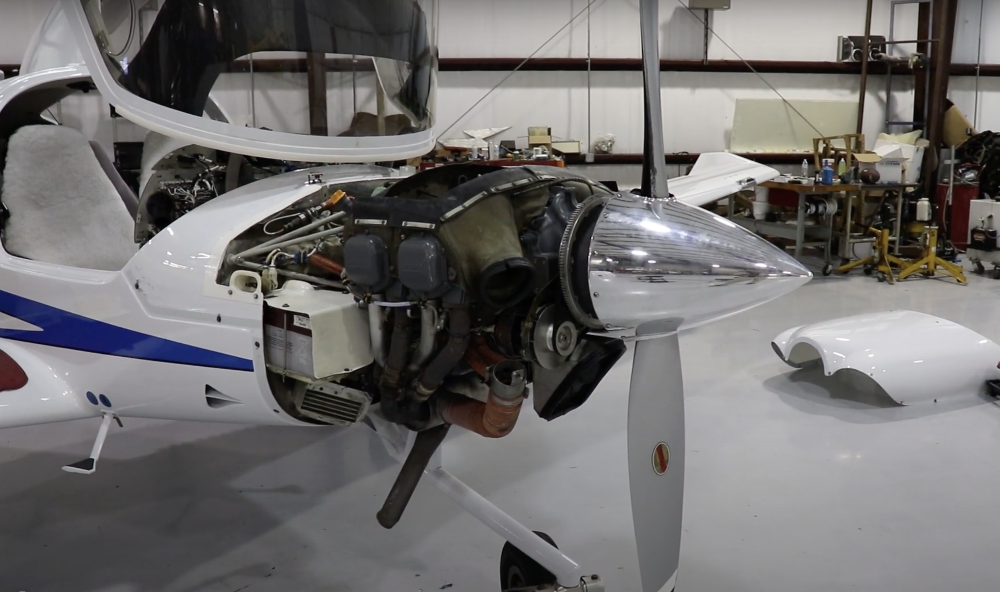
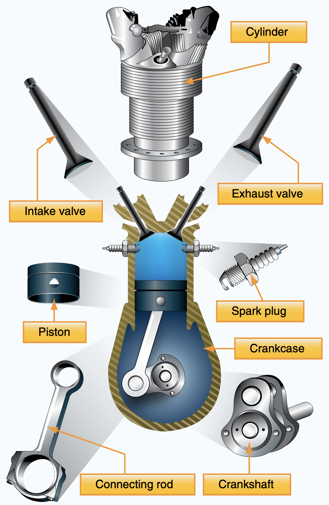
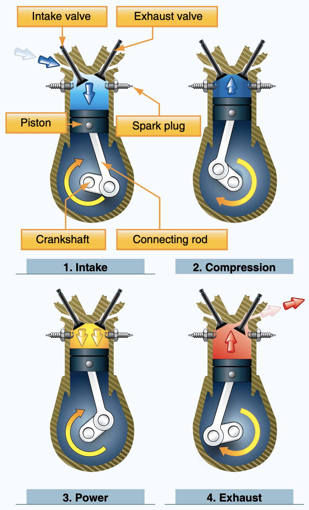
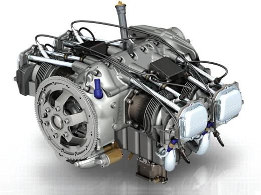
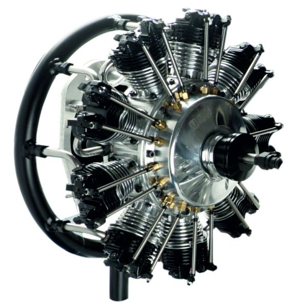
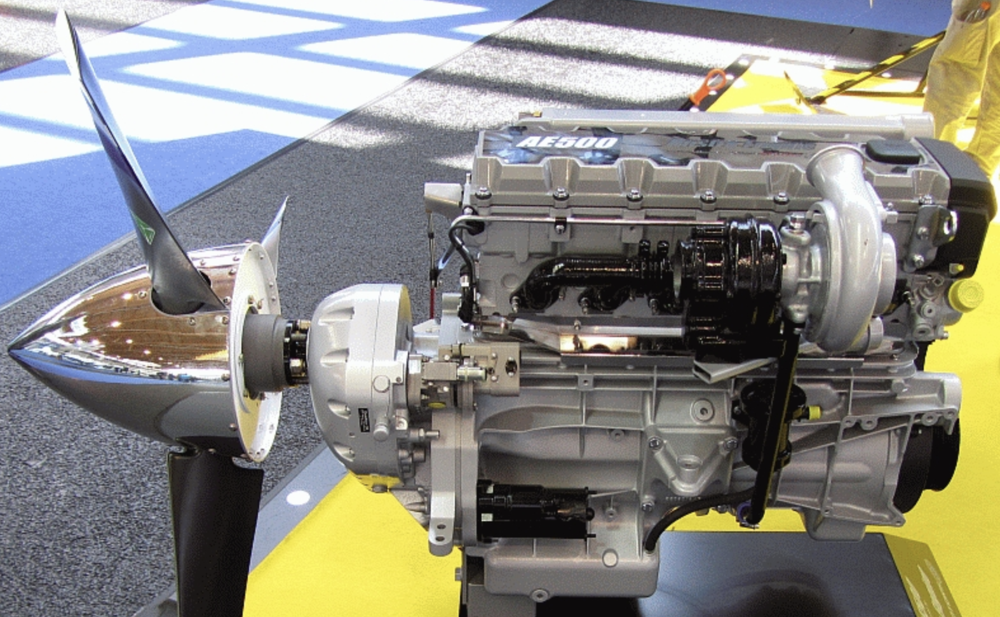

# Engine

Chemical Energy 
&nbsp;&nbsp;&nbsp;&nbsp;&nbsp;&nbsp;&nbsp;&nbsp;&nbsp;&nbsp;&nbsp;&nbsp;=>
&nbsp;&nbsp;&nbsp;&nbsp;Mechanical Energy (Rotation)

---

## Reciprocating Engine

- Cylinder
- Piston
- Intake valve
- Exhaust valve
- Spark plug
- Crankshaft

---

## Engine Cycle

- Intake
- Compression
- Power
- Exhaust

---

## Engine Types

|Opposed|Radial|Inline|
|--|--|--|
||||

---

---

## Engine Issue #1: Detonation

Uncontrolled, explosive ignition

**Symptoms**: metallic sound, reduced power, overheating

**Root Causes**:

- Low fuel grade
- High power, lean mixture

<key>**Consequence**: engine failure</key>

---

## Engine Issue #2: Pre-ignition

Ignite prior to intended time

**Symptoms**: high-pitched noise, rough engine, overheating

**Root Causes**:

- Carbon deposit
- Cracked spark plug insulator

<key>**Consequence**: engine failure</key>

---

