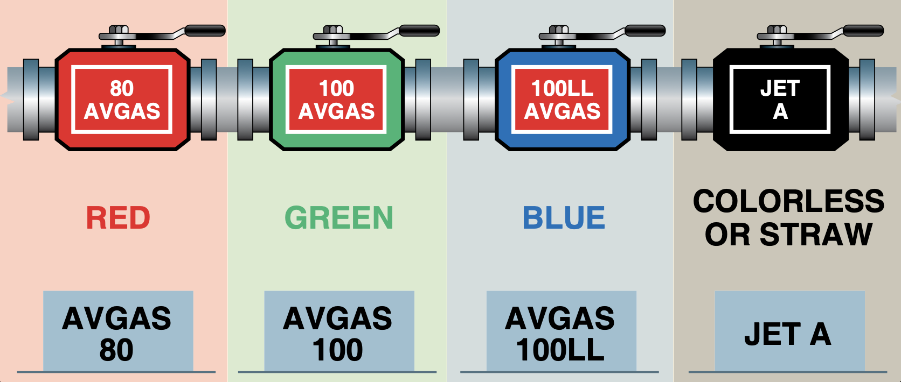
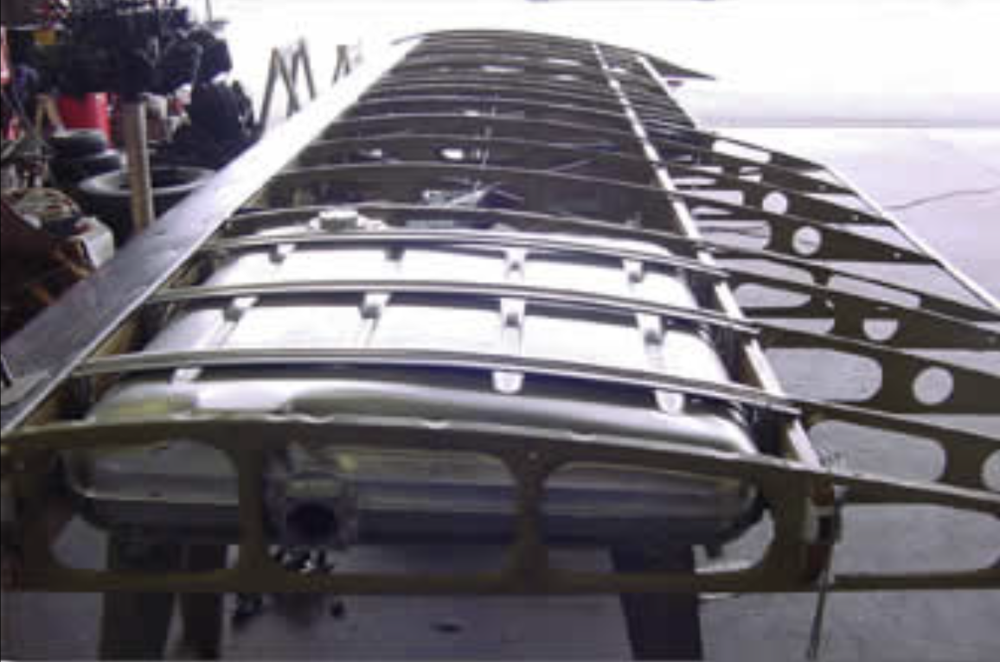
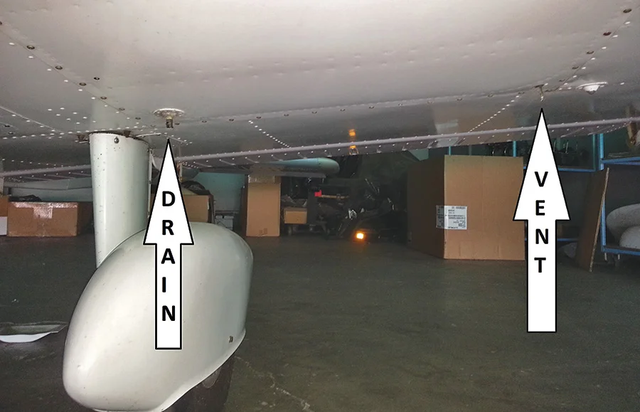
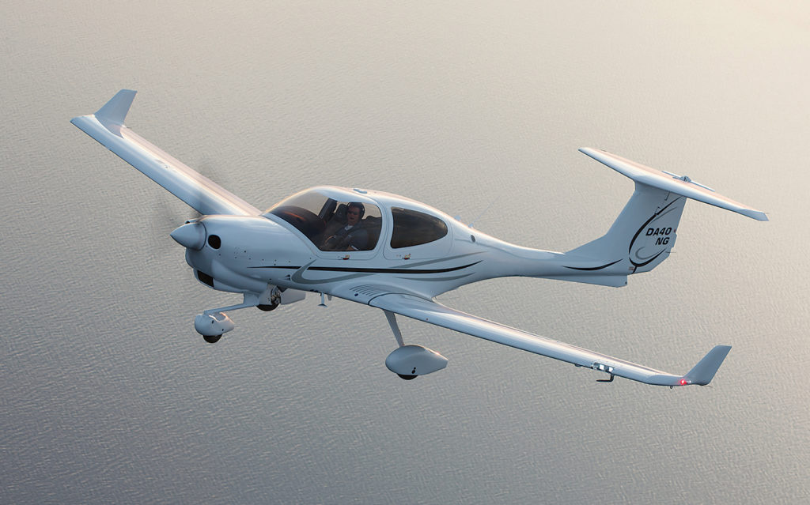
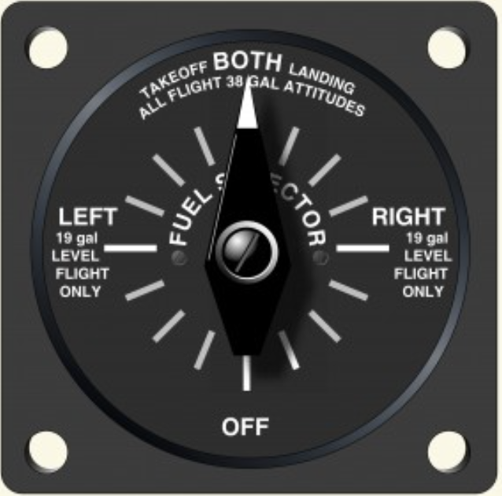
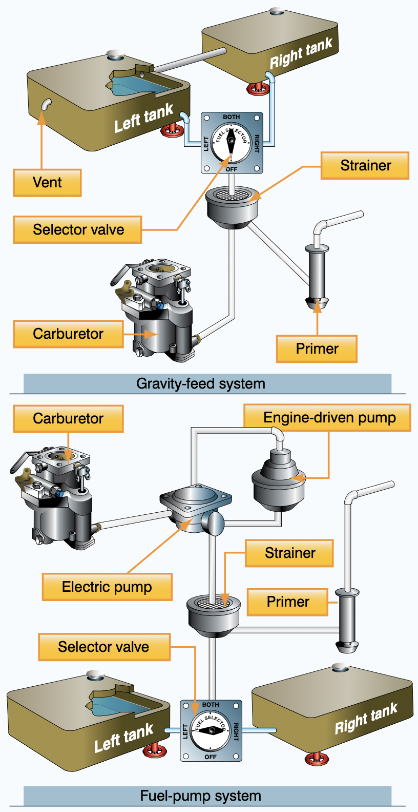
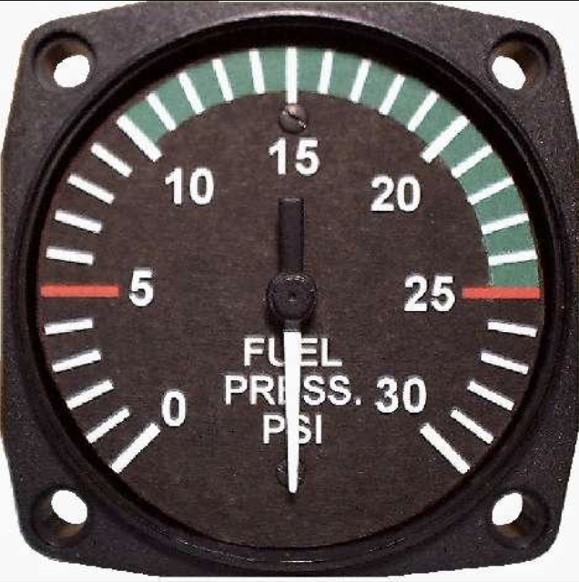
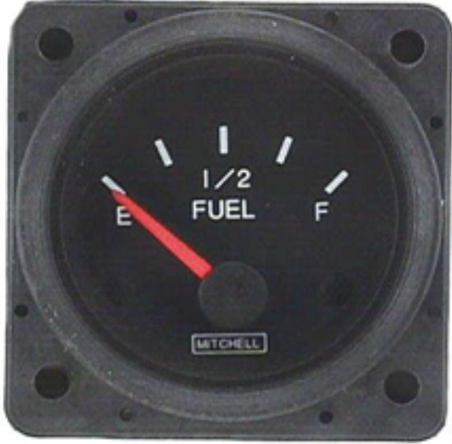
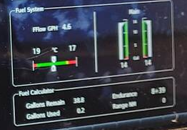

# Fuel System

---

## Fuel Grades

Grade: antiknock value / detonating pressure

<!--
When not available, use higher grade 
-->

---

## Fuel Tank

- Vent
- Drain

 |

---

<left>

## Fuel System

- Gravity-fed System
- Fuel-pump System
    - Engine driven fuel pump
    - Electric fuel pump
- Fuel Selector

  

</left>

<right>

</right>

<!--
Electric fuel pump: engine start, extra boost, backup
-->

---

## Fuel Instruments

- Fuel Pressure Indicator
- Fuel Quantity Indicator

 

  
