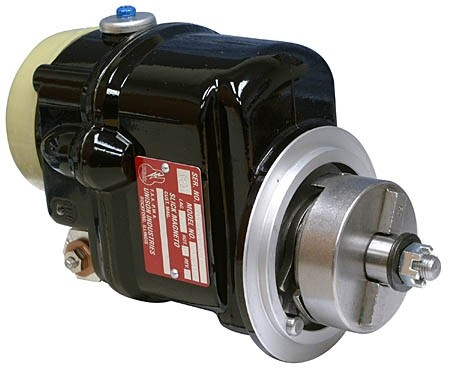
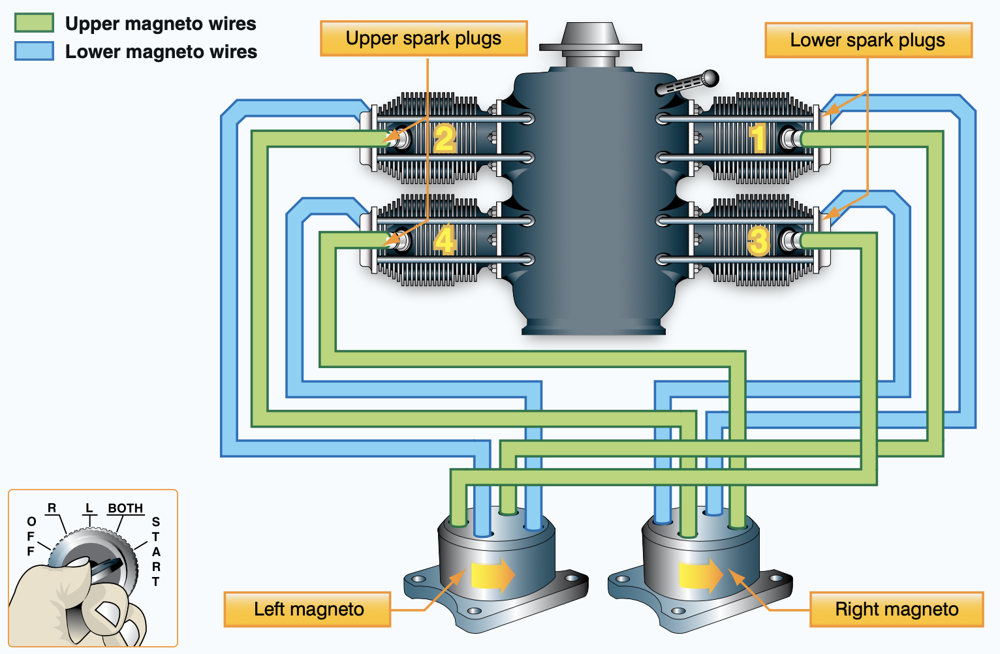
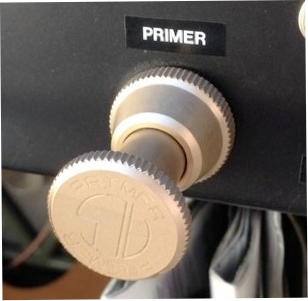
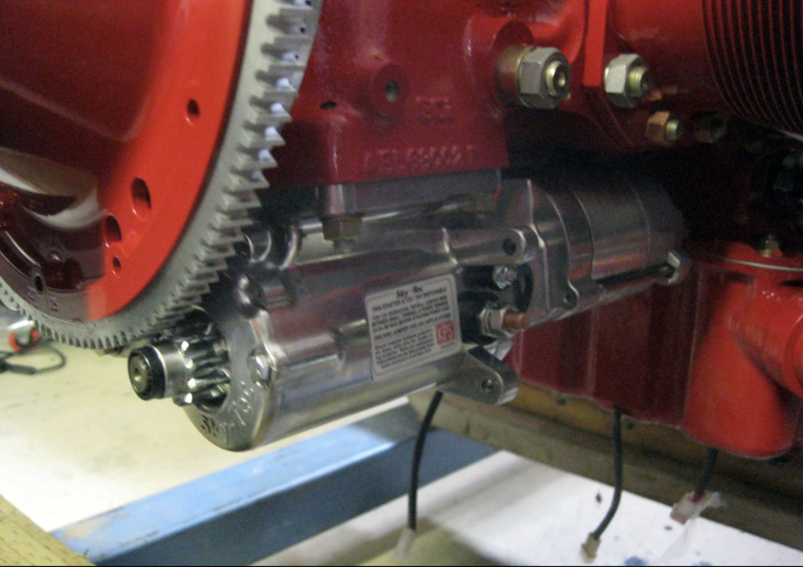

## Ignition System

Provide spark to ignite fuel/air mixture in cylinder 

- 2x Magneto
- 2x Spark plugs per cylinder

---

## Starter

Primer: vaporize fuel into cylinder
- Lock after use
- Over-priming

Starter: crank the engine
- Battery driven

---

## Hand Propping

|Doing it right|Doing it wrong|
|--|--|
|||