# Induction System

Provide & control air / fuel mixture

<!--
Goals:
- mix air and fuel
- control air / fuel ratio
- control mixture flow
-->

---

## Induction System Types

- Carburetor
- Fuel Injection

 

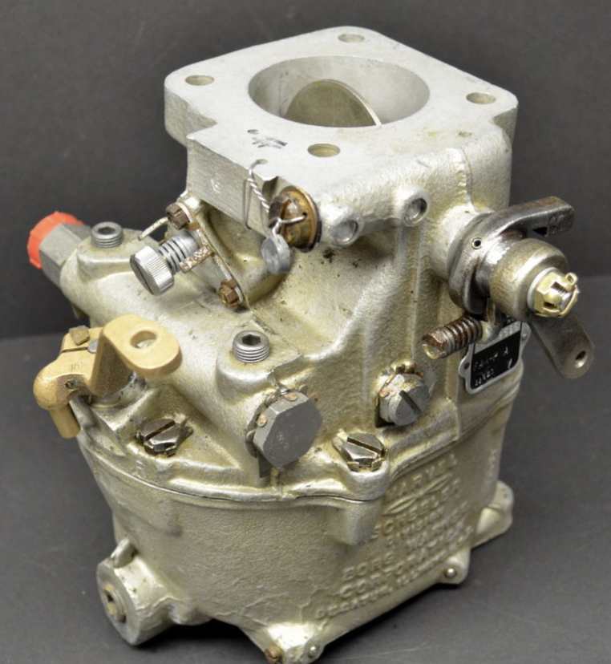 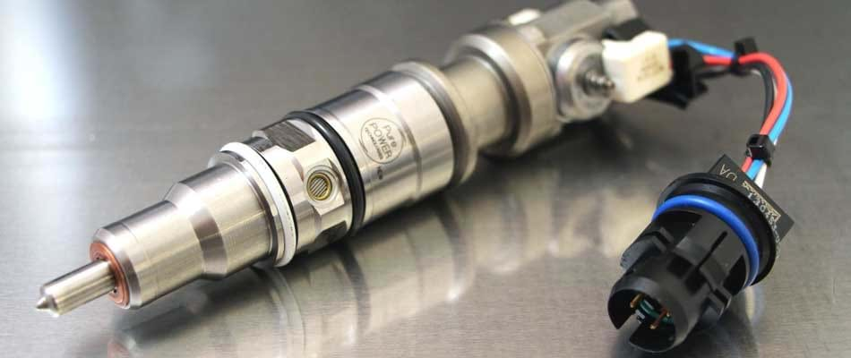

<!--
Fuel injection engines become widely adopted in new cars during 1980-1990s, and in airplanes since late 1990s.
-->

---

## Carburetor

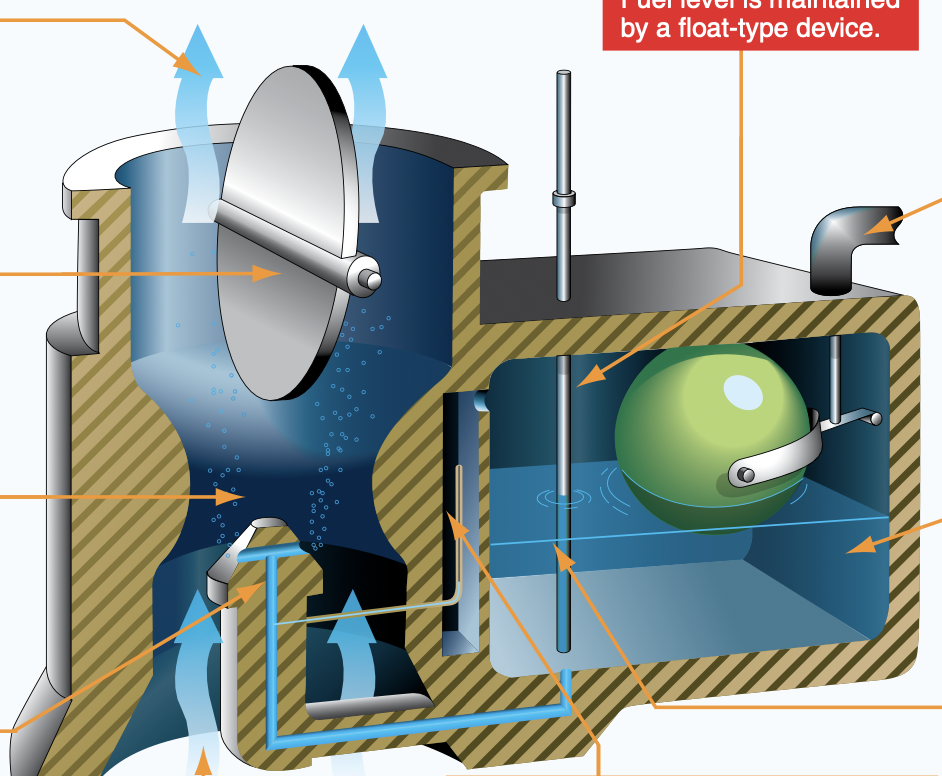

<!--
Like an garden sprayer.
- water storage
- pressure
- nozzle
- control mechanism

Water storage: float chamber, like a toilet water tank, with floating ball.

Pressure: venturi

Control mechaism:
  - air / fuel ratio: mixture needle
  - air / fuel mixture: throttle valve
-->

---

## Carburetor Icing

 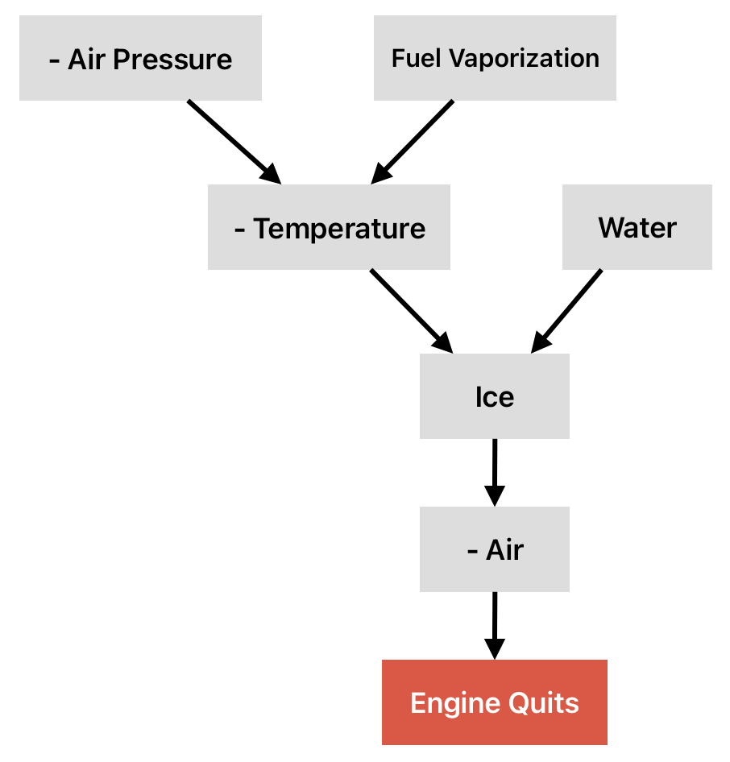

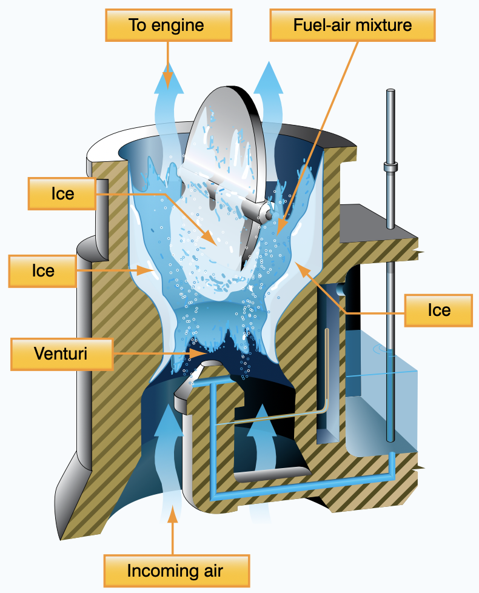

---

## Carburetor Icing

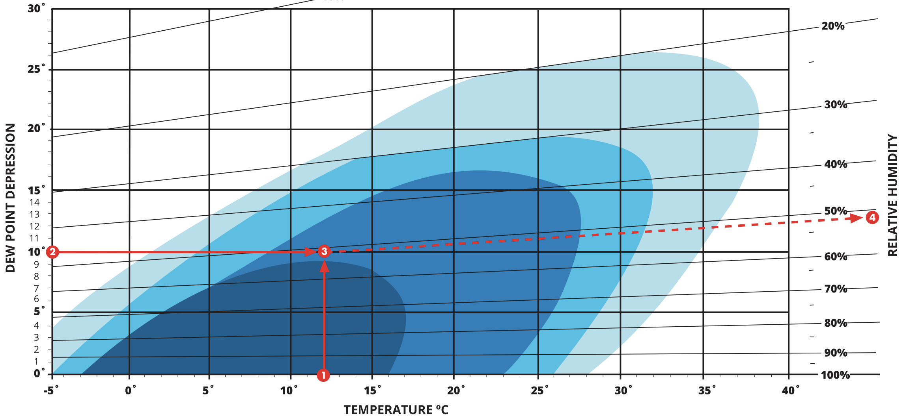

---

---

<left>

## Carb Ice Prevention & Mitigation

Periodically open throttle during descent

Carburetor Heat:
- Full ON
- Remain ON after removing ice
- OFF during takeoff/climb

</left>
<right>

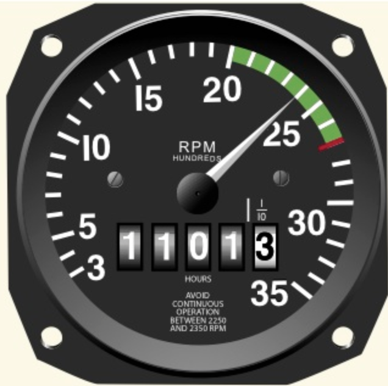
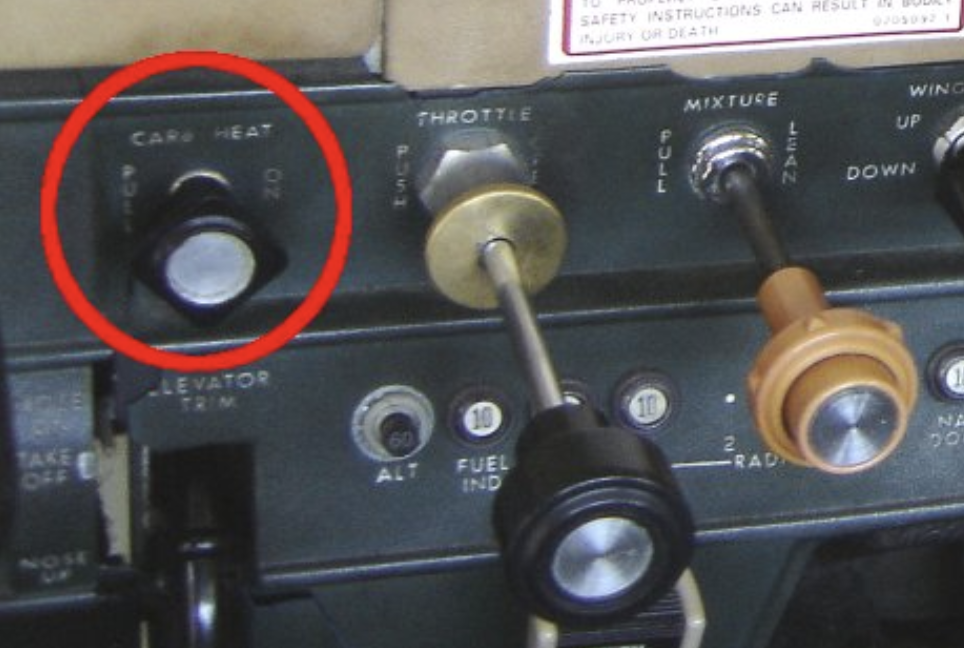

</right>

---

## Fuel Injection System

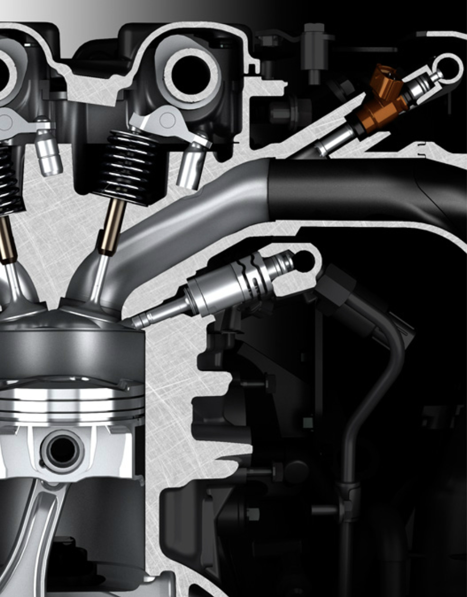 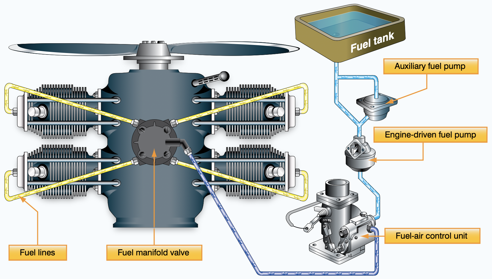

---

<invert>

## FADEC (Full Authority Digital Engine Computer)

- No carburetor & carburetor heat
- No mixture control
- No prop control
- No engine priming
- No magnetos

</invert>

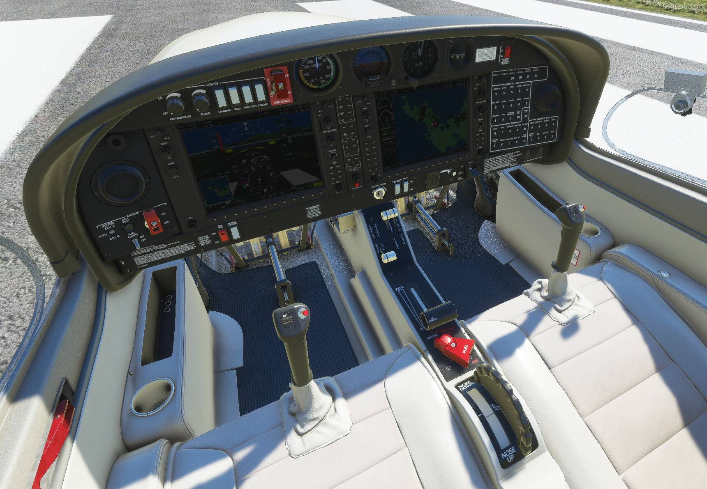

---

## Takeaway

- Fly a modern airplane!