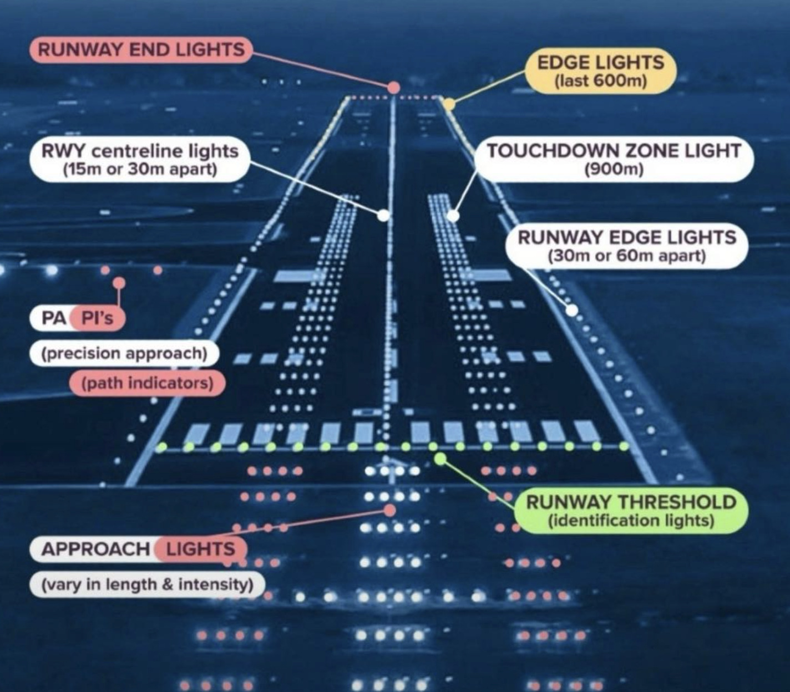
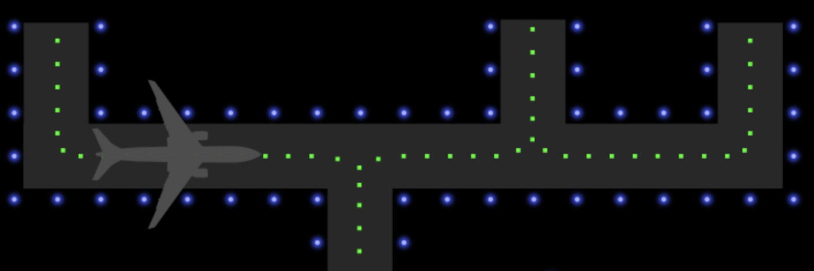
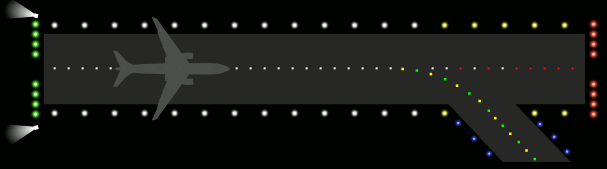
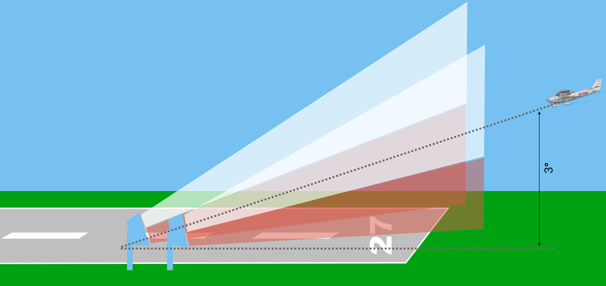
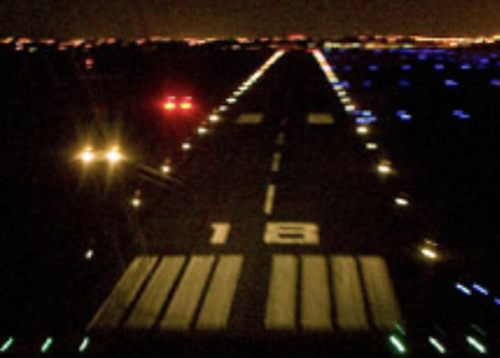

# Airport Markings, Signs and Lights

---

## Runway Markings

<!--
- Runway Number (L/C/R, >3 parallel runways)
- Threshold
- Centerline (200ft)
- Touchdown zone
- Displaced threshold
- Stopway
-->

---

## Taxiway Markings

<left>

</left>
<right>

</right>

<!--
- Centerline
- Hold short line
-->

---

## Ramp Markings

<!--
- Ramp boundary
- Vehicle lane
-->

---

## Signs

 

---

## Runway Lights

- Runway End Identifier Light (REIL)
- Threshold (green)
- Touchdown Zone Lights (white)
- Centerline Light (white)
- Edge Light (white / amber / red)
(HIRL/MIRL/LIRL)

<!--
- Touchdown zone lights: 100ft - 3000ft from threshold
- Runway edge light
  - instrument runway, last 2000ft: amber
  - end of runway: red
-->

---

## Taxiway Lights

<left>

- Centerline Lights (green)
- Lead-on/off Lights (yellow)
- Edge Lights (blue)

</left>
<right>

---

## Visual Approach Slope Indicator (VASI)

- White + White: Too High
- White + Red: Proper slope
- Red + Red: Too Low

 

---

## Precision Approach Path Indicator (PAPI)

---

## Instrument Approach Lights

---

<!--
KBFI: 2x. Runway edge lights, PAPI (precision approach path indicator), approach lights, rotating beacon, taxiway lights
-->
