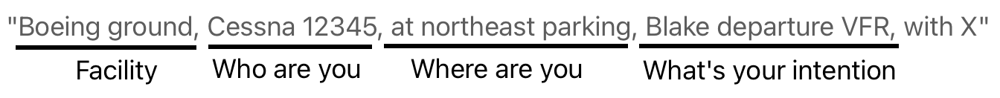
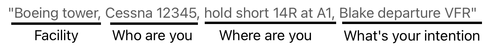

# Communication

---

## Air Traffic Control

- Tower
- Ground
- Clearance Delivery
(IFR)

---

## Communication

- Phonetic alphabet
- Clearance
  - When entering movement area
  - When entering runway
  - When landing

---

## Examples

**Ground**

ATC: "Cessna 12345, Boeing ground, taxi to 14R at A1 via A"

**Tower**

ATC: "Cessna 12345, Boeing tower, 14R clear for takeoff"

---

## Special Instructions

- “Hold Short”
- “Line up and wait”
- “Land and hold short”

---

## Lost-Communication Procedure

 
