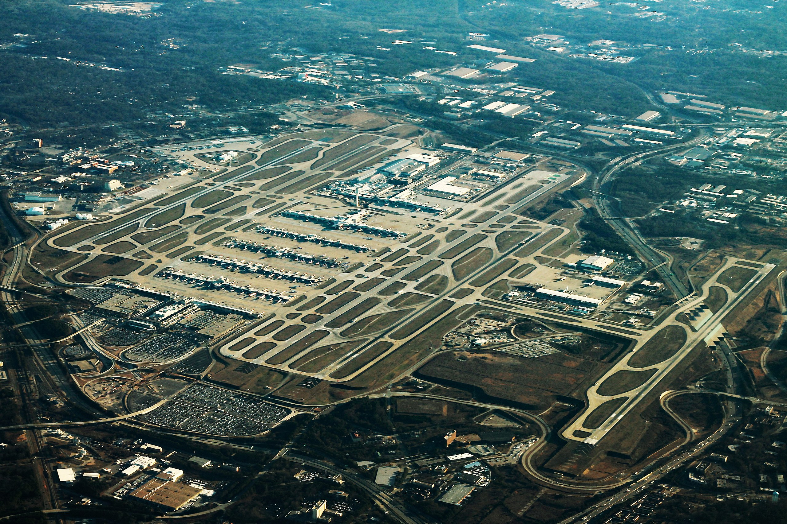

# Airport Operations

---

## Objectives

To safely & professionally operate at all kinds of airports, big and small.

---

## Prep

- Read "Pilot's Handbook of Aeronautical Knowledge":
  - [Chapter 14: Airport Operations][1]

[1]: https://www.faa.gov/regulationspolicies/handbooksmanuals/aviation/phak/chapter-14-airport-operations

<!--
Instructor prep:
  - FAA chart supplement
-->

---

<!--
Stehekin State airport, WA (6S9)
-->

---

<!--
Eastsound airport, WA (KORS)
-->
---

<!--
KATL: Atlanta Airport, Georgia. World's busiest airport since 2005. 5 9000ft+ runways. 190+ gates. 800M aircraft operations in 2024. 1 aircraft operation every 40 second.
-->

---

1. [Non-Towered Airport](non-towered-airport.md)
1. [Towered Airport](towered-airport.md)
1. [Wake Turbulence](wake-turbulence.md)
1. [Runway Incursion](runway-incursion.md)