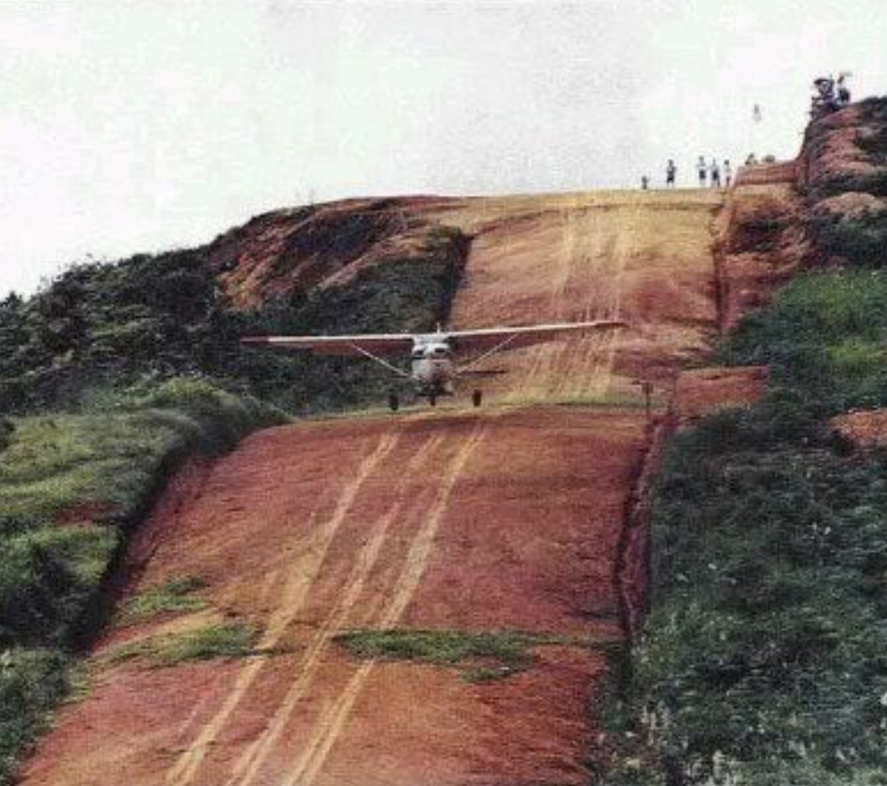

# Airport Operations

---

## Objectives

To safely & professionally operate at all kinds of airports, big and small.

---

## Prep

- Read "Pilot's Handbook of Aeronautical Knowledge":
  - [Chapter ?: Airport Operations][1]

[1]: 

<!--
Instructor prep:
  - airport supplyment
-->

---

## Backyard Airport

---

## Major Airport

---

1. [Non-Towered Airport](non-towered-airport.md)
1. [Towered Airport](towered-airport.md)
1. [Wake Turbulence](wake-turbulence.md)
1. [Runway Incursion](runway-incursion.md)