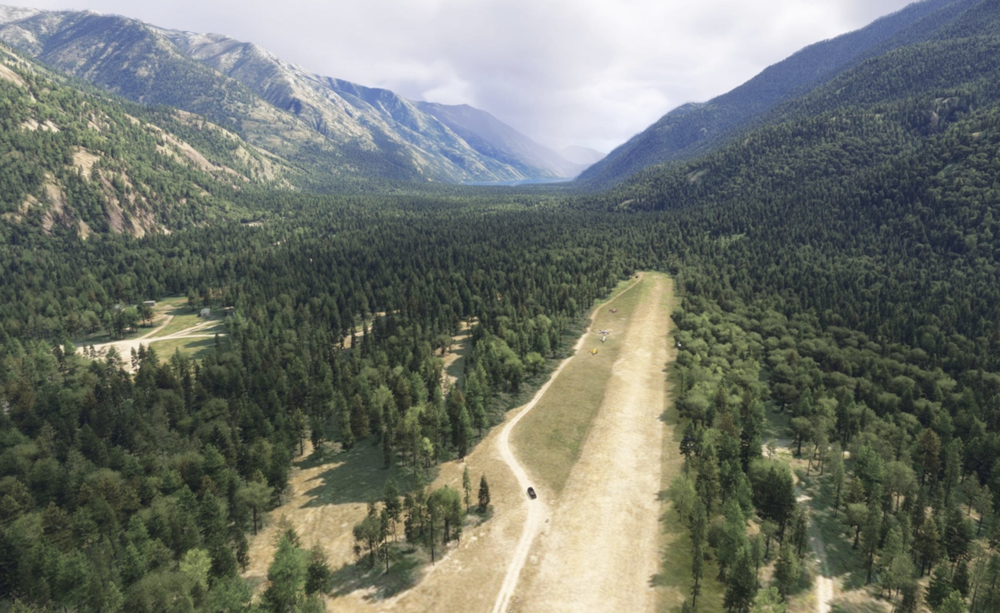
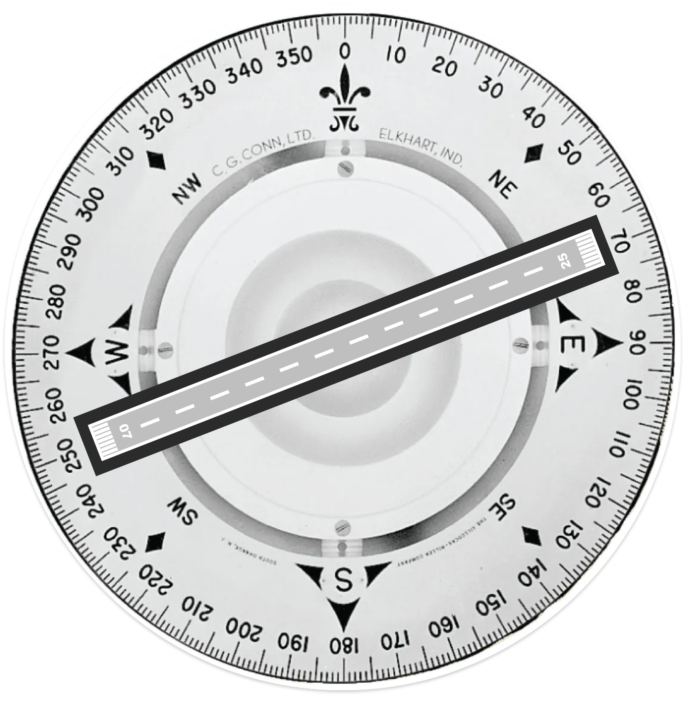
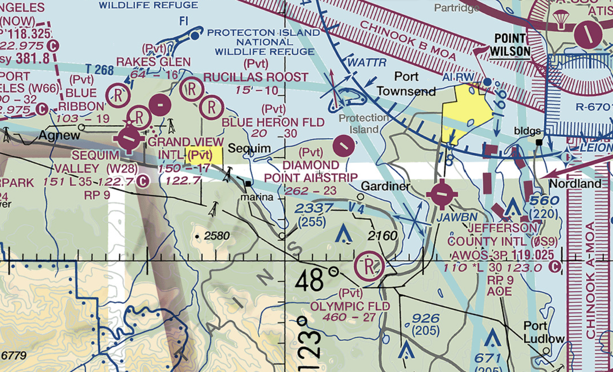
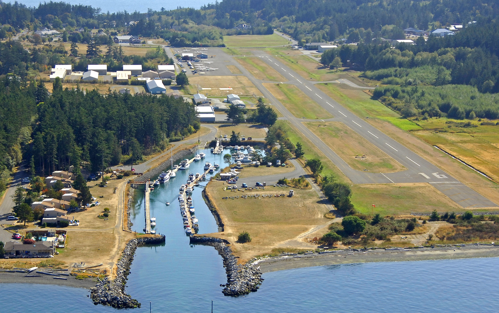
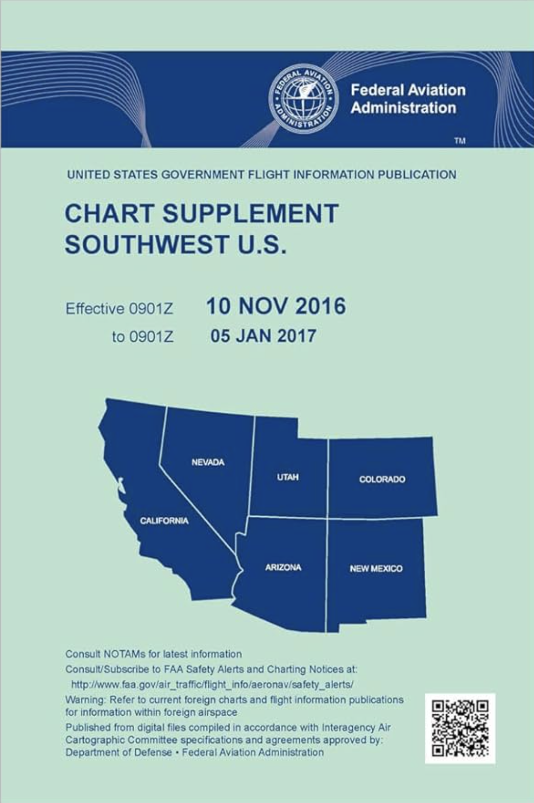
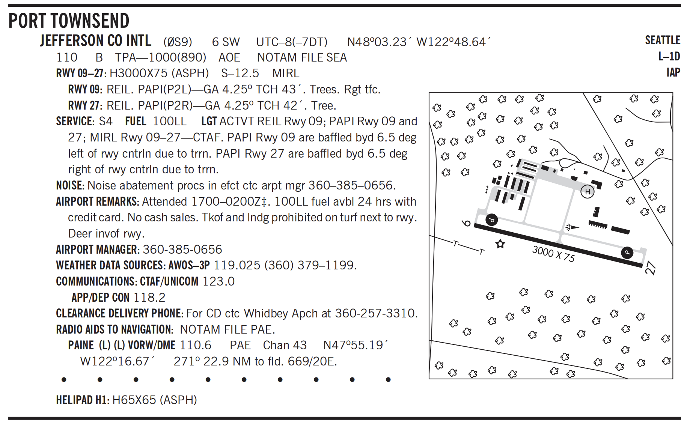
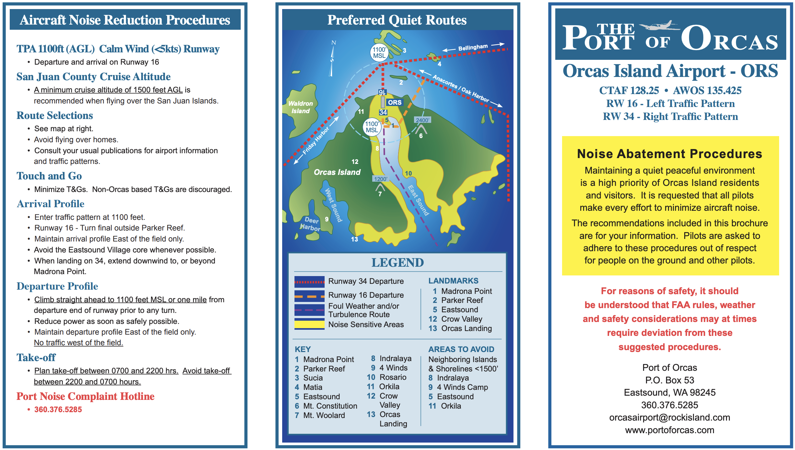

# Non-Towered Airport

---

---

<!--
Question: how would you build an airport in your backyard?
-->
--- 

<!--
- Runway
- Wind
- Traffic pattern
- Communication
-->

---

## Runway

---

## Weather Observation

- Wind cone / wind sock
- Tetrahedon
- Wind tee

  

---

## Traffic Pattern

- Upwind
- Crosswind
- Downwind
- Base
- Final

Departure / Arrival
- 45° Crosswind
- 45° Downwind

<!--
Standard pattern: left turn
-->
---

## Communication - Common Traffic Advisory Frequency (CTAF)

|Audience|Who you are|Where you are|What is your intention|
|--|--|--|--|
|"Eastsound traffic"|"Cessna 12345"|"5 miles north at 2500(ft)"|"entering left downwind for runway 9"|

 
<non-key>

- "Eastsound traffic, Cessna 12345, taking off runway 9, departure to northeast"
- "Eastsound traffic, Cessna 12345, turning final runway 9, full stop"
- ......

</non-key>

---

<!--
- Diamond Point Airstrip: residential community airpark, elevation, runway length
- W28: code, lighting, CTAF, non-standard traffic pattern
- 0S9: weather station, AOE
-->

---

---

## Airport Beacon

|||
|--|--|
|Civilian Land Airport|<white>●</white><green>●</green>|
|Water Airport|<white>●</white><yellow>●</yellow>|
|Heliport|<white>●</white><yellow>●</yellow><green>●</green>|
|Military Airport|<white>●</white><white>●</white><green>●</green>|

ON when:
- < VFR weather minimum
- From sunset to sunrise

---

## Taxiway Lights

<left>

- Taxiway
  - Centerline (green)
  - Edge (blue)
- Runway
  - Centerline (white)
  - Edge (white)
  - Threshold (green)
- Runway End Identifier Light
(REIL)

</left>
<right>

---

## Visual Approach Slope Indicator (VASI)

- White + White: Too High
- White + Red: Proper slope
- Red + Red: Too Low

 

---

## Chart Supplement

---

## VFR Procedure / Noise Abatement

