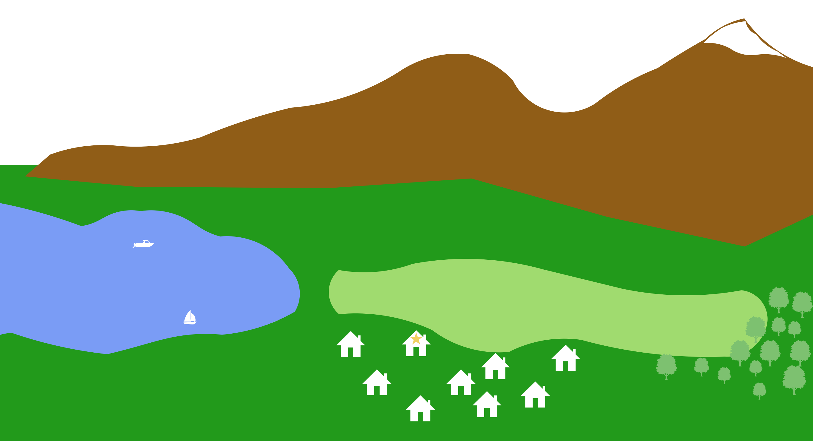
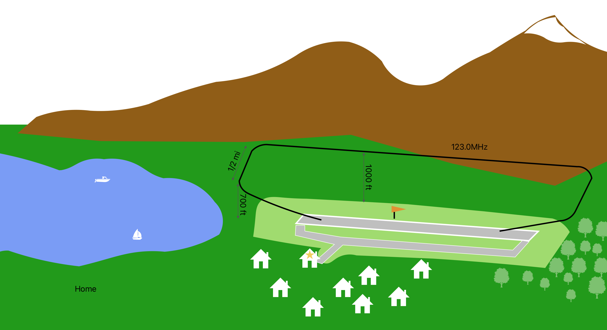
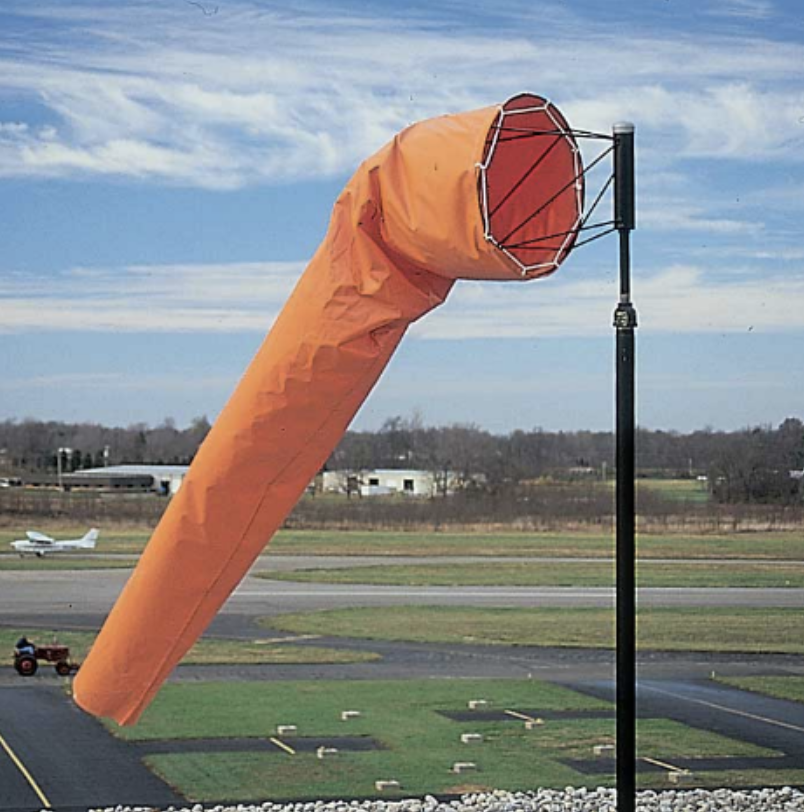
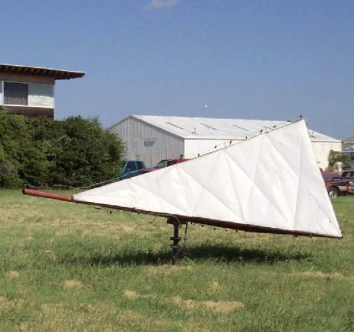
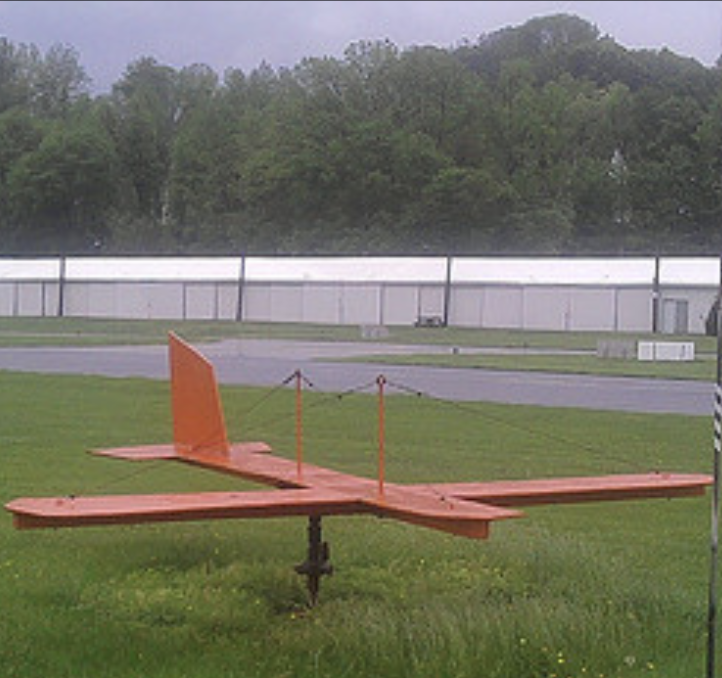
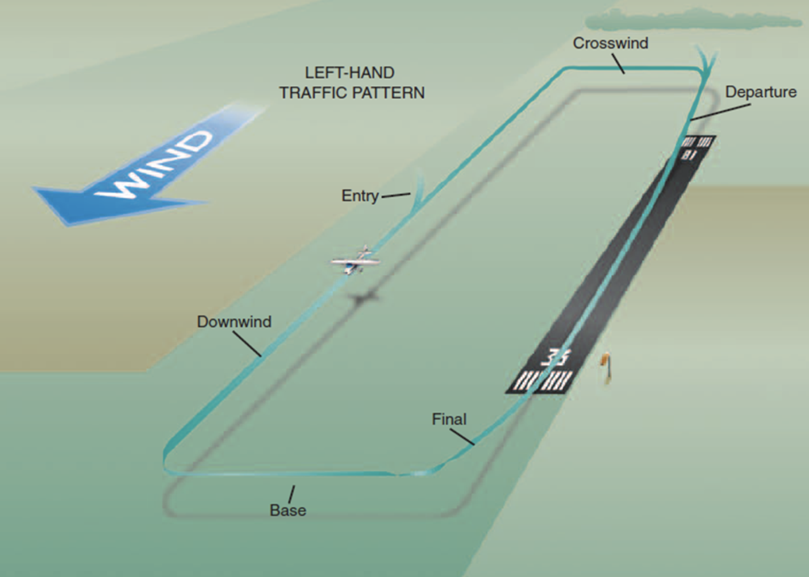
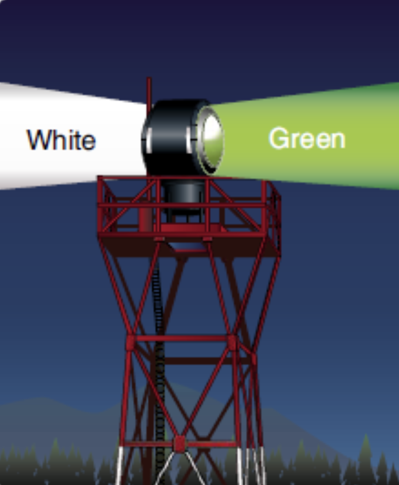

# Non-Towered Airport

---

<!--
Question: how would you build an airport in your backyard?
- Runway
- Wind
- Traffic pattern
- Noise abatement
- Communication
-->
--- 

<!--
- Runway
- Wind
- Traffic pattern
- Noise abatement
- Communication
-->

---

## Runway

(Direction)

---

## Weather Observation

- Wind cone / wind sock
- Tetrahedon
- Wind tee

  

---

## Traffic Pattern

- Upwind
- Crosswind
- Downwind
- Base
- Final

Departure / Arrival
- 45° Crosswind
- 45° Downwind

<!--
Standard pattern: left turn
-->
---

## VFR Procedure / Noise Abatement

(BFI brochure)

---

## Communication - Common Traffic Advisory Frequency (CTAF)

|Audience|Who you are|Where you are|What is your intention|
|--|--|--|--|
|"Eastsound traffic"|"Cessna 12345"|"5 miles north at 2500(ft)"|"entering left downwind for runway 9"|

 
<non-key>

- "Eastsound traffic, Cessna 12345, taking off runway 9, departure to northeast"
- "Eastsound traffic, Cessna 12345, turning final runway 9, full stop"
- ......

</non-key>

---

## Airport Beacon

- Civilian Land Airport
- Water Airport
- Heliport
- Military Airport

ON when:
- < VFR weather minimum
- From sunset to sunrise

---

## Visual Approach Slope Indicator (VASI)

- White + White: Too High
- White + Red: Proper slope
- Red + Red: Too Low

 

---

## Airport Information - On Chart

(chart)

---

## Airport Information - In Supplyment

(Supplyment)