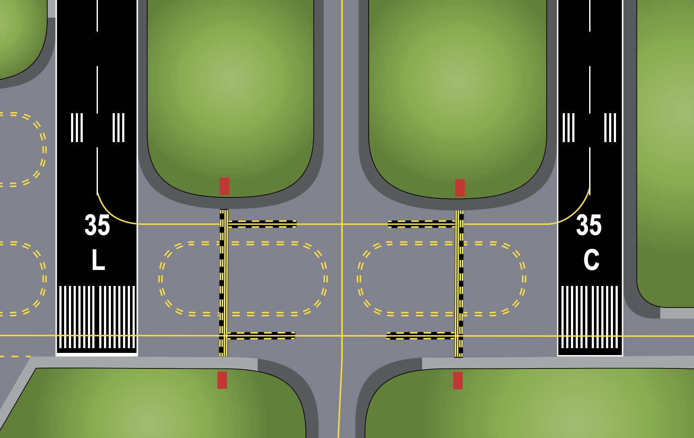
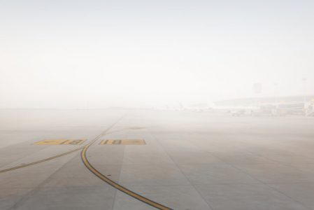

# Runway Incursion

---

## Definition

An incident where an unauthorized aircraft/vehicle/person is on runway.

         

---

---

## Runway Incursion

- Study airport diagram, A/FD, NOTAMs
- Write down, read back and draw taxi route
- Sterile cockpit
- Situational awareness
- Progressive taxiing

 

When in doubt...
<red>STOP</red> and ask

<!--
Sterile cockpit
- Heads up
- Task prioritization
- No distractive activities (setting GPS, chatting)
Situational awareness
- which runways are active?
- landing traffic?
- departure traffic?
- use geo-location on G1000, ForeFlight

-->

---

## Runway Crossing

- Obtain CLEARANCE
- Confirm runway is CLEAR
- All lights ON
- Cross with minimum delay

---

## Parallel Taxiway

<!--
Use extra caution
-->
---

## Night Taxi Operations

- Landing lights OFF
- Anti-collision lights OFF
- Taxi <red>SLOW</red>
- Runup: use parking brake

---

## Low Visibility Taxi Operations

- Taxi <red>SLOW</red>
- Heads UP
- Lights (centerline light, stop bar light, runway guard light)
- Geographic position marking
- Non-towered airport: position report on CTAF

---

<!--
Runway incursion after landing:
- 12/6/1999, United 1448, US Air 2998
-->
