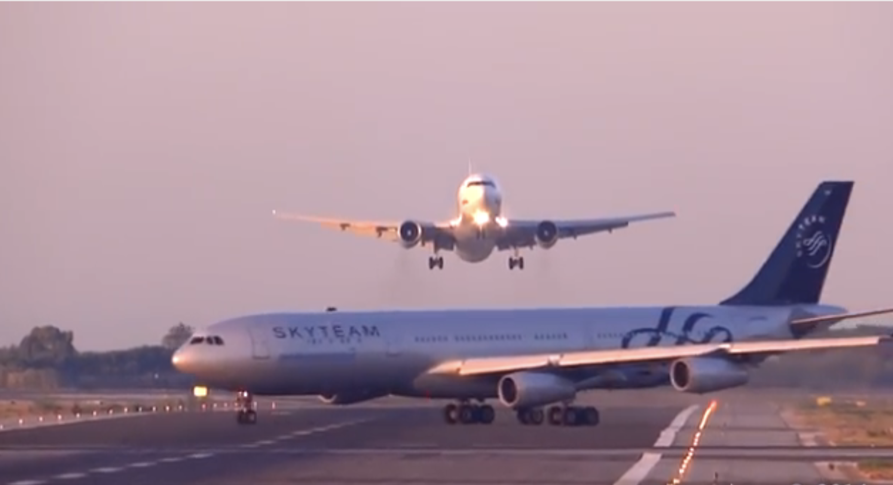
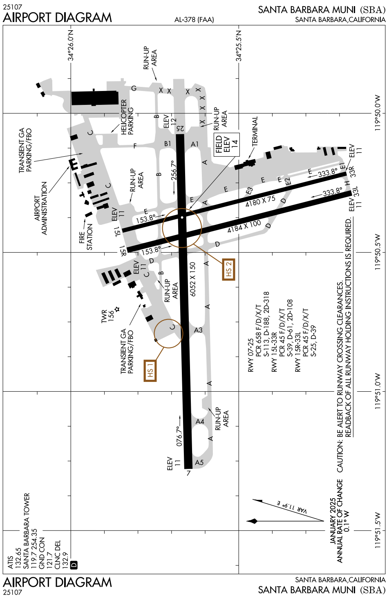

# Runway Incursion

---

## Runway Incursion

An incident where an unauthorized aircraft/vehicle/person is on runway.

         

---

---

<!--
12/6/1999, United 1448, US Air 2998
-->

---

## Runway Incursion

- Study airport diagram, A/FD, NOTAMs
- Write down, read back and draw taxi route
- Situational awareness
- Progressive taxiing
- When in doubt, <red>STOP</red> and ask

<!--
Situational awareness: which runways are active? landing traffic? departure traffic? 
-->

